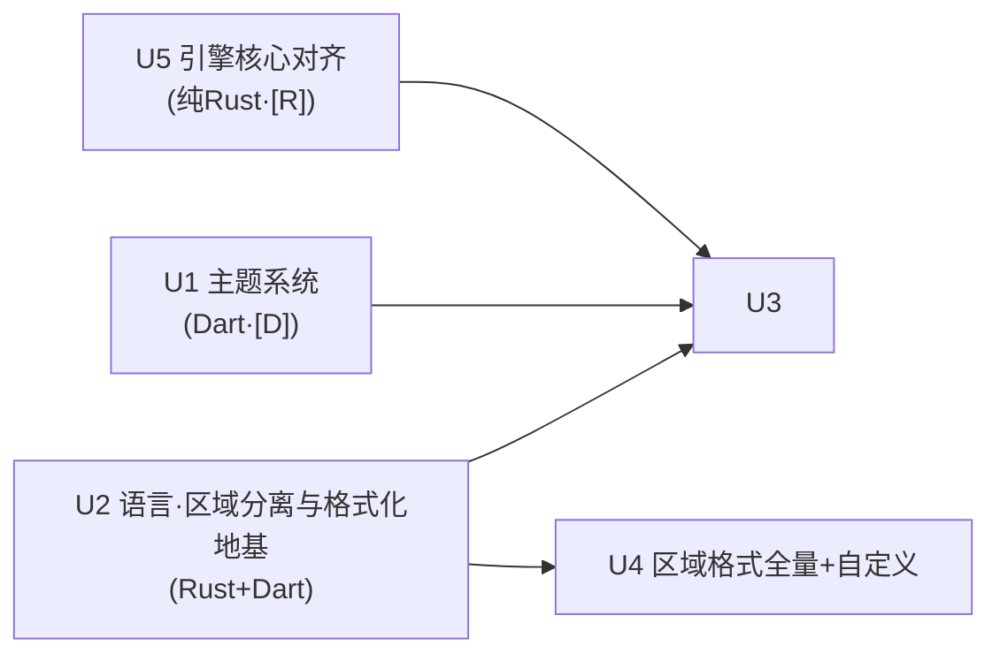

# Calculator-planover 增量架构设计 v2

> 文档类型：**增量架构设计**（不推翻基线 `docs/ARCHITECTURE.md`，仅定义本次改进的分层改动、契约与任务分解）
> 配套基线：`docs/ARCHITECTURE.md`（v1，下称"基线"）
> 配套需求：`docs/PRD-INCREMENT-v2.md`（v2，下称"增量 PRD"）
> 撰写人：高见远（架构师）
> 语言：简体中文

---

## 0. 增量裁决覆盖基线声明（显式冲突登记）

> 凡与基线 `ARCHITECTURE.md` 冲突之处，**以本文件为准**。工程师若发现疑似矛盾，先读本表。

| # | 基线内容 | 本增量裁决 | 影响 |
|---|---|---|---|
| **IC-1** | 基线 §1.1 应用显示区/预览行/进制行**自上而下**为「输入行→预览行→进制行」，且线框图（PRD §4.1）预览在输入**下方** | **结果显示区移到输入区上方**（原版一致的"三区结构"）。见 §8 UI-01 | 布局 widget 重构 |
| **IC-2** | 5×5 键盘**含 `=` 键**（基线 P0-24） | **主键盘去掉 `=`**；calculate-on-fly 默认开启；`=` 仅存 Simple 模式键盘 + 物理 Enter + 结果区长按"保存到历史"。见 §8 / 增量 PRD §3.2 裁决 D1 | 键盘 widget + 状态机 |
| **IC-3** | 基线 P0-05：「按 `=` 提交后更新 `ans`、写历史」 | **预览成功即更新 `ans`**；历史写入 = 显式提交 / 开始新表达式 / 退出前。见 §7 UI-14/UI-15 | `CalculatorController` 状态机 |
| **IC-4** | 角度 3 种（deg/rad/grad） | 新增 **Turns** → 4 种 | `session.rs` `AngleMode` |
| **IC-5** | 记数法 3 种（Auto/Scientific/Fixed） | 新增 **Engineering**（仅 Engineer 模式） | `format.rs` `Notation` |
| **IC-6** | 函数集不含 cot/acot/coth/acoth/sgn/frac | 新增 6 个 | `functions.rs` |
| **IC-7** | 无记忆寄存器 | 新增 **M+/M−/MC/MR** 单一记忆寄存器 | 新 `memory.rs` |
| **IC-8** | 主题 = system/light/dark 三档（`AppThemeMode`） | 扩展为 **≥16 固定主题 + 跟随系统 + 高对比**，15 语义 token 驱动 | `theme/tokens.dart` + `settings_store.dart` |
| **IC-9** | 数值格式化全部在 Rust（基线 C8） | **维持并强化**：数字/货币格式化仍在 Rust（A1）；**新增** `set_region_format` 经 `dispatch` 传入 `RegionFormatConfig` | `format.rs` / `api.rs` |
| **IC-10** | 语言与区域未显式拆分 | 拆分为 **DisplayLanguage（界面文案）** 与 **RegionFormat（数字/货币/时间/日期）** 两个独立持久化设置，绝不用 `Intl.defaultLocale` 绑死（A3） | `settings_store.dart` / `region_format_controller.dart` |

> ⚠️ **applicationId 口径冲突（需主理人最终裁定，不阻塞开工）**：基线 `ARCHITECTURE.md` 与首版 PRD 均按用户拍板写死 `org.solovyev.android.calculator`；但**增量 PRD §2.2 第 65 行**与本次 resume 指令均写 `com.planover.calculatorplanover`。二者不一致。本设计**不改动 applicationId**，沿用仓库现有配置；若需从 `org.solovyev...` 改为 `com.planover...`，属破坏性包名变更，须主理人单独拍板并同步改 `android/app/build.gradle.kts` + 所有 CI 校验断言（基线 §8 verify-package）。

---

## 1. 分层改动图与数据流

### 1.1 数据流图（设置 → 引擎 → 格式化）

```mermaid
graph TB
    subgraph DART["Flutter (Dart)"]
        direction TB
        SET[L2 设置层<br/>SettingsController / SettingsStore]
        LC[DisplayLanguage<br/>界面文案 locale]
        RF[RegionFormat<br/>数字/货币/时间/日期规则]
        GW[EngineGateway 抽象]
        NAT[NativeEngine<br/>dart:ffi]
        DTF[Dart 格式化器<br/>时间/日期/历史时间戳]
        UI[UI 层<br/>theme / keypad / history]
        SET -->|独立| LC
        SET -->|独立| RF
        LC -->|AppLocalizations(locale)| UI
        RF -->|A1: set_region_format| GW
        RF -->|A2: 时间/日期 pattern+locale| DTF
    end

    subgraph FFI["FFI 边界 (C ABI + JSON)"]
        J[calc_* / calc_dispatch]
    end

    subgraph RUST["Rust 引擎 (calculator_core)"]
        API[api::dispatch]
        ENG[Engine]
        FMT[format.rs<br/>数字/货币格式化 + RegionFormatConfig]
        NUM[Num / eval]
        MEM[memory.rs]
        API --> ENG --> FMT
        ENG --> NUM
        ENG --> MEM
    end

    GW --> NAT --> J --> API
    DTF -.时间/日期 不进 Rust.-> UI
    UI --> GW

    %% A3 解耦边界
    LC -. "A3: 绝不通过 Intl.defaultLocale 绑定" .- RF
```

**解耦边界（A3）铁律**：`DisplayLanguage` 只驱动 `AppLocalizations`（UI 文案）；`RegionFormat` 只驱动数值/货币（经 `set_region_format` 进 Rust）与时间/日期（Dart 侧 `intl` + 自定义模式串）。二者**分别持久化、分别传参**；Dart 侧**禁止**调用 `Intl.defaultLocale = ...` 或 `Intl.systemLocale` 来隐式绑定二者。

### 1.2 ASCII 调用流（数值路径 vs 时间/日期路径）

```
                    ┌─ DisplayLanguage ──▶ AppLocalizations(locale) ──▶ 按钮/菜单/标题文案
SettingsController ─┤
                    └─ RegionFormat ─────┬─(A1) set_region_format ──▶ Rust session.region_format
                                         │                              └─▶ format_number / evaluate_* 输出数字/货币
                                         └─(A2) DateFormat(pattern, regionLocaleId)
                                                                       └─▶ 历史条目 短日期/短时间（Dart，不涉计算语义）

关键：RegionFormat 进入 Rust 的是"数字/货币格式化配置"；时间/日期**永远不进 Rust**，避免内核膨胀（A2/Q4）。
```

---

## 2. 关键数据结构

### 2.1 Rust 侧（全部位于 `engine/core/src/`，纯数据 + serde）

```rust
// ── format.rs ──────────────────────────────────────────────
#[derive(Debug, Clone, Copy, Default, serde::Deserialize, serde::Serialize, PartialEq)]
#[serde(rename_all = "snake_case")]
pub enum Notation {
    #[default] Auto,
    Scientific,
    Fixed,
    Engineering,   // 新增（IC-5）：指数对齐 3 的倍数
}

/// 分组方式：标准 3;0（123,456,789）或印度式 3;2;0（12,34,56,789）
#[derive(Debug, Clone, Copy, serde::Deserialize, serde::Serialize, PartialEq, Eq)]
pub enum GroupPattern {
    #[serde(rename = "3;0")] Standard,
    #[serde(rename = "3;2;0")] Indian,
}
impl Default for GroupPattern { fn default() -> Self { GroupPattern::Standard } }

/// 负数格式 5 种（RF-N-06）
#[derive(Debug, Clone, Copy, serde::Deserialize, serde::Serialize, PartialEq, Eq)]
#[serde(rename_all = "snake_case")]
pub enum NegativeNumberFormat {
    MinusParen,     // (1.1)
    MinusPlain,     // -1.1
    MinusSpace,     // - 1.1
    TrailingMinus,  // 1.1-
    TrailingMinusSpace, // 1.1 -
}

/// 货币正数格式 4 种（RF-C-02）
#[derive(Debug, Clone, Copy, serde::Deserialize, serde::Serialize, PartialEq, Eq)]
#[serde(rename_all = "snake_case")]
pub enum CurrencyPositiveFormat { Before, After, BeforeSpace, AfterSpace }

/// 货币负数格式 = 符号位(4) × 正格式(4) = 16 种（RF-C-03）
#[derive(Debug, Clone, Copy, serde::Deserialize, serde::Serialize, PartialEq, Eq)]
pub struct CurrencyNegativeFormat {
    #[serde(rename = "sign")] pub sign: CurrencyNegativeSign,
    #[serde(rename = "symbol")] pub symbol: CurrencyPositiveFormat,
}
#[derive(Debug, Clone, Copy, serde::Deserialize, serde::Serialize, PartialEq, Eq)]
#[serde(rename_all = "snake_case")]
pub enum CurrencyNegativeSign { Paren, Before, BeforeSpace, Trailing }

#[derive(Debug, Clone, serde::Deserialize, serde::Serialize, PartialEq)]
pub struct CurrencyFormatConfig {
    #[serde(default)] pub symbol: Option<String>,
    #[serde(default)] pub positive_format: Option<CurrencyPositiveFormat>,
    #[serde(default)] pub negative_format: Option<CurrencyNegativeFormat>,
    #[serde(default)] pub decimal_separator: Option<String>,
    #[serde(default)] pub decimal_digits: Option<u8>,
    #[serde(default)] pub group_separator: Option<String>,
    #[serde(default)] pub group_pattern: Option<GroupPattern>,
}

/// 区域格式配置（A1）。所有字段 Option → 缺省即"现状行为"，保证 238 个既有测试不破坏
#[derive(Debug, Clone, Default, serde::Deserialize, serde::Serialize)]
pub struct RegionFormatConfig {
    #[serde(default)] pub decimal_separator: Option<String>,  // "." 默认
    #[serde(default)] pub group_separator: Option<String>,     // None 默认（不分组）
    #[serde(default)] pub group_pattern: Option<GroupPattern>, // 3;0
    #[serde(default)] pub leading_zero: Option<bool>,          // true
    #[serde(default)] pub negative_format: Option<NegativeNumberFormat>,
    #[serde(default)] pub list_separator: Option<String>,
    #[serde(default)] pub currency: Option<CurrencyFormatConfig>,
}
impl RegionFormatConfig {
    pub fn validate(&self) -> Result<()>;   // 非法分隔符/非法枚举 → InvalidSettings(5001)
}
```

```rust
// ── session.rs ─────────────────────────────────────────────
#[derive(Debug, Clone, Copy, PartialEq, Eq)]
pub enum AngleMode { Deg, Rad, Grad, Turns }   // 新增 Turns（IC-4）
impl AngleMode {
    pub fn from_id(s: &str) -> Option<Self>;   // 接受 "deg"|"rad"|"grad"|"turns"
    pub fn to_radians(&self, v: f64) -> f64;   // Turns: v * 2π
    pub fn from_radians(&self, v: f64) -> f64;
}

pub struct EngineSettings {
    pub angle_mode: AngleMode,
    pub word_size: u8,
    pub format: NumberFormatSettings,
    pub compute_mode: ComputeMode,   // 新增（IC-6/A6）：Engineer | Simple
}

#[derive(Debug, Clone, Copy, PartialEq, Eq)]
pub enum ComputeMode { Engineer, Simple }
impl ComputeMode {
    /// A6 模式默认值表：切换模式时写回 session.settings
    pub fn defaults(&self) -> ModeDefaults;
}
pub struct ModeDefaults {
    pub angle_mode: AngleMode,     // Engineer→Rad, Simple→Deg
    pub notation: Notation,        // Engineer→Engineering(可选)/Auto, Simple→Fixed
    pub rounding_digits: u8,       // Engineer→(按精度设置), Simple→5
}

pub struct Session {
    pub variables: HashMap<String, Num>,
    pub ans: Option<Num>,
    pub settings: EngineSettings,
    pub region_format: Option<RegionFormatConfig>,  // 新增（A1）
    pub last_result: Option<Num>,                    // 新增：供 M+ / M- 使用
    pub memory: Num,                                 // 新增（IC-7）：单一记忆寄存器，初值 0
}
impl Session {
    pub fn reset(&mut self);   // 清零 variables/memory，但保留 ans（与基线 Q9 对齐；记忆随 reset 清零，Q13-1）
}
```

```rust
// ── memory.rs（新文件）─────────────────────────────────────
pub struct Memory;
impl Memory {
    pub fn add(session: &mut Session, amount: &Num);
    pub fn subtract(session: &mut Session, amount: &Num);
    pub fn clear(session: &mut Session);
    /// 返回应插入表达式的文本（负数包成 (-5)）+ 展示文本
    pub fn recall_text(session: &Session) -> (String /*insert*/, String /*display*/);
}
```

```rust
// ── api.rs：dispatch 新增方法 ──────────────────────────────
pub fn dispatch(method: &str, payload: &str, engine: &mut Engine) -> String;
// 新增 method 字符串（均在既有 Envelope 信封内）：
//   "set_region_format"  -> 设置 session.region_format
//   "format_currency"    -> 用 region_format.currency 格式化给定 Num
//   "memory_add" / "memory_subtract" / "memory_clear" / "memory_recall"
// EvaluateRequest 增加可选字段：
//   region_format: Option<RegionFormatConfig>  // 临时覆盖（与 session 合并，session 优先持久值）
```

### 2.2 Dart 侧（位于 `app/lib/src/`，纯 Dart，无 codegen）

```dart
// ── src/l10n/region_registry.dart（新）─────────────────────
/// 区域格式注册表：region id (BCP47) -> 默认 RegionFormat 预设
class RegionPreset {
  final String id;          // "de-DE"
  final String decimalSeparator;
  final String? groupSeparator;
  final GroupPattern groupPattern;
  final NegativeNumberFormat negativeFormat;
  final String? dateShortPattern;   // "dd.MM.yyyy"
  final String? timeShortPattern;   // "HH:mm"
  final bool use24h;
  final String? firstDayOfWeek;
}
class RegionRegistry {
  static const Map<String, RegionPreset> presets = { /* de-DE, en-US, zh-CN, hi-IN(3;2;0), ar-SA, ... */ };
  static RegionPreset resolve(String regionId);     // 未知区域回落 en-US 预设
  static RegionPreset systemDefault();              // 从 platformDispatcher.locale 推导
}

// ── src/models/region_format.dart（新）─────────────────────
enum GroupPattern { standard, indian }   // 3;0 / 3;2;0
enum NegativeNumberFormat { minusParen, minusPlain, minusSpace, trailingMinus, trailingMinusSpace }
enum CurrencyPositiveFormat { before, after, beforeSpace, afterSpace }
class CurrencyNegativeFormat { final CurrencyNegativeSign sign; final CurrencyPositiveFormat symbol; }
enum CurrencyNegativeSign { paren, before, beforeSpace, trailing }
class RegionFormat { /* 与 Rust RegionFormatConfig 1:1 的 Dart 镜像，fromJson/toJson */ }

// ── src/l10n/locale_model.dart（新，替换/扩展既有语言设置）──
class DisplayLanguage {
  final String id;          // "en" | "zh-CN" | "zh-TW" | "ja" ...
  final bool humanReviewed; // 是否有人工校订译文
  final int completionPct;  // 译文完成度（LG-04 / LC-08）
}
// ⚠️ DisplayLanguage 与 RegionFormat 是**两个独立对象**，互不直接引用（A3）

// ── src/theme/tokens.dart（新，IC-8）──────────────────────
/// 15 个语义色彩 token（增量 PRD §4.3，TH-01 全覆盖）
class ThemeTokens {
  final Color colorBackground, colorDisplayBackground, colorExpressionBackground,
      colorSurface, colorAccent, colorTextPrimary, colorTextSecondary,
      colorKeyBackground, colorKeyText, colorKeyPressed, colorKeyOperator,
      colorKeyFunction, colorDivider, colorError, colorSuccess;
}
abstract class AppTheme {
  String get id;
  String get name;
  bool get isDark;
  ThemeTokens get tokens;        // 每个主题必须 15 个 token 全定义，禁止 null（TH-01）
  AppTheme resolveForBrightness(bool dark);  // 跟随系统时按系统明暗取对应 token 集
}
class ThemeRegistry {
  static List<AppTheme> all();    // ≥16 固定主题（P0:9 原版复刻 + 跟随系统之外还应含 High Contrast）
  static AppTheme byId(String id);
}
// 高对比：既作为开关（TH-05）也作为独立主题 #10（Q11）
enum DisplayThemeMode { system, themeId(String), highContrast }
```

### 2.3 跨语言字段对齐约定（与基线 §10 共享知识一致）

| Rust `RegionFormatConfig` | Dart `RegionFormat` | 说明 |
|---|---|---|
| `decimal_separator: Option<String>` | `String decimalSeparator` | JSON 一律 `snake_case`；Dart 用 `fromJson` 容错默认值 |
| `group_pattern: Option<GroupPattern>` | `GroupPattern groupPattern` | `"3;0"`/`"3;2;0"` 字符串透传 |
| `negative_format` | `NegativeNumberFormat` | `_` → `camelCase` 由 serde `rename_all` 处理 |
| `currency.negative_format.sign/symbol` | `CurrencyNegativeFormat` | 16 组合 |
| `AngleMode::Turns` | `angle_mode: "turns"` | `from_id` 双向 |

---

## 3. 接口与 DTO 变更（`set_region_format` 固定契约）

> **核心结论（回答"数字格式化到底放 Rust 还是 Dart"）**：
> **数字/货币格式化放 Rust（A1），时间/日期放 Dart（A2/Q4）。**
> 依据：① 基线铁律 C8"数值计算与格式化只在 Rust"必须维持，否则分数/工程记数法/进制/千分位会双实现漂移；② 增量 PRD 把数字/货币格式化器列为 37 条 `[R]` 可本机验证项——若放 Dart 则全变 CI-only `[D]`，直接摧毁"本地可真实验证"的分层策略；③ 时间/日期不涉及计算语义、且需 CLDR 月份/星期名数据，放 Rust 会显著膨胀内核并引入 locale 依赖（违反 C7 内核精简），故放 Dart 用 `intl`（纯 Dart、无非 codegen、无平台通道）。
> **Rust 侧零新依赖**：`RegionFormatConfig` 仅用既有 `serde` 反序列化；格式化复用现有 `f64`/字符串路径，不引入 GMP/ICU。

### 3.1 `set_region_format` 请求/响应契约（Rust↔Dart 共同遵守）

```jsonc
// 请求（全部字段可选；缺省 = 现状行为，保证 238 测试不破坏）
{
  "decimal_separator": ".",           // RF-N-01: . , ٫ 空格 自定义1字符
  "group_separator": ",",             // RF-N-03: 无/,/'/空格/٬/自定义
  "group_pattern": "3;0",             // RF-N-04: "3;0" | "3;2;0"(印度式)
  "leading_zero": true,               // RF-N-07: .5 <-> 0.5
  "negative_format": "minus_plain",   // RF-N-06: 5 选 1（见 §2.1 枚举）
  "list_separator": ",",              // RF-N-09(P2)
  "currency": {                        // RF-C-*（P1，结果区货币开关默认关）
    "symbol": "¥",                    // RF-C-01
    "positive_format": "before",      // RF-C-02: before|after|before_space|after_space
    "negative_format": {               // RF-C-03: 16 组合 = sign(4) × symbol(4)
      "sign": "paren",                // paren|before|before_space|trailing
      "symbol": "before"
    },
    "decimal_separator": ".",         // RF-C-04
    "decimal_digits": 2,              // RF-C-05 (JPY=0, CNY=2)
    "group_separator": ",",           // RF-C-06
    "group_pattern": "3;0"
  }
}
// 响应
{ "ok": true,  "data": { "applied": true } }
// 失败（非法分隔符长度>1 / 未知枚举 / pattern 非法）
{ "ok": false, "error": { "code": 5001, "kind": "invalid_settings",
                          "message": "非法区域格式：group_pattern 必须为 3;0 或 3;2;0" } }
```

### 3.2 `format_currency` 契约（A1/Q8 货币能力）

```jsonc
// 请求
{ "value": "3.5", "currency": { /* 同 RegionFormatConfig.currency，可覆盖 */ } }
// 响应
{ "ok": true, "data": { "display": "¥3.50", "negative_display": "(¥3.50)" } }
```
> 结果区"货币显示"开关在 Dart 侧（`preview_line`/`display_panel`），默认 **关闭**（Q8）；开启时调用 `format_currency` 并用 `region_format.currency` 渲染。

### 3.3 `memory_*` 契约（IC-7 / CP-01~07）

```jsonc
// memory_add / memory_subtract：使用 session.last_result（最近一次成功预览值）
{ "ok": true, "data": { "memory": "5", "display": "5" } }
// memory_clear
{ "ok": true, "data": { "memory": "0" } }
// memory_recall：返回应插入表达式的文本（负数包成 (-5)）+ 展示文本（CP-05）
{ "ok": true, "data": { "insert_text": "(-5)", "display": "-5" } }
```
> `M+`/`M-` 操作的是 `session.last_result`（即当前结果区显示值）。`reset_session` 清零 `memory`（Q13-1）；"清空历史"不清零（因历史在 Dart 侧，互不影响）。

### 3.4 既有 API 向后兼容要点（**不得破坏 238 个 `cargo test -p calculator_core`**）

1. `RegionFormatConfig` 全部字段 `Option`，`#[derive(Default)]` → 不传时 `format_number`/`evaluate_*` 行为与现状**逐字节一致**。
2. `AngleMode::Turns`、`Notation::Engineering`、新函数均为**枚举新增变体/新增表项**，不改既有变体语义；既有 `from_id` 对旧字符串仍有效。
3. `Session` 新增 `region_format`/`last_result`/`memory` 字段，均带默认值，构造器 `Session::new()` 不变。
4. `dispatch` 的既有 method（`evaluate_preview` 等）入参结构**不删不改**；仅 `EvaluateRequest` 新增可选 `region_format`。
5. **§13.6 有意差异五条（CP-D01~D05）一律不动**：`%` 语义保持 `x/100`、引擎内括号自动配对保留、进制前缀现状、错误分类粒度、单位换算实现。

---

## 4. A1–A6 逐条决策

| # | 决策 | 理由 | 受影响模块/文件 | 验证 |
|---|---|---|---|---|
| **A1** | 数字/货币格式化→Rust，经 `set_region_format` + `RegionFormatConfig` 入 `session` | 维持 C8 单一数据源；37 条 `[R]` 须本机可验 | `format.rs` `session.rs` `api.rs` `ffi/src/lib.rs` | `[R]` 格式化器单测 |
| **A2** | 时间/日期→Dart（用 `intl`，纯 Dart 包） | 不涉计算语义、避免内核 locale 膨胀；月份/星期名属 UI | `utils/date_format.dart` `region_format_controller.dart` | `[D]` 格式化单测 |
| **A3** | 语言/区域**完全解耦**，禁止 `Intl.defaultLocale` | 修正原版"小数分隔符随语言变"缺陷；支持 zh-CN+de-DE 组合 | `settings_store.dart` `region_format_controller.dart` `l10n/` | `[D]` 组合矩阵 C1~C8 |
| **A4** | 表达式内部语法恒为 `.`；区域 `,` 仅做显示/输入双向映射（LC-09） | 引擎不解析区域分隔符，零 lexer 改动、最稳 | `expression_field.dart`（显示映射）`edit.rs`（粘贴规范化） | `[R]`+`[D]` |
| **A5** | 15 语义 token 在 Dart 集中定义 | 20×15=300 色值，硬编码不可维护 | `theme/tokens.dart` `theme_registry` | `[D]` token 完整性断言 |
| **A6** | Engineer/Simple 模式经 `dispatch` 模式默认值表驱动引擎默认值 | 角度/记数法/舍入随模式变 | `session.rs` `ModeDefaults` `settings_controller.dart` | `[R]`+`[D]` |

---

## 5. 需求 → 模块映射表

### 5.1 语言/区域分离（§5 LC-01~09）

| 需求 | 归属模块/文件 | 验证 |
|---|---|---|
| LC-01 独立区域格式设置项 | `settings_store.dart` + `region_format_controller.dart` | `[D]` |
| LC-02 语言选项（含回落） | `l10n/locale_model.dart` + `AppLocalizations` | `[D]` |
| LC-03 区域格式选项 | `l10n/region_registry.dart` | `[R]`(格式化)+`[D]` |
| LC-04 任意组合 | `settings_controller.dart` 双独立状态 | `[D]` |
| LC-05 区域默认跟随系统 | `region_registry.systemDefault()` | `[D]` |
| LC-06 同步为语言区域一键 | `region_format_controller.syncFrom(language)` | `[D]` |
| LC-07 即时生效+持久化 | `settings_store` | `[D]` |
| LC-08 完成度%+未校订标记 | `DisplayLanguage.completionPct` + 设置页 UI | `[D]` |
| LC-09 小数点键面双向映射 | `expression_field.dart` 显示映射 + `edit.rs` 粘贴规范化 | `[R]`+`[D]` |

### 5.2 区域格式（§6 RF-*）

| 需求 | 归属 | 验证 |
|---|---|---|
| RF-N-01~07（数字核心 7 项） | `format.rs` + `RegionFormatConfig` | `[R]` |
| RF-N-08 度量衡 | `region_format_controller.dart` | `[D]` |
| RF-N-09 列表分隔符(P2) | `format.rs` | `[R]` |
| RF-C-01~07（货币 7 项） | `format.rs` `format_currency` + Dart 开关 | `[R]` |
| RF-T-01/02/05/06（时间 4 项 P0） | `utils/date_format.dart`（`intl` + 自定义 pattern） | `[R]`(校验器)+`[D]` |
| RF-T-03/04 (P1) | 同上 | `[R]` |
| RF-D-01（短日期 P0） | `utils/date_format.dart` | `[R]` |
| RF-D-02/03/04/07 (P1/公历+) | `utils/date_format.dart` + `region_registry` | `[R]`+`[D]` |
| RF-D-04 非公历 5 种(P1) | `utils/date_format.dart`（偏移/年号类） | `[R]` |
| RF-X-01/02/03（自定义模式串+校验器） | `utils/pattern_validator.dart` | `[R]` |
| RF-X-04/05 档案导入导出(P2) | `settings_store` | `[D]` |

### 5.3 核心逻辑对齐（§13 CP-01~19）

| 需求 | 归属模块/文件 | 验证 |
|---|---|---|
| CP-01~07 记忆寄存器 | `memory.rs` + `session.rs` + `api.rs`(`memory_*`) + `ffi` + `memory_panel.dart` | `[R]`/`[D]` |
| CP-08/09 Engineering 记数法 | `format.rs`(`Notation::Engineering`) | `[R]` |
| CP-10 cot | `functions.rs` | `[R]` |
| CP-11 acot（值域 (0,π)） | `functions.rs` | `[R]` |
| CP-12 coth | `functions.rs` | `[R]` |
| CP-13 acoth（\|x\|>1） | `functions.rs` | `[R]` |
| CP-14 sgn（sgn(0)=0） | `functions.rs` | `[R]` |
| CP-15 frac（frac(-3.25)=-0.25） | `functions.rs` | `[R]` |
| CP-16 历史标注 M | `history_entry.dart` + `history_sheet.dart` | `[D]` |
| CP-17 ans/M 区分 | 设置/帮助页 + 指示器样式 | `[D]`+`[M]` |
| CP-18 `0d:` 兼容(P2) | `lexer.rs`（可选） | `[R]` |
| CP-19 不支持复数告知(P1) | README + 帮助页 + 键盘无复数入口 | `[D]` |
| CP-L01~06 已知限制（不做） | 风险章节明示 + 帮助页 | — |
| CP-D01~05 有意差异（保留） | 不动 | — |

---

## 6. 任务分解（U1–U5，按可独立交付批次）

> 依赖：U5（引擎核心，纯 Rust `[R]`）与 U1（主题，纯 Dart）可**并行启动**；U2（l10n/区域基础）是所有格式化的地基；U4 依赖 U2；U3（键盘/交互）依赖 U2 + U5。

### U1 — 主题系统（IC-8 / TH-01~09）
**依赖**：无（仅改 `settings_store` 的 theme 模型，可与 U2 并行）
**涉及文件**
```
app/lib/src/theme/tokens.dart            (新：15 token + AppTheme + ThemeRegistry)
app/lib/src/theme/app_theme.dart        (改：基于 tokens 生成 ThemeData/ColorScheme)
app/lib/src/state/settings_controller.dart (改：DisplayThemeMode 取代 AppThemeMode)
app/lib/src/state/settings_store.dart    (改：theme 字段迁移)
app/lib/src/ui/screens/settings_screen.dart (改：主题选择器，≥16 项 + 高对比开关)
app/lib/src/ui/widgets/theme_picker.dart (新)
```
**验收**：`[D]` 遍历全部主题×15 token 无 null；`[D]` 跟随系统实时切换；`[M]` 对比度观感。

### U2 — 语言·区域分离与格式化地基（A1/A2/A3/A4 / LC-01~09, RF 网关）
**依赖**：无（地基）
**涉及文件**
```
engine/core/src/format.rs                (改：RegionFormatConfig 接入 + 数字/货币格式化)
engine/core/src/session.rs               (改：region_format 字段)
engine/core/src/api.rs                   (改：set_region_format / format_currency)
engine/ffi/src/lib.rs                    (改：导出 set_region_format / format_currency)
app/lib/src/models/region_format.dart    (新：与 Rust 1:1 镜像)
app/lib/src/l10n/region_registry.dart    (新：区域预设表 + systemDefault)
app/lib/src/l10n/locale_model.dart       (新：DisplayLanguage + 完成度)
app/lib/src/state/region_format_controller.dart (新)
app/lib/src/state/settings_store.dart    (改：DisplayLanguage + RegionFormat 双独立持久化)
app/lib/src/state/settings_controller.dart (改)
app/lib/src/l10n/app_localizations*.dart (改：zh-TW 补齐 + 完成度字段)
```
**验收**：`[R]` `cargo test -p calculator_core`（含 set_region_format 契约测试）+ 数字/货币格式化器单测；`[D]` 组合矩阵 C1~C8。

### U3 — 键盘与交互仿照（IC-1/IC-2/IC-3 / UI-01~24, CP 键盘入口）
**依赖**：U2（区域分隔符显示）、U5（记忆/Turns/Engineering/新函数）
**涉及文件**
```
app/lib/src/ui/home_screen.dart          (改：三区结构，结果显示区在上方)
app/lib/src/ui/widgets/display_panel.dart (改：结果区右对齐大字号 + 货币开关 + 长按保存到历史)
app/lib/src/ui/widgets/expression_field.dart (改：LC-09 逗号双向映射 + 光标/滚动)
app/lib/src/ui/widgets/keypad.dart      (改：严格 5×5 去 =，25 键位)
app/lib/src/ui/widgets/key_button.dart  (改：drag 上滑 % / 下滑 ^2)
app/lib/src/ui/widgets/memory_panel.dart (新：M+/M-/MC/MR)
app/lib/src/ui/widgets/function_tabs.dart (改：含 cot/acot/coth/acoth/sgn/frac)
app/lib/src/ui/widgets/{constants_panel,variables_panel,history_sheet}.dart (改)
app/lib/src/state/calculator_controller.dart (改：calculate-on-fly 状态机，见 §7)
engine/core/src/edit.rs                  (改：drag 方向 insert 支持)
```
**验收**：`[D]` 逐键 25 位断言无 `=`；`[D]` 光标/长按连删/历史复用/返回遍历；`[M]` drag 手势冲突实测。

### U4 — 区域格式全量 + 自定义（RF-* / A1 全量）
**依赖**：U2（RegionFormatConfig 已落地）
**涉及文件**
```
engine/core/src/format.rs                (改：currency 16 负数 / 印度式 3;2;0 / 前导零 / 列表分隔符)
engine/core/src/api.rs                   (改：format_currency 全能力)
engine/ffi/src/lib.rs                    (改)
app/lib/src/utils/date_format.dart       (新：intl + 自定义 pattern，时间/日期全部 RF-T/RF-D)
app/lib/src/utils/pattern_validator.dart (新：RF-X-03 模式串校验器，≥8 非法串错误码)
app/lib/src/state/region_format_controller.dart (改：RF-N-08 度量衡、RF-D-04 非公历 5 种)
app/lib/src/ui/screens/region_format_screen.dart (新)
```
**验收**：`[R]` 负数 5 种 / 货币负 16 种 / 分组 3;2;0 / 模式串校验器；`[D]` 历史时间/日期渲染。

### U5 — 引擎核心对齐（§13 CP-01~19）
**依赖**：无（纯 Rust，`[R]` 本机可验）
**涉及文件**
```
engine/core/src/memory.rs                (新)
engine/core/src/session.rs               (改：memory / last_result / AngleMode::Turns / ComputeMode)
engine/core/src/format.rs                (改：Notation::Engineering)
engine/core/src/functions.rs             (改：cot/acot/coth/acoth/sgn/frac + 语义裁决)
engine/core/src/api.rs                   (改：memory_* / from_id turns/engineering)
engine/ffi/src/lib.rs                    (改：导出 memory_*)
engine/core/tests/t09_memory.rs          (新)
engine/core/tests/t10_engineering.rs     (新)
engine/core/tests/t11_functions.rs       (新)
```
**验收**：`[R]` `cargo test -p calculator_core` 全绿（新增 15 条 P0 `[R]` + 既有 238 不被破坏）；`[D]` CP-07/16/17/19。

### 6.1 任务依赖图



**批次交付顺序建议**：`U5`（先锁引擎，本机全绿）→ `U2`（格式化地基）→ `U1`（可并行）→ `U4` → `U3`（收口交互）。

---

## 7. 状态机变更（calculate-on-fly）

> 直接影响 `app/lib/src/state/calculator_controller.dart`，须有 Dart 单测（IC-3 / UI-14/UI-15）。

**新语义**：
1. 每次输入变化（防抖 120ms）→ `evaluatePreview` 成功 → **立即更新 `ans = result`**（UI-15）且 session `last_result` 同步更新（供 M+/M-）。
2. 预览失败（语法/数学错误）→ `ans` 与 `last_result` **不变**，仅显示错误。
3. 历史写入时机 = 满足任一（UI-14）：① 显式提交（Simple `=`/Enter/结果区长按保存到历史）；② 在一个"完整且有效"表达式后开始输入**新**表达式（即当前表达式已成功求值、用户继续输入新 token）；③ 退出页面/应用前（`WidgetsBinding` `pause`/`detached` 钩子）。
4. Simple 模式 `=`：触发显式提交（写入历史 + 把结果作为新表达式起点）。
5. 模式切换（Engineer↔Simple）经 `dispatch` 写回 `ModeDefaults`（A6）：Simple 默认 Deg + Fixed + 四舍五入 5 位；Engineer 默认 Rad + 可选 Engineering + 按精度设置。

**Dart 测试设计**（`test/unit/controller_preview_test.dart` 扩展）：
- `输入 "1+2" → 输入 "3"` 断言历史新增 `1+2=3` 且当前表达式为 `3`；
- `输入 "1+2" 后输入 "ans*2"` 断言结果 6（ans 实时）；
- `显式提交后 history 长度 +1`；
- `M+ 后用 memory_recall 插入文本等于 (-5) 形态`。

---

## 8. UI / 交互重构要点

- **三区结构（UI-01）**：`home_screen` 自上而下 `display_panel`（结果，右对齐大字号，`AutoSizeText` 缩字号）→ `expression_field`（可编辑，可见光标）→ `keypad`（5×5）。
- **严格 5×5 键位（UI-04）**：见增量 PRD §3.2 表。第 5 行第 5 位 = `🕘` 历史（**无 `=`**）。
- **drag 手势（UI-19）**：可拖拽键位集合须逐一对齐原版 `cpp_app_keyboard.xml` 的 drag 属性，本设计**明确限定**集合为：`%` 键（上滑→插入 `%`）、`^2` 键（下滑→插入 `^2`）；阈值：垂直位移 > 24dp 且 > 1.5× 水平位移判定为 drag，否则视为 tap；与列表/页面滚动冲突时，键盘区手势 `absorb`、不向父级冒泡。
- **←/→ 光标（UI-16）**：第 1 行 1/2 位；调用 `calc_apply_edit` 的 cursor move。
- **长按连删（UI-17）**：`⌫` 长按 ≥500ms 起连续删除，松开停止（`key_button` 内部 Timer）。
- **历史复用（UI-20）**：点击历史条目 → 载入输入区、光标置末尾。
- **返回键遍历（UI-21）**：`WillPopScope`/物理返回 → 先遍历上一条历史表达式，到顶再退出。
- **两种模式键面（UI-23）**：Engineer 含 `ƒ` 科学面板、默认 Rad、Engineering 可选；Simple 无 `ƒ` 展开、默认 Deg、Fixed 四舍五入 5 位、含 `=` 键。

---

## 9. 风险与规避（含 resume 指定三项）

### 9.1 CI 签名不固定 → `INSTALL_FAILED_UPDATE_INCOMPATIBLE`
- **现象**：CI 默认 debug keystore 每次运行随机生成；测试机已装旧 key 的 APK 时，重装报签名冲突。
- **规避**：仓库**提交一份固定 `android/app/keystore/debug.keystore`**，并在 `app/android/app/build.gradle.kts` 显式配置 `signingConfigs.debug { storeFile / storePassword("android") / keyPassword("android") }`，使每次 CI 与本地使用同一 debug 密钥。**绝不**把 release keystore 入库。

### 9.2 GitHub PAT 明文泄露
- **现象**：若用长期 PAT 做 Release/推送，泄露后攻击者可改写仓库。
- **规避**：Release 步骤只用 `GITHUB_TOKEN`（Actions 自动注入、最小权限、自动过期）；如确需外部访问，用 **fine-grained PAT** 且**仅勾选必要 repo 权限**，并通过 Actions Secrets 注入（不出现在日志，`echo` 时不打印）；泄露后立即 revoke。本仓库 CI 不要求 PAT，可完全避免。

### 9.3 ≥20 语言全译延期（Q6）
- **现象**：本期仅 `en`/`zh-CN`/`zh-TW` 三人校订；其余语言回落英文并显式标注（LC-08）。若误把未校订语言当完成，会静默误导。
- **规避**：`DisplayLanguage.completionPct` + `humanReviewed` 字段驱动 UI 标记；`AppLocalizations` 加载器**先查校订包、缺失 key 回落 en**；语言包加载器设计为可"直接批量灌入"后续批次（P1 17 门 / P2 20 门），不改动加载框架。

### 9.4 其他风险
- **R-4 `flutter analyze` 因 lint 红**：沿用基线策略 `flutter analyze --no-fatal-infos`；`analysis_options.yaml` 关闭 `prefer_const_constructors` 等噪声；`intl` 仅用于时间/日期，不引入 codegen。
- **R-5 引入 `intl` 后 `flutter test` 宿主无 locale 数据**：`intl` 纯 Dart 无原生依赖；CI/宿主默认 locale 可解析；自定义 pattern 不依赖系统数据，风险低。
- **R-6 RegionFormatConfig 误改既有 238 测试**：所有字段 `Option`+`Default`，`format_number` 在 `None` 分支走现状分支；U5/U2 落地后**必须**先跑 `cargo test -p calculator_core` 确认 238 仍全绿再合入。
- **R-7 `cargo-ndk`/FFI 新增导出符号遗漏**：每次 `api.rs` 增 method，须同步在 `ffi/src/lib.rs` 导出 `calc_<method>`（或走统一 `calc_dispatch`），并在 `t08_api_json.rs` 补契约测试。
- **R-8 净室合规（§13.7 N1~N5）**：仅对齐行为，不得移植原版函数体/算法/资源；新增第三方库须许可证审查（沿用"无 GPL 传染 / 无外部 C 库"约束）。

---

## 10. 待明确事项（不阻塞开工）

| # | 事项 | 默认处理 |
|---|---|---|
| O-1 | **applicationId 口径冲突**（IC 注）：基线 `org.solovyev.android.calculator` vs 增量 `com.planover.calculatorplanover` | 沿用仓库现状；变更需主理人单独拍板 + 同步 CI 校验 |
| O-2 | "高对比"作为独立主题 #10 的 token 集来源（纯黑底/纯白字/高饱和 accent 具体值） | 由 U1 实现时按 WCAG AAA ≥7:1 自定，TH-05 约束 |
| O-3 | 跟随系统主题的"明暗"取哪套 token（Light/Dark 各自的 15 token） | `AppTheme.resolveForBrightness` 在跟随系统模式下按 `platformDispatcher.platformBrightness` 二选一 |
| O-4 | 印度式 `3;2;0` 分组在"简体中文界面 + hi-IN 区域"（C8）下的展示 | 数字按 hi-IN 分组 `12,34,56,789`，UI 文案仍中文（A3 解耦的直接证据） |
| O-5 | 复数不支持的"帮助页"文案与入口位置 | CP-19：README + 应用内帮助页；键盘/函数面板不出现 `i`/`re`/`im`/`conjugate` |

---

*文档结束 · 增量架构设计 v2 · 与 `PRD-INCREMENT-v2.md` 配套 · 如有变更请版本迭代，勿直接覆盖*
