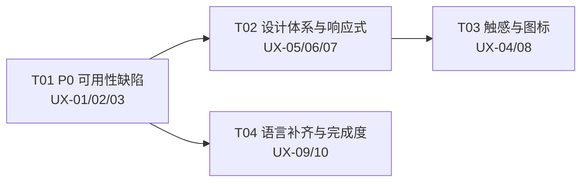
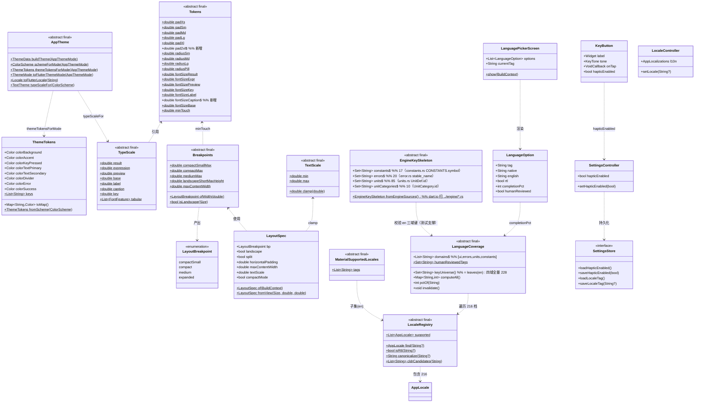
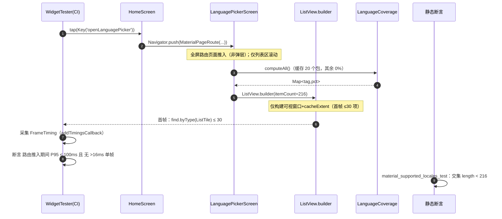
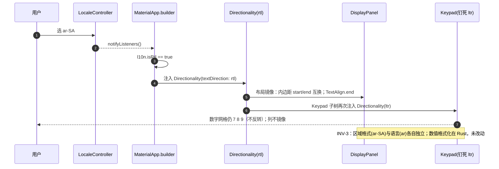

# Calculator-planover 增量架构设计 v3
## 真机反馈整改 · 响应式适配 · 设计体系落地 · 多语言可用性闭环

> 文档类型：**增量架构设计**（不推翻 `docs/ARCHITECTURE.md` 与 `docs/ARCHITECTURE-INCREMENT-v2.md`，仅定义本次整改的分层改动、契约与任务分解）
> 配套基线：`docs/ARCHITECTURE.md`（v1，下称"基线"）、`docs/ARCHITECTURE-INCREMENT-v2.md`（v2，下称"增量架构 v2"）
> 配套需求：`docs/PRD-INCREMENT-v3.md`（v3.0，下称"增量 PRD"）
> 撰写人：高见远（架构师）
> 语言：简体中文

---

## 0. 范围与本次架构影响摘要

### 0.1 一句话结论

**本次为纯 Dart/UI 层 + Android 资源层（res/ + manifest）改动，Rust 引擎零改动。**

### 0.2 `[R]` 条数核实（已逐条核对增量 PRD §8.1）

| 核实项 | 结论 | 证据 |
|---|---|---|
| 增量 PRD §8.1 `[R]` 条数 | **0** | v3 §8.1 表格行：`[R] Rust 本机 \| 0（本次为纯 UI/UX 层整改）` |
| v3 §7「不做」是否含引擎 | **含** | v3 §7：`❌ 不重构 Rust 计算引擎的数值模型` |
| 代码层是否真的不需要动 Rust | **是** | 本次 10 条 UX 需求的落点全部在 Dart（`app/lib`）与 `app/android/**`；数值/格式化语义（`Num`/`format.rs`）不被触碰 |

> **引擎测试基线**：`engine/core` 现有 **293 个测试**（`cargo test -p calculator_core`）必须保持全绿且**不被本增量修改**。本次任何提交都**不得**改动 `engine/**`。
> 若实施过程中发现"必须动 Rust"的点，**必须停下并在 §6 IC 表登记 + 向主理人报备**，理由须写明；本设计目前**未发现**任何此类点。

### 0.3 改动面总览（按缺口类型，承接 v3 §2.3）

| 改动域 | 缺口类型 | 落点 | 对应需求 |
|---|---|---|---|
| i18n 订阅刷新 | 实现 | `app/lib/src/ui/**`（16 处） | UX-01 |
| 语言选择器 + `supportedLocales` | 规范 + 实现 | `app/lib/app.dart`、新建 `ui/screens/language_picker_screen.dart`、`l10n/`、`ui/screens/settings_screen.dart` | UX-02 |
| RTL 接入 | 规范 + 实现 | `app.dart`、`ui/home_screen.dart`、`ui/widgets/keypad.dart` | UX-03 |
| 触感反馈 | 实现 | `ui/widgets/key_button.dart`、`state/`、`storage/`、`ui/screens/settings_screen.dart` | UX-04 |
| 响应式/屏幕适配 | 规范 + 实现 | 新建 `theme/breakpoints.dart`、改 `ui/home_screen.dart`、`state/settings_controller.dart`、`storage/settings_store.dart`（横屏形态偏好） | UX-05 |
| 设计体系 | 规范 + 实现 | `theme/tokens.dart`、`theme/app_theme.dart`、新建 `theme/type_scale.dart` | UX-06 |
| 系统字号 clamp | 规范 + 实现 | `theme/breakpoints.dart`(`LayoutSpec`)、`ui/home_screen.dart` | UX-07 |
| 应用图标 | 规范 | `app/android/app/src/main/res/**` | UX-08 |
| 译文完成度 | 规范 + 实现 | 新建 `l10n/language_coverage.dart`、`ui/screens/language_picker_screen.dart` | UX-09 |
| 语言补齐 20 门 | 实现 | `app/assets/i18n/**`（+17 JSON） | UX-10 |
| **三域翻译 + 覆盖率口径**（本次 P2 补漏） | **规范 + 实现（+补全 3 域叶子）** | 改 `app/assets/i18n/*.json`（**补 `errors`/`units`/`constants` 三域**）、新建 `app/test/support/engine_key_skeleton.dart`、改 `l10n/language_coverage.dart` | UX-09 / UX-10 |

### 0.4 与既有裁决的一致性声明

本设计**完全遵守** v2 的 A1~A6 与 IC-1~IC-10，逐条核对结论：

| 既有裁决 | 本增量是否触碰 | 说明 |
|---|---|---|
| A1 数字/货币格式化在 Rust | 否 | 本次不新增/修改 `set_region_format` 契约 |
| A2 时间/日期在 Dart | 否 | 本次不改 `utils/region_date_format.dart` 语义 |
| A3 语言与区域格式解耦 | **强化** | RTL（UX-03）由**语言**驱动，**不得**由区域格式驱动（见 §3.3 / INV-3） |
| A4 引擎内部语法恒为 `.` | 否 | 键盘 `LTR 钉死`（§3.3）不影响 LC-09 的 `.` 双向映射 |
| A5 15 色 token 集中定义 | 否（**仅新增字号/间距 token**） | 新增 `fontSizeCaption`/`pad2xl` **不进入** `ThemeTokens`，TH-01 不受影响（见 §2.2 / IC-1） |
| A6 Engineer/Simple 模式 | 否 | — |
| IC-9 数值格式化在 Rust（维持 C8） | 否 | — |
| IC-10 语言/区域双独立持久化 | 否 | 语言设置已独立（`LocaleController`）；本次不合并 |

---

## 1. 响应式架构（UX-05 / UX-07）

### 1.1 断点系统的定义位置与形式

**裁决**：**新建 `app/lib/src/theme/breakpoints.dart`**，**不**扩展 `tokens.dart`。

**理由（取舍）**：
- `tokens.dart` 的语义是"**与主题无关的视觉常量**"（间距/圆角/字号/触摸区），而断点/方向/缩放是"**布局策略**"，混入会让 `tokens.dart` 承担两种变化原因；
- v3 §5.1 D-1 要求"字号/间距/圆角/色彩**只能**来自 token"。**`pad2xl` 与 `fontSizeCaption` 仍在 `tokens.dart`（D-1 单一来源）**，`breakpoints.dart` **引用** `Tokens` 而非自造数值；
- 布局类文件（`breakpoints.dart` / `type_scale.dart`）与 `tokens.dart` / `app_theme.dart` 一并列入 §2.4 的"裸值豁免白名单"。

**代码级接口（工程师照此实现）**：

```dart
// app/lib/src/theme/breakpoints.dart
import 'package:flutter/widgets.dart';
import 'tokens.dart';

/// 宽度断点（v3 §4.3）。**一律以 dp（逻辑像素）为准**。
enum LayoutBreakpoint { compactSmall, compact, medium, expanded }

/// 断点常量与判定（纯函数，`[D]` 可直接构造 Size 断言）。
abstract final class Breakpoints {
  static const double compactSmallMax = 360.0; // w < 360
  static const double compactMax      = 600.0; // 360 <= w < 600
  static const double mediumMax       = 840.0; // 600 <= w < 840
  // expanded: w >= 840

  /// 横屏低高度阈值（v3 §4.4：< 480dp 必须分栏）。
  static const double landscapeShortMaxHeight = 480.0;

  /// XL 平板/折叠内屏的最大内容宽度（v3 §4.2 XL：建议 600dp）。
  static const double maxContentWidth = 600.0;

  /// 最小触摸区（复用 token，D-1 单一来源）。
  static const double minTouch = Tokens.minTouch; // 44.0

  static LayoutBreakpoint ofWidth(double w) {
    if (w < compactSmallMax) return LayoutBreakpoint.compactSmall;
    if (w < compactMax) return LayoutBreakpoint.compact;
    if (w < mediumMax) return LayoutBreakpoint.medium;
    return LayoutBreakpoint.expanded;
  }

  static bool isLandscape(Size s) => s.width > s.height;
}

/// 系统字号缩放的上下界（v3 §4.5）。
abstract final class TextScale {
  static const double min = 0.8;
  static const double max = 1.5;
  static double clamp(double v) => v < min ? min : (v > max ? max : v);
}

/// 横屏布局形态（**Q1 用户裁决：两套形态**，替换 v3 §4.4 的"一律强制分栏"）。
enum LandscapeLayout {
  /// 左显示右键盘（4:6）。
  split,

  /// 纵向堆叠（显示 → 表达式 → 键盘），与竖屏同构。
  stacked,
}

/// 由 MediaQuery 派生的**布局规格单例对象**——UI 层**唯一**读取尺寸/断点/缩放的入口。
/// 目的：让 home_screen 不再各自散读 MediaQuery，且让测试可注入（见 §1.5）。
class LayoutSpec {
  const LayoutSpec({
    required this.bp,
    required this.landscape,
    required this.landscapeShort,
    required this.split,
    required this.splitToggleVisible,
    required this.horizontalPadding,
    required this.maxContentWidth,
    required this.textScale,
    required this.compactMode,
  });

  final LayoutBreakpoint bp;
  final bool landscape;

  /// 横屏且可用高度 < 480dp（v3 §4.4 上半区：**强制分栏、无开关**）。
  final bool landscapeShort;

  /// 本次实际渲染形态：`true`=分栏 4:6；`false`=纵向堆叠。判定规则（Q1）：
  /// - 竖屏 → 恒 `false`（堆叠）；
  /// - 横屏 short（h < 480dp）→ 恒 `true`（**强制分栏**，必然溢出，不给开关）；
  /// - 横屏 tall（h ≥ 480dp）→ 由用户偏好 [landscapePref] 决定（默认 `split`）。
  final bool split;

  /// 仅"横屏且高度 ≥ 480dp"时为 `true` —— **该断点下才显示**「分栏/堆叠」切换入口。
  final bool splitToggleVisible;

  /// 页面左右主内边距：compactSmall→padSm(8)，其余→padLg(16)（§4.2）。
  final double horizontalPadding;

  /// 内容最大宽度：bp==expanded 时 = Breakpoints.maxContentWidth，否则 = double.infinity。
  final double maxContentWidth;

  /// 已 clamp 到 [0.8, 1.5] 的系统字号缩放（v3 §4.5）。
  final double textScale;

  /// 超限（textScale==1.5 仍溢出）时的紧凑降级开关（§4.5）。
  final bool compactMode;

  /// 从 BuildContext 派生（生产路径）；[pref] 为用户偏好（持久化，见 §1.6）。
  factory LayoutSpec.of(BuildContext c, {LandscapeLayout? pref}) => LayoutSpec.fromView(
        size: MediaQuery.sizeOf(c),
        devicePixelRatio: MediaQuery.devicePixelRatioOf(c),
        systemTextScale: MediaQuery.textScalerOf(c).scale(1.0),
        landscapePref: pref,
      );

  /// 纯函数派生（测试路径，见 §1.5）。
  factory LayoutSpec.fromView({
    required Size size,
    double devicePixelRatio = 1.0,
    double systemTextScale = 1.0,
    LandscapeLayout? landscapePref, // null → 默认 split（推荐值）
  }) {
    final double w = size.width / devicePixelRatio; // 逻辑 dp
    final double h = size.height / devicePixelRatio;
    final LayoutBreakpoint bp = Breakpoints.ofWidth(w);
    final bool landscape = Breakpoints.isLandscape(size);
    final bool short = landscape && h < Breakpoints.landscapeShortMaxHeight;
    final bool tall = landscape && !short; // 横屏且 h >= 480dp
    final bool split = landscape &&
        (short ||
            (tall &&
                (landscapePref ?? LandscapeLayout.split) == LandscapeLayout.split));
    final double scale = TextScale.clamp(systemTextScale);
    return LayoutSpec(
      bp: bp,
      landscape: landscape,
      landscapeShort: short,
      split: split,
      // 只有"横屏 tall"才给切换入口（Q1）；short 与竖屏均无入口
      splitToggleVisible: tall,
      horizontalPadding:
          bp == LayoutBreakpoint.compactSmall ? Tokens.padSm : Tokens.padLg,
      maxContentWidth:
          bp == LayoutBreakpoint.expanded ? Breakpoints.maxContentWidth : double.infinity,
      textScale: scale,
      // 只有到上限 1.5 且小屏时启用紧凑降级（是否真溢出由 §2 的降级布局兜底）
      compactMode: scale >= TextScale.max && bp == LayoutBreakpoint.compactSmall,
    );
  }
}
```

> **注意 `textScale` 的单一来源**：系统缩放只在 `LayoutSpec` 里被 clamp 一次，UI 层**禁止**再直接读 `MediaQuery.textScaleFactorOf` / `textScalerOf`（否则会双重缩放）。全局 clamp 由 §1.4 的 `MediaQuery` 注入统一施加。

### 1.2 `home_screen.dart` 断点驱动改造（组件树伪代码）

现状（已核实）：`home_screen.dart` 是裸 `Column`，四子节点 `DisplayPanel → ExpressionField → FunctionTabs → Expanded(Keypad)`，**无 `LayoutBuilder` / 无断点 / 无横屏分支 / 无宽度约束**。

改造后**组件树伪代码**（**四态**：竖屏堆叠 / 横屏·强制分栏 / 横屏·可选分栏 / 横屏·可选堆叠，统一由 `LayoutSpec` 驱动）：

```
HomeScreen.build(context):
  pref = Provider.of<SettingsController>(context, listen: true).landscapeLayout  # 持久化偏好(§1.6)，默认 split
  spec = LayoutSpec.of(context, pref: pref)             # §1.1
  l10n = Provider.of<LocaleController>(context, listen: true).l10n   # UX-01 修复后

  appBar = AppBar(title: ...,
    actions: [
      # 切换入口：**仅** spec.splitToggleVisible（横屏 tall）时出现（Q1）；short/竖屏不出现
      if (spec.splitToggleVisible) _SplitStackToggle(pref, settings.setLandscapeLayout),
      settingsIcon, historyIcon,
    ])
  chrome = Scaffold(appBar: appBar, body: SafeArea(child: Focus(...)))

  display   = DisplayPanel(spec)                        # 结果区：对齐方向随 RTL
  expr      = ExpressionField()
  tabs      = FunctionTabs()
  keypad    = Keypad()                                  # 内部钉死 LTR（§3.3）

  if spec.split:                                        # ── 横屏·分栏（short 强制 / tall 可选）──
      body = Row(children: [
        Expanded(flex: 4, child: Column([display, expr, tabs])),   # 显示栏 4
        Expanded(flex: 6, child: keypad),                          # 键盘栏 6（§4.4 4:6）
      ])
  else:                                                 # ── 堆叠（竖屏，或横屏-tall 选堆叠）──
      body = Column([
        display,
        expr,
        tabs,                                           # compactSmall 时 tabs 允许横向滚动（§4.2 S）
        Expanded(child: keypad),
      ])

  # ── XL｜≥600dp 宽度约束（§4.2 XL：内容居中含 maxContentWidth）──
  if spec.maxContentWidth.isFinite:
      body = Center(child: ConstrainedBox(
                 constraints: BoxConstraints(maxWidth: spec.maxContentWidth),
                 child: body))

  # ── 全局内边距（字号 clamp 由 §1.4 的 MaterialApp.builder 统一施加，不在此处）──
  body = Padding(padding: EdgeInsets.symmetric(horizontal: spec.horizontalPadding),
                 child: body)

  return chrome(body: body)
```

> **横屏·堆叠形态的硬约束**：堆叠只在 `h ≥ 480dp` 的横屏出现（short 恒分栏）。**验收要求：横屏 tall 的两种形态在 `h==480` 边界与 `textScale==1.5` 下均无溢出**——这是"允许用户选堆叠"的前提（见 §1.3 与 §7 T02）。

**关键实现约束**：
1. **`LayoutBuilder` vs `MediaQuery`**：优先用 `MediaQuery.sizeOf(context)`（`LayoutSpec.of` 已封装，`SizeOf` 是精确订阅，不订阅无关字段，避免无谓重建）。若担心系统键盘弹起导致高度变化引起横竖切换抖动，可在 `Scaffold.body` 外层再包一层 `LayoutBuilder` 用 `constraints.maxWidth` 复算断点——**本设计允许但不强制**（v3 §4.1 口径中心是"可用宽度"，两者等价）。
2. **`maxContentWidth` 的实现位置**：**统一在 `HomeScreen` 内、`body` 的最终包裹层**（`Center + ConstrainedBox`），**不**下沉到各子组件。理由：单一落点、易于断言 `find.byType(ConstrainedBox)` 的 `maxWidth==600`。
3. **RTL 对齐**：`DisplayPanel` 的结果文本对齐从 `TextAlign.right` 改为 `TextAlign.end`（D-5，见 §2.4/§3.3）；`Row` 的 `flex` 分栏在 RTL 下**自动**左右互换（Flutter 内建），无需手写 `left/right`。
4. **横屏 `flex 4:6` 的落点**：`Row` 子节点 `Expanded(flex:4/6)`，**不写死像素宽**，保证任意宽度下键盘优先满足 44dp 下限（§4.4）。
5. **切换入口落点（Q1）**：放在 `AppBar.actions` 首位（横屏时 AppBar 变矮、横向空间充裕），用 `IconButton` 表达两态（分栏图标 / 堆叠图标），点击即 `settings.setLandscapeLayout(next)` → 持久化 + `notifyListeners` → `LayoutSpec` 重算 → 形态即时切换。**不得**为用户把分栏状态写进 `MediaQuery`。

### 1.3 断点 → 形态映射表（可断言）

| 场景 | 宽度/高度 | 形态 | `split` | `splitToggleVisible` | `horizontalPadding` | `maxContentWidth` |
|---|---|---|---|---|---|---|
| 竖屏 `compactSmall` | w < 360 | 堆叠 | false | false | `padSm`=8 | ∞ |
| 竖屏 `compact` | 360 ≤ w < 600 | 堆叠 | false | false | `padLg`=16 | ∞ |
| 竖屏 `medium` | 600 ≤ w < 840 | 堆叠 + 居中约束 | false | false | `padLg`=16 | **600** |
| 竖屏 `expanded` | w ≥ 840 | 堆叠 + 居中约束 | false | false | `padLg`=16 | **600** |
| **横屏 · short** | 任意 w，**h < 480** | **强制分栏 4:6** | **true** | **false**（无入口） | 按宽度 | 按宽度 |
| **横屏 · tall · 偏好=`split`（默认）** | 任意 w，**h ≥ 480** | 分栏 4:6 | **true** | **true** | 按宽度 | 按宽度 |
| **横屏 · tall · 偏好=`stacked`（用户选）** | 任意 w，**h ≥ 480** | 纵向堆叠 | **false** | **true** | 按宽度 | 按宽度 |

> ⚠️ **方向优先于宽度 + 两套横屏形态（Q1 用户裁决）**：
> 1. 横屏判定用 `landscape`（`w > h`）；**short（h<480）恒强制分栏**，理由不变（低高度下堆叠必然溢出）；
> 2. **tall（h≥480）才给「分栏/堆叠」切换入口**，偏好持久化（§1.6），默认 `split`；
> 3. **堆叠形态必须在 h≥480 下无溢出**——这是"允许用户选堆叠"的**前提条件**，写入 §7 T02 验收；若某档堆叠溢出，须在该档**回退强制分栏**（实现细节由 `LayoutSpec` 兜底：可在 `fromView` 内对"tall+stacked 但预估溢出"再判，若需要则用 `LayoutSpec` 已知的 `textScale`/宽度预留判定）；
> 4. 宽度断点只决定**分栏后**栏宽与是否再加第二窗格（UX-12，P2，本期默认不做）。

### 1.4 字号 clamp 的施加位置（UX-07）

**裁决**：在 `app.dart` 的 `MaterialApp.builder` 里对子树套一层 clamp 后的 `MediaQuery`：

```dart
// app.dart  _ThemedApp.build 内
MaterialApp(
  ...,
  builder: (BuildContext ctx, Widget? child) {
    final MediaQueryData mq = MediaQuery.of(ctx);
    // 1) 字号 clamp [0.8,1.5]（v3 §4.5）
    final TextScaler clamped = TextScaler.linear(TextScale.clamp(mq.textScaler.scale(1.0)));
    // 2) RTL 注入（§3.3）
    final TextDirection dir = locale.l10n.isRtl ? TextDirection.rtl : TextDirection.ltr;
    return MediaQuery(
      data: mq.copyWith(textScaler: clamped),
      child: Directionality(textDirection: dir, child: child!),
    );
  },
)
```

**为什么在这里做（取舍）**：
- `MaterialApp.builder` 是**全应用唯一**穿过的窄腰，一处施加即全局生效（含 `Dialog` 等 overlay——它们由 `MaterialApp` 的 `Navigator` 承载，继承同一 `MediaQuery`；语言页现为**独立路由页面**，同样继承）；
- 只 clamp、不放大，默认 `scale=1.0` 时 `TextScaler.linear(1.0)` 与原状**逐位等价**，不破坏既有 widget 测试（IC-6）；
- `LayoutSpec.textScale` 同样由此派生，二者同源，避免"容器按 1.5 缩放但字号按系统 2.0 渲染"的错配。

### 1.5 多尺寸测试的可测性设计（**让 CI 真能跑五档**）

**问题**：widget 测试默认窗口 800×600，无法覆盖 §4.2 五档 + 横竖屏。

**方案**：新建测试脚手架 `app/test/support/harness.dart`（**放 `test/support/`，不入 `lib/`**，避免污染产物）：

```dart
// app/test/support/harness.dart
/// 把被测 Widget 包进可注入尺寸/缩放/语言/主题的宿主，返回可断言的 Finder 环境。
Future<void> pumpApp(
  WidgetTester tester, {
  required Widget child,
  Size size = const Size(411, 891),      // 默认 6.4" 竖屏（§4.1 参照档）
  double devicePixelRatio = 1.0,
  double textScale = 1.0,                // 系统字号原始值（未 clamp）
  String localeTag = 'en',               // 语言
  AppThemeMode theme = AppThemeMode.system,
  LandscapeLayout? landscapeLayout,      // Q1 横屏形态偏好（null → split）
  LocaleController? locale,              // 可复用同一控制器做切语言断言
  CalculatorController? calculator,
  …
}) async { /* 构造 FakeEngine + MultiProvider + MyApp/定向 Widget */ }

/// 在 §4.2 全部档位（含横竖屏 short/tall）上遍历执行 body —— golden/无溢出断言的统一入口。
Future<void> forEachDeviceClass(
  WidgetTester tester,
  Future<void> Function(WidgetTester, DeviceClass) body,
) async { … }

/// 一档设备（代表设备 + Size）。
class DeviceClass {
  const DeviceClass(this.name, this.size, {this.dpr = 1.0});
  final String name; final Size size; final double dpr;
  /// 内置档位（v3 §4.2 + Q1 两套横屏）：S/M/L/XL 竖屏 + 横屏 short/tall。
  static const List<DeviceClass> all = <DeviceClass>[
    DeviceClass('S', Size(320, 640)),        // < 360
    DeviceClass('M', Size(411, 891)),        // 360–599
    DeviceClass('L', Size(480, 1000)),       // 410–599
    DeviceClass('XL', Size(800, 1280)),      // ≥ 600（平板竖屏）
    DeviceClass('P-short', Size(891, 411)),  // 横屏 h<480 → 强制分栏（无入口）
    DeviceClass('P-tall', Size(1024, 600)),  // 横屏 h≥480 → 可切换（分栏/堆叠）
  ];
}
```

**签名要点**：
- `MediaQueryData(size: size, devicePixelRatio: dpr, textScaler: TextScaler.linear(textScale))` 由 harness 注入，**不再**用 `tester.binding.window.physicalSizeTestValue`（已弃用且不携带 dpr 语义）；
- 语言注入：传入或新建 `LocaleController(loader: 内存 loader)`（**不读 rootBundle**、不碰 FFI，沿用 v2 R3 思路）；
- `forEachDeviceClass` 让"无溢出/触摸区"断言**参数化复用**（见 §7 T02 的 `responsive_test.dart`）。

**可断言的判据（v3 §3.1 UX-05）**：
1. **无溢出**：`tester.takeException()` 中不得含 `RenderFlex overflow`；用 `expect(tester.takeException(), isNot(isA<FlutterError>()))` 兜底，并在 `forEachDeviceClass` 每档各断言一次。
2. **触摸区**：遍历全部可见 `KeyButton`，断言其 `tester.getSize(finder)` 的宽高均 ≥ `Breakpoints.minTouch`（44dp）。
3. **宽度约束**：`XL` 档断言存在 `ConstrainedBox(maxWidth: 600)` 且主内容 `tester.getSize` 宽 ≤ 600。
4. **分栏/堆叠断言**：`P-short` 档断言存在含 `Expanded(flex:4)`/`(flex:6)` 的 `Row`；`P-tall` 档分别以 `landscapeLayout=split`（断言 `Row`）与 `=stacked`（断言纵向 `Column`）验证两形态。
5. **切换入口可见性**：`P-tall` 档断言 `Key('splitStackToggle')` **存在**；`P-short` 与竖屏档断言其**不存在**（Q1）。

### 1.6 横屏形态切换：状态、持久化与入口（Q1）

**新增持久化项（纳入 P1-11 持久化清单）**：

| 项 | 取值 |
|---|---|
| 设置键 | `settings.landscape_layout`（`SharedPreferences`，与既有 `settings.theme_mode` 同风格） |
| 类型 | `LandscapeLayout` 枚举（`split` / `stacked`），字符串落盘（`enum.name`） |
| 默认值 | `split`（推荐；读取失败/无值 → `split`） |
| 归属 | `SettingsStore`（接口 + `SharedPreferencesSettingsStore` + `MemorySettingsStore` **三处各加**一对 `load/saveLandscapeLayout`） |
| 状态 | `SettingsController.landscapeLayout` + `setLandscapeLayout(...)`（落盘 + `notifyListeners`） |

```dart
// settings_store.dart（改）
Future<LandscapeLayout> loadLandscapeLayout();       // 默认 LandscapeLayout.split
Future<void> saveLandscapeLayout(LandscapeLayout v);
// settings_controller.dart（改）
LandscapeLayout get landscapeLayout;                 // 默认 split
Future<void> setLandscapeLayout(LandscapeLayout v);  // 落盘 + notifyListeners
```

**切换入口（**仅** `spec.splitToggleVisible` 即"横屏 tall"下可见）**：`AppBar.actions` **首位**的 `IconButton(key: Key('splitStackToggle'))`，图标两态（分栏 / 堆叠），`onPressed` 在 `split ↔ stacked` 间切换并持久化。**竖屏与横屏 short 下不渲染该按钮**（避免"改了没用"的困惑）。

**工作量影响（回应"评估工作量并在任务列表体现"）**：
- `breakpoints.dart`：`LayoutSpec` 增 `landscapeShort`/`splitToggleVisible` 两字段 + `landscapePref` 入参（**§1.1 规格已给出**）；
- `home_screen.dart`：+1 个 `AppBar.actions` 分支 + 一条 `Row`/`Column` 二选一（形态本就是二选一，增量主要是**入口 UI + 状态读取**）；
- `settings_store.dart` / `settings_controller.dart`：各 +2 方法（机械改动）；
- 测试：`responsive_test.dart` 增 `P-short`（强制分栏、**无**入口）/ `P-tall`×{`split`,`stacked`}（有入口、**两形态均无溢出**）三组断言；`DeviceClass.all` 已含 `P-short`/`P-tall`（§1.5）。
- **净增量**：约 **1 个新状态项 + 1 个入口按钮 + 3 组布局测试**；**归入 T02**（见 §7）。

---

## 2. 设计体系落地架构（UX-06）

### 2.1 `buildTheme` 完整规格

**现状**（已核实 `theme/app_theme.dart`）：`buildTheme()` **只有 3 个字段**（`useMaterial3`/`colorScheme`/`brightness`），无 `textTheme`、无任何组件主题。

**目标规格**（v3 §5.5 的 12 类组件主题全补齐，且满足 D-2"所有主题共用同一套字阶"）：

```dart
// app/lib/src/theme/type_scale.dart  （新建：字阶"单一来源"）
/// 7 级字阶的**固定数值**（v3 §5.2）——与主题无关，所有主题共用。
abstract final class TypeScale {
  // 基准字号（dp）——由 tokens.dart 的 Tokens.fontSize* 提供
  static const double result    = Tokens.fontSizeResult;    // 40
  static const double expression= Tokens.fontSizeExpr;      // 28
  static const double preview   = Tokens.fontSizePreview;   // 22
  static const double base      = Tokens.fontSizeBase;      // 16
  static const double label     = Tokens.fontSizeLabel;     // 14
  static const double caption   = Tokens.fontSizeCaption;   // 12  （新增）
  static const double key       = Tokens.fontSizeKey;       // 22

  // 数字与运算符键用等宽数字（v3 §5.2 验收 4）
  static const List<FontFeature> tabular = <FontFeature>[FontFeature.tabularFigures()];
}

/// 7 级 TextStyle（**仅 color 随主题变，size/weight/height 恒定**）。
TextTheme typeScaleFor(ColorScheme s) => TextTheme(
      displayMedium: TextStyle(fontSize: TypeScale.result,     height: 1.15, fontWeight: FontWeight.w400, color: s.onSurface,   fontFeatures: TypeScale.tabular),
      headlineMedium:TextStyle(fontSize: TypeScale.expression, height: 1.20, fontWeight: FontWeight.w400, color: s.onSurface),
      titleLarge:    TextStyle(fontSize: TypeScale.preview,    height: 1.25, fontWeight: FontWeight.w400, color: s.onSurface),
      bodyLarge:     TextStyle(fontSize: TypeScale.base,       height: 1.40, fontWeight: FontWeight.w400, color: s.onSurface),
      labelLarge:    TextStyle(fontSize: TypeScale.label,      height: 1.40, fontWeight: FontWeight.w500, color: s.onSurfaceVariant),
      bodySmall:     TextStyle(fontSize: TypeScale.caption,    height: 1.40, fontWeight: FontWeight.w400, color: s.onSurfaceVariant),
      // Key(22) 不占 Material 槽位：由 KeyButton 走 AppTextStyles.key（见 §2.2 / IC-7）
    );
```

```dart
// app/lib/src/theme/app_theme.dart  buildTheme 目标签名（结构，不是实现体）
ThemeData buildTheme(AppThemeMode mode) {
  final ColorScheme scheme = schemeForMode(mode);
  final ThemeTokens  t      = ThemeTokens.fromScheme(scheme);   // 15 色 token（A5，不动）
  return ThemeData(
    useMaterial3: true,
    colorScheme: scheme,
    brightness: scheme.brightness,
    textTheme: typeScaleFor(scheme),                            // ①
    elevatedButtonTheme: _buttonFrom(scheme),                   // ②
    filledButtonTheme:   _buttonFrom(scheme),
    outlinedButtonTheme: _outlinedButtonFrom(scheme),
    textButtonTheme:     _textButtonFrom(scheme),
    iconButtonTheme:     _iconButtonFrom(scheme),               // ③ 尺寸 ≥44
    cardTheme:           _cardFrom(scheme),                     // ④ radiusMd
    listTileTheme:       _listTileFrom(scheme),                 // ⑤ 字阶
    dialogTheme:         _dialogFrom(scheme),                   // ⑥ radiusLg
    bottomSheetTheme:    _bottomSheetFrom(scheme),              // ⑦
    appBarTheme:         _appBarFrom(scheme),                   // ⑧ 48dp
    dividerTheme:        _dividerFrom(scheme),                  // ⑨ 1dp + colorDivider
    inputDecorationTheme:_inputFrom(scheme),                    // ⑩
    snackBarTheme:       _snackBarFrom(scheme),                 // ⑫
    // ⑪ 键盘按键主题（项目自定义 KeyButton）不落 ThemeData，由 KeyButton 读 12 类 token +
    //    KeyTone 决定（见 §2.2），并用 [D] 断言三类键（数字/运算/函数）配色取自 token。
  );
}
```

**"所有主题共用同一套字阶、仅色值不同"的保证机制**：
- `TypeScale` 的 `size/weight/height/fontFeatures` 是 **`const` 常量**（编译期固定），`typeScaleFor(scheme)` **只**把 `color` 换成 `scheme.*`；
- 因此 `buildTheme(mode).textTheme.displayMedium.fontSize == 40` 对**任意** `mode` 恒成立 → §2.3 的"字阶唯一性断言"天然可测。

### 2.2 新增 token 的加入方式与 TH-01 兼容性（**关键：不冲突**）

| 新增项 | 加入位置 | 是否触碰 `ThemeTokens` | 对 TH-01 的影响 |
|---|---|---|---|
| `fontSizeCaption = 12.0` | `class Tokens`（`tokens.dart`） | **否** | **无影响** |
| `pad2xl = 32.0` | `class Tokens` | **否** | **无影响** |
| `Key(22)` 复用既有 `fontSizeKey` | 不新增 | **否** | **无影响** |

**为什么确认不冲突（已读代码）**：`app/test/widget/theme_test.dart` 的 TH-01 断言是
```dart
final Map<String, Color> map = themeTokensForMode(mode).toMap();
for (final key in ThemeTokens.keys) expect(map[key], isNotNull);
expect(map.length, 15);                 // ← 只锁"15 个色彩 token"
```
它只遍历 **`ThemeTokens`（色彩）** 与 `ThemeTokens.keys`。本次新增的是 **`Tokens` 里的字号/间距常量**，属**不同类**，`ThemeTokens.keys` 与 `toMap()` **一行不改** → `map.length == 15` 依旧成立。**结论：TH-01 测试零改动、必然通过。**（登记为 IC-1）

**键盘按键主题（第 ⑪ 类）的落地方式**：`KeyButton` 已按 `KeyTone{normal,function,accent,danger}` 取色（现用 `colorScheme` 直接值）。改造为**从 12 个语义 token 派生**：
```dart
// key_button.dart（改：把 colorScheme 直取换成 themeTokensForMode 派生的 token）
Color _background(ThemeData theme, AppThemeMode mode) {
  final ThemeTokens t = themeTokensForMode(mode);
  switch (widget.tone) {
    case KeyTone.normal:   return t.colorKeyBackground;
    case KeyTone.function: return t.colorKeyFunction;
    case KeyTone.accent:   return t.colorKeyOperator;
    case KeyTone.danger:   return t.colorError;
  }
}
```
按压态用 `t.colorKeyPressed`（水波 `splashColor`）；圆角用 `Tokens.radiusMd`。**`[D]` 断点**：三类键（数字/运算/函数）的背景色分别等于 `colorKeyBackground`/`colorKeyOperator`/`colorKeyFunction`。

### 2.3 对比度断言的可实现性（UX-06 / v3 §5.4）

**可实现**：WCAG 对比度是**纯函数**，无需 Flutter 渲染即可在 `flutter test` 断言。

```dart
// app/test/support/contrast.dart
/// WCAG 2.1 相对亮度（sRGB 线性化）。
double _lin(double c) => c <= 0.03928 ? c / 12.92 : _pow((c + 0.055) / 1.055, 2.4);
double relLuminance(Color c) =>
    0.2126 * _lin(c.r) + 0.7152 * _lin(c.g) + 0.0722 * _lin(c.b);

/// 对比度比 (L_light+0.05)/(L_dark+0.05)，恒 ≥ 1。
double contrastRatio(Color fg, Color bg) {
  final double a = relLuminance(fg), b = relLuminance(bg);
  final double hi = a > b ? a : b, lo = a > b ? b : a;
  return (hi + 0.05) / (lo + 0.05);
}
```

**遍历接口与阈值表**（`app/test/unit/contrast_test.dart`）：

```dart
/// (前景, 背景, 阈值, 说明) —— 逐主题遍历断言。
List<ContrastCase> casesFor(ThemeTokens t) => <ContrastCase>[
  ContrastCase(t.colorTextPrimary,   t.colorBackground,         4.5, '正文'),
  ContrastCase(t.colorTextPrimary,   t.colorDisplayBackground,  4.5, '结果显示区正文'),
  ContrastCase(t.colorTextPrimary,   t.colorExpressionBackground,4.5,'表达式区正文'),
  ContrastCase(t.colorTextSecondary, t.colorSurface,            4.5, '次要文本(§5.4 禁透明降灰)'),
  ContrastCase(t.colorKeyText,       t.colorKeyBackground,      4.5, '数字键文本'),
  ContrastCase(t.colorAccent,        t.colorBackground,         3.0, '非文本 UI(accent)'),
  ContrastCase(t.colorDivider,       t.colorBackground,         3.0, '分隔线/边框'),
  ContrastCase(t.colorError,         t.colorBackground,         3.0, '错误态'),
];

test('逐主题对比度达标（§5.4）', () {
  for (final AppThemeMode m in AppThemeMode.values) {
    final ThemeTokens t = themeTokensForMode(m);
    for (final ContrastCase c in casesFor(t)) {
      final double r = contrastRatio(c.fg, c.bg);
      // 高对比主题（IC-8）：正文阈值提为 7:1
      final double th = (m == AppThemeMode.highContrast && c.wcagText) ? 7.0 : c.min;
      expect(r, greaterThanOrEqualTo(th - 1e-6), reason: '$m 对比度不足: $r < $th');
    }
  }
});
```
**取舍**：M3 `fromSeed` 配色**不一定**让所有配对达标（尤其 `colorTextSecondary` vs `colorSurface`、高对比 7:1）。若断言失败，**唯一合法修法**是给对应主题加**显式 token 覆盖函数** `ThemeTokens.overrideFor(mode)`（而非改 `fromScheme` 的通用派生）——见 §2.5 的 `highContrast` 处理与 IC-8。

### 2.4 "UI 层无裸字号/裸间距/裸圆角"的 grep 断言设计（D-1 / D-5）

**可实现性**：`flutter test` 运行在 VM 上，可用 `dart:io` 读取仓库文件。故写成**真测试**而非 CI shell 脚本（更早失败、可本地/CI 同一套）。

**新建 `app/test/unit/style_guard_test.dart`**：

```dart
// 规则（正则）——命中即失败：
final List<_Rule> rules = <_Rule>[
  _Rule('裸字号',   RegExp(r'fontSize\s*:\s*[0-9]'),                      'UI 层禁止裸 fontSize，请用 Tokens.fontSize*'),
  _Rule('裸圆角',   RegExp(r'(BorderRadius|Radius)\.circular\(\s*[0-9]'), '请用 Tokens.radius*'),
  _Rule('裸内边距', RegExp(r'EdgeInsets\.[a-zA-Z]+\(\s*[0-9]'),           '请用 Tokens.pad*'),
  _Rule('裸间距',   RegExp(r'SizedBox\([^)]*\b(width|height)\s*:\s*[0-9.]+'), '请用 Tokens.pad*'),
  // D-5：禁 left/right 语义（服务于 RTL）
  _Rule('LTR 内边距', RegExp(r'EdgeInsets\.(only|fromLTRB)\([^)]*\b(left|right)\s*:' ), '请用 start/end'),
  _Rule('LTR 对齐',   RegExp(r'TextAlign\.(left|right)'),                  '请用 TextAlign.start/end'),
];
```

**允许的例外（豁免白名单 / 误报抑制）**：
1. **按路径豁免**（token 与布局策略的**定义处**天然是唯一允许出现裸值的地方）：
   `lib/src/theme/tokens.dart`、`lib/src/theme/app_theme.dart`、`lib/src/theme/type_scale.dart`、`lib/src/theme/breakpoints.dart`。
2. **按行内联豁免**：源码注释 `// style-guard:ignore <reason>` 出现在命中行**上一行或同行**时跳过该行；用于极少数确需字面量的地方（例如 `Opacity(opacity: 1.0)` 这类非间距数值——实际上 `opacity` 不命中上述规则，此机制仅作兜底）。
3. **数值白名单**：`0` / `0.0` / `1.0`（分割线粗细、`Expanded(flex:)`、`flex` 等）**不**触发（规则已排除纯 `0`，`SizedBox(height:0)` 允许）。
4. **扫描范围**：仅 `lib/src/ui/**/*.dart` + `lib/app.dart`；**不扫** `lib/src/theme/**`、`lib/src/models/**`、`lib/src/state/**`、`test/**`、`android/**`。
5. **误报抑制的"诚实兜底"**：若某规则出现高频误报（如 `EdgeInsets` 里嵌了 token 表达式），测试打印 `文件:行:命中文本`，并在 `reason` 里要求先改 UI 代码或加 `style-guard:ignore`；**禁止**通过放宽正则来"让它绿"（测试注释写明）。

**D-5 的 RTL 无关性另配**：既有的 `EdgeInsets.only(left/right:` 若存在，须改 `start/end:`（与 §3.3 RTL 一并处理）。

### 2.5 高对比主题的 token 来源（IC-8）

**现状**：`highContrast` = `fromSeed(Yellow, dark)`——**不保证** ≥7:1。
**裁决**：为 `highContrast` 增加**显式 token 覆盖表**：
```dart
// app_theme.dart
ThemeTokens themeTokensForMode(AppThemeMode mode) {
  final ThemeTokens base = ThemeTokens.fromScheme(schemeForMode(mode));
  if (mode == AppThemeMode.highContrast) return _highContrastOverride(base);
  return base;
}
ThemeTokens _highContrastOverride(ThemeTokens _) => const ThemeTokens(
  colorBackground: Color(0xFF000000), colorDisplayBackground: Color(0xFF000000),
  colorTextPrimary: Color(0xFFFFFFFF), colorKeyText: Color(0xFFFFFFFF),
  colorAccent: Color(0xFFFFFF00), /* …其余 15 项按 ≥7:1 选定… */);
```
这是对 v2 IC-8"主题由 fromSeed 派生"的**最小例外**，登记 §6 IC-8。**注意**：`themeTokensForMode` 的返回值仍是**完整 15 token**，TH-01 测试不受影响。

---

## 3. i18n 缺陷修复架构（UX-01 / UX-02 / UX-03 / UX-09）

### 3.1 UX-01 订阅修复（16 处，逐处列出）

**根因（已核实）**：`Provider.of<LocaleController>(context, listen: false).l10n` 在**展示文案**处取值 → 该 Widget **不订阅** `LocaleController` 的通知；且这些 Widget 多被 `const` 构造（const 元素不重建），于是语言切换后**文案不刷新**（而 `_LanguageRow` 自身用了 `listen: true` → 表现为"部分文案变、部分不变"）。

**16 处清单（已 grep 实证，行号为准）**：

| # | 文件:行 | Widget | 修法 |
|---|---|---|---|
| 1 | `ui/screens/settings_screen.dart:125` | `_ThemeRow` | `listen: true` |
| 2 | `ui/screens/settings_screen.dart:158` | `_RegionRow` | `listen: true`（**同处 161–162 行的 `listen:false` 保留**——它用于触发 action `region.setRegion(locale.manualTag)`，**合法**） |
| 3 | `ui/screens/settings_screen.dart:227` | `_AngleRow` | `listen: true` |
| 4 | `ui/screens/settings_screen.dart:263` | `_WordSizeRow` | `listen: true` |
| 5 | `ui/screens/settings_screen.dart:290` | `_NotationRow` | `listen: true` |
| 6 | `ui/screens/settings_screen.dart:327` | `_PrecisionModeRow` | `listen: true` |
| 7 | `ui/screens/settings_screen.dart:356` | `_PrecisionRow` | `listen: true` |
| 8 | `ui/screens/settings_screen.dart:379` | `_FractionRow` | `listen: true` |
| 9 | `ui/screens/settings_screen.dart:412` | `_GroupingRow` | `listen: true` |
| 10 | `ui/screens/settings_screen.dart:430` | `_SubmitRow` | `listen: true` |
| 11 | `ui/screens/settings_screen.dart:461` | `_AnsVsMemoryCard` | `listen: true` |
| 12 | `ui/screens/settings_screen.dart:488` | `_ComplexHelpCard` | `listen: true` |
| 13 | `ui/widgets/constants_panel.dart:26` | `ConstantsPanel` | `listen: true` |
| 14 | `ui/widgets/history_sheet.dart:206` | `HistorySheet`（内容构建） | `listen: true` |
| 15 | `ui/widgets/keypad.dart:37` | `Keypad` | `listen: true` |
| 16 | `ui/widgets/memory_sheet.dart:34` | `MemorySheet` | `listen: true` |

**统一改法（选定并说明理由）**：

> **展示文案处：`Provider.of<LocaleController>(context, listen: true).l10n`；触发 action 处：保持 `listen: false`（且**绝不**在其上取 `.l10n`）。**

**为什么选 `listen: true` 而非 `context.select` / `Consumer`**：
1. **与既有约定一致**：`home_screen.dart:31`、`app.dart:88-89`、`settings_screen.dart:35`、`function_tabs.dart:30`、`unit_converter_screen.dart:136`、`preview_line.dart:29` **已经**用 `listen: true`。统一到同一种写法，降低认知与审计成本；
2. **订阅粒度可接受**：`LocaleController` 的通知只是"语言已切换"（低频事件），`l10n` 是整包替换，无部分字段的选择价值 → `context.select` 相对 `listen: true` **无收益**；
3. **`Consumer` 会引入缩进层级**、改变 Widget 树，波及既有 `const` 断言与 golden，**收益为负**；
4. **`listen: true` 能修复"const 子组件不重建"**：订阅是**元素级**（`InheritedWidget` 依赖），即使 Widget 实例是 `const`，收到通知时其 Element 仍会 `markNeedsBuild` 重建。

**必须区分（关键，避免误改）**：`listen:false` 用于**触发 action** 是**合法且正确**的。例如 `_RegionRow` 的 `Provider.of<LocaleController>(context, listen: false)`（第 161–162 行）仅用于取 `locale.manualTag` 传给 `region.setRegion(...)`，**不解引用 `.l10n`** → **保持不动**。

**`[D]` 断言（UX-01）**：
- **静态断言**：新建 `app/test/unit/no_listen_false_l10n_test.dart`，扫描 `lib/**`，要求正则
  `Provider\.of<LocaleController>\([^)]*listen:\s*false[^)]*\)\s*\.l10n` **命中数为 0**。
- **逐屏刷新断言**：新建 `app/test/widget/locale_refresh_test.dart`，用 harness 注入同一 `LocaleController`，`en → zh-CN` 切换后逐屏断言全部展示文案变化（主界面标题、设置页每一行标题、历史抽屉、常量面板、变量面板、键盘语义标签）；再做 `en → zh-CN → en` 往返 3 次断言回到初始态。（批量 4 补 `en → ja` 断言。）

### 3.2 UX-02 卡死修复

#### 3.2.1 `supportedLocales` 收敛为"CLDR 有 `MaterialLocalizations` 数据的交集"

**约束**：本机无 Flutter SDK，**不能用运行时探测 + 手抄**的方式拍脑袋，且不能让 App 每帧去探测 216 次。

**裁决（静态表 + 测试守护）**：新建 `app/lib/src/l10n/material_supported_locales.dart`：

```dart
// app/lib/src/l10n/material_supported_locales.dart（新）
/// `MaterialApp.supportedLocales` 的**权威取值**：`LocaleRegistry.supported` 中
/// **真正有 `GlobalMaterialLocalizations` 数据**的子集（v3 UX-02）。
///
/// 为什么是静态表而不是运行时 216 次探测：
/// 1. 本机无 Flutter SDK，运行时探测的**结果无法在本地复核**，只能盲信；
/// 2. 静态表是"可 review 的 artifact"，且由 [material_supported_locales_test] 在
///    CI 里**重算真交集并断言相等** —— 一旦漂移立刻红，永不静默出错；
/// 3. 运行期零探测、零 `Future`、零抖动（探测本身不是卡死主因，但省掉更稳）。
///
/// ⚠️ 维护方式：只允许通过 CI 失败信息里打印的"期望列表"整体替换本文件。
abstract final class MaterialSupportedLocales {
  /// 交集（BCP-47，与 [AppLocale.tag] 同形）。
  /// 初值由 CI 首次运行 [material_supported_locales_test] 打印的期望列表填入；
  /// 未填前该测试即为红灯（防止"忘了收敛"直接发布）。
  static const List<String> tags = <String>[
    // 'en', 'zh-CN', 'ar', 'de', 'es', 'fr', 'it', 'ja', 'ko', 'nl', 'pl',
    // 'pt', 'ru', 'tr', 'uk', 'vi', 'cs', 'fi', … 由 CI 打印列表后落定
  ];
}
```

**消费方（改 `app.dart`）**：
```dart
supportedLocales: MaterialSupportedLocales.tags
    .map(toFlutterLocale)
    .toList(growable: false),
```

**`[D]` 守护测试**（`app/test/unit/material_supported_locales_test.dart`）：
```dart
test('supportedLocales == CLDR∩GlobalMaterialLocalizations 且 != 216', () {
  final List<Locale> expected = LocaleRegistry.supported
      .map((AppLocale a) => toFlutterLocale(a.tag))
      .where(GlobalMaterialLocalizations.delegate.isSupported)
      .toList(growable: false);

  // 断言 A：静态表已与真交集同步（不一致时 reason 打印期望列表）
  expect(MaterialSupportedLocales.tags.map(toFlutterLocale).toList(), expected,
      reason: '静态表漂移。期望列表 = $expected');

  // 断言 B：收敛后**必须**小于 216（证明确实做了收敛）
  expect(expected.length, lessThan(216));
});
```

#### 3.2.2 **卡死根因判定路径（可 CI 自动化，不靠"改了看看"）**

增量 PRD 给出两个候选根因，本设计用**一条测试同时裁决二者**：

| 候选根因 | 判定方法（`[D]`，可 CI 断言） | 判据 |
|---|---|---|
| **(a) `supportedLocales` 含 216 条（含无 Material 数据的）** | `material_supported_locales_test` 断言 B：交集 `length` | 若 `length == 216` → (a) **不是**根因（所有 locale 都有 Material 数据）；若 `length < 216` → (a) **是**根因之一（选中无数据 locale 时 `GlobalMaterialLocalizations` 解析失败/异常） |
| **(b) `DropdownButton` 一次构建 216 个 `DropdownMenuItem`** | 新建 `app/test/widget/language_picker_perf_test.dart`：① 断言新选择器**首帧构建项 ≤ 30**；② 采集**路由推入动画**期间的帧耗时，断言 **P95 ≤ 100ms 且最大单帧 ≤ 16ms** | 首帧项数用 `find.byType(ListTile)` 计数（`ListView.builder` 懒加载 → 远小于 216）；帧耗时用下述回调 |

**帧耗时采集接口**（`flutter_test` 原生能力，无需新依赖）：
```dart
testWidgets('选择器打开：首帧项 ≤30、P95 帧 ≤100ms、无 >16ms 单帧', (tester) async {
  final frameTimes = <int>[]; // 微秒
  tester.binding.addTimingsCallback((List<FrameTiming> timings) {
    for (final t in timings) frameTimes.add(t.totalSpan.inMicroseconds);
  });
  await pumpApp(tester, child: const HomeScreen());
  await tester.tap(find.byKey(const Key('openLanguagePicker')));
  await tester.pump();                    // 路由推入首帧
  expect(find.byType(ListTile).evaluate().length, lessThanOrEqualTo(30));
  await tester.pumpAndSettle();           // 完成路由推入（MaterialPageRoute ~300ms，多帧）
  final p95 = percentile(frameTimes, 0.95);
  expect(p95, lessThanOrEqualTo(100 * 1000));                 // ≤100ms
  expect(frameTimes.every((us) => us <= 16 * 1000), isTrue);  // 无 >16ms 帧（必要时放宽到 32ms，见 §3.2.3）
});
```

> **取舍与结论**：本设计**同时**消除 (a)(b) 两个候选根因（收敛 `supportedLocales` + 换懒加载选择器），因此**无需在发布前"先复现再定位"**——测试矩阵本身即"判定路径"：(a) 由交集大小裁决，(b) 由首帧项数与帧耗时裁决；二者谁红即谁是根因。这也是对 v3 §2.2"不再靠 `[M]` 蒙"的机械化落实。

#### 3.2.3 语言选择器：**独立全屏路由页面**（UX-02 / Q3 用户裁决）

> **Q3 用户裁决（生效，非"待定"）**：**放弃底部弹层，改为独立全屏页面选择器**（`Navigator.push(MaterialPageRoute)`）。形态对照本项目既有先例 `app/lib/src/ui/screens/unit_converter_screen.dart`（同为"页面 + `MaterialPageRoute`"模式，见该文件 `HomeScreen`/`FunctionTabs` 的 `Navigator.of(context).push(MaterialPageRoute(builder: (_) => const UnitConverterScreen()))` 用法）。
> **落点**：`app/lib/src/ui/screens/language_picker_screen.dart`（从 `ui/widgets/` 移到 `ui/screens/`——它是**页面**，不是 sheet）。

新建 `app/lib/src/ui/screens/language_picker_screen.dart`：

```dart
/// 一档语言的展示模型（含完成度，服务于 UX-09）。**与页面解耦，可独立单测**。
class LanguageOption {
  const LanguageOption({required this.tag, required this.native, required this.english,
      this.rtl = false, this.completionPct = 0, this.humanReviewed = false});
  final String tag; final String native; final String english; final bool rtl;
  final int completionPct;        // 0..100（UX-09）
  final bool humanReviewed;       // 是否有人工校订包
}

/// 全屏语言选择页面（Q3 用户裁决：路由页面，非弹层）。
class LanguagePickerScreen extends StatefulWidget {
  const LanguagePickerScreen({super.key, required this.options, this.currentTag});

  /// 全量 **216** 条（LG-03：清单不缩减；**不得**预先 map 成 Widget）。
  final List<LanguageOption> options;

  /// 当前生效语言标签；`null` = 跟随系统。
  final String? currentTag;

  /// 以路由方式打开，返回 [LanguagePickResult?]（见下方语义）。
  static Future<LanguagePickResult?> show(BuildContext context) =>
      Navigator.of(context).push<LanguagePickResult>(
        MaterialPageRoute<LanguagePickResult>(builder: (_) => LanguagePickerScreen(...)),
      );
}

/// 选择结果（区分"取消"与"选跟随系统"）。
sealed class LanguagePickResult {}
class FollowSystem extends LanguagePickResult {}          // 选中"跟随系统"
class PickedTag extends LanguagePickResult { final String tag; } // 选中某语言
```

**页面语义（路由页面专属设计）**：

| 项 | 设计 | 理由 |
|---|---|---|
| 导航结构 | `Scaffold(appBar: AppBar(title: 语言, /* 自动 back */), body: ...)` | 作为路由页面必须有 AppBar 与返回；`AppBar` 自动带返回箭头 |
| 搜索框位置 | **固定在 `AppBar.bottom`（`PreferredSize` 内）**，不随列表滚动 | 216 项必然长列表；搜索是**必要可用性**（用户不可能滚动找 `zh-CN`）。固定搜索框保证"任意滚动位置都能改查询"，且避免 `SliverAppBar` 折叠逻辑带来的额外测量开销（利于 P95 断言） |
| 滚动 | 仅**列表区**滚动（搜索框固定） | 页面级滚动与"搜索框固定"取舍时，固定搜索框优先（可用性 > 视觉简洁） |
| 返回语义 | `Navigator.pop(context, result)`：**取消/返回键 → 不传值或传 `null`**；选"跟随系统" → `FollowSystem()`；选某语言 → `PickedTag(tag)` | 路由 `push<LanguagePickResult>` 的返回值天然区分：`null` = 用户取消（**不改变当前语言**）；`FollowSystem()` = 显式选跟随系统；`PickedTag` = 选具体语言。`_LanguageRow` 按 `switch` 三态处理 |
| 平板/大屏 | `medium`/`expanded` 断点（§4.3）下：主内容以 `Center + ConstrainedBox(maxWidth: Breakpoints.maxContentWidth)` **居中约束**，列表在宽屏用 **双列网格**（`SliverGridDelegateWithMaxCrossAxisExtent(maxCrossAxisExtent: 360)`）分担横向空间 | 这是**用户选全屏而非弹层的直接收益点**：弹层在平板必然是窄条，全屏页可双列、可居中；与 **UX-12**（≥840dp 双窗格）方向一致——语言页在 `expanded` 下即为"双列"形态的第二窗格雏形 |
| RTL 兼容 | 页面根 `Directionality(textDirection: l10n.isRtl ? rtl : ltr)`；内边距一律 `EdgeInsetsDirectional`/`start-end`（D-5） | 服务 UX-03 |

**⚠️ 实现收敛（复核对齐，**非设计变更**）：`maxContentWidth` 恒取 `Breakpoints.maxContentWidth = 600`**

> **背景**：实现方当前在 `language_picker_screen.dart` 用了 `ConstrainedBox(maxWidth: 720)` + 双列阈值 `constraints.maxWidth >= 600` + `maxCrossAxisExtent: 420`。以下为**复核结论**（Team-Lead 指定核对项）：
> 1. **`maxContentWidth` 保留 600，不采纳 720。** 项目内"最大内容宽度"必须**单一取值**（§2.4 `style_guard` 的精神：禁止裸值/重复语义常量）；T02 已断言"XL 档存在 `ConstrainedBox(maxWidth: 600)`"。若选择器用 720，会出现**两个**"最大内容宽度"（600 与 720），复核必判**不一致**。故实现须把 `720` 改为引用 `Breakpoints.maxContentWidth`。
> 2. **双列阈值 = `Breakpoints.maxContentWidth`（600）**，不得再引入第二个魔法数；即"设备宽度 ≥ 600dp → 双列，否则单列"。
> 3. **列宽 360 vs 420：在内容被钉死 ≤600 的前提下，两者都恰好排成 2 列**（`ceil(600/360)=2`、`ceil(600/420)=2`），**取值不产生差异**。为可断言起见，宽屏**建议直接用 `SliverGridDelegateWithFixedCrossAxisCount(crossAxisCount: 2)`**（确定性、`[D]` 可断言列数 == 2），免去 `maxCrossAxisExtent` 的换算解释。
> 4. **结论：设计取值 600 不变**（不是把 600 改成 720，也不是把 720 改成另一个数——而是**合并到既定的 600**）；`frame` 侧只需把 720/420 换成 `Breakpoints.maxContentWidth` + 固定 2 列。**无返工，无设计变更**。

**必须保留的能力（验收口径不变）**：
1. **可搜索**：`AppBar.bottom` 的 `TextField`（`onChanged` → 过滤 `options`，匹配 `native`/`english`/`tag`，大小写不敏感、子串匹配）；过滤结果**实时**反映到 `itemCount`。
2. **懒加载**：列表用 `ListView.builder`（或 `GridView.builder` 宽屏双列），`itemCount = filtered.length`；**禁止**任何"先把 216 项 `map` 成 Widget 列表"的写法。保证 `cacheExtent` 内构建项 ≤ 30。
3. **首屏构建项 ≤ 30**、**P95 帧 ≤ 100ms 且无 >16ms 单帧**（§3.2.2，口径已按**路由推入动画**校正，见下）。
4. **完成度展示**（UX-09）：每项 `ListTile(title: "$native  ($english)", trailing: Text("$completionPct%"))`；`humanReviewed == false` 时副标题打"未校订"标记（文案走 `l10n.tr('ui.settings.langUnreviewed')`）。
5. **216 档清单不缩减**（LG-03 保持）——页面仍列出全部 216 项，仅换**呈现方式**。

**设置页接线（改 `settings_screen.dart` 的 `_LanguageRow`）**：
```dart
ListTile(
  key: const Key('openLanguagePicker'),                 // 供测试点击（保留）
  title: Text(l10n.tr('ui.settings.language')),
  subtitle: Text(currentLanguageDisplayName),
  trailing: const Icon(Icons.chevron_right),
  onTap: () async {
    final LanguagePickResult? r = await LanguagePickerScreen.show(context);
    switch (r) {
      case null: break;                                  // 取消：不改
      case FollowSystem(): await locale.setLocale(null);  // 跟随系统
      case PickedTag(:final tag): await locale.setLocale(tag);
    }
  },
)
```
> `Key('openLanguagePicker')` 从 `DropdownButton` 迁移到 `ListTile`，测试点击口径不变。

**路由推入动画的帧耗时口径（回应"P95 是否仍可达"）**：断言对象是**每次 `pump` 的帧 `totalSpan`**，而非整个转场总时长。`MaterialPageRoute` 默认转场 ~300ms，由**多帧**组成，每帧目标 ~16.6ms；因此 `P95 帧 ≤ 100ms`（宽松上界）与"无 >16ms 单帧"在此口径下**仍可达**——只要页面构建不做 216 项一次性布局即可。若真机大列表首帧因字体度量偏慢，允许把"无 >16ms 单帧"放宽为"**无 >32ms 单帧**"（对应 30fps 下限）并**在测试 reason 中标注**；`P95 ≤ 100ms` 的硬口径**不变**（PRD 原文口径）。

### 3.3 UX-03 RTL 接入点

**裁决：在 `app.dart` 的 `MaterialApp.builder` 注入一层 `Directionality`（见 §1.4 代码），不去改 `MaterialApp.locale` 语义、也不散落 `Directionality` 到各页面。**

**为什么是 `MaterialApp.builder` 而不是依赖 `MaterialApp` 自动 RTL**：
- **关键原因**：UX-02 把 `supportedLocales` 收敛为 Material 交集后，**31 档 `rtl:true` 语言中不在交集里的那些**（如 `ckb`/`prs`/`ps`/`sd`/`ug`/`ku` 等）会被 `supportedLocales` 排除 → `MaterialApp` 在解析本地化时会**回落到某个 LTR 支持语言** → 其 `WidgetsLocalizations.textDirection` 变 LTR → **这些 RTL 语言就会按 LTR 排版**。因此**必须**由我们自己的 `l10n.isRtl` 显式注入 `Directionality`，才能保证"任意 RTL 语言都镜像"。
- 与 `LocaleController` 联动：`_ThemedApp` 已 `listen: true` 订阅 `LocaleController`（`app.dart:88-89`），`builder` 在其 `build` 内读取 `locale.l10n.isRtl`，语言一变即重建 → 方向即时切换。

**键盘"镜像但数字不反转"的实现（+ IC 澄清 + 架构裁决取代）**：

> ⚠️ **语义澄清（登记 §6 IC-5；PRD UX-03.4 措辞已由本架构裁决取代）**：v3 UX-03 验收 4 同时要求"键盘列顺序镜像"与"数字键面本身不得反转（`1 2 3` 仍为 `1 2 3`）"。**若真的镜像列顺序，`1 2 3` 会变成 `3 2 1`，与后半句自相矛盾。**
> **裁决（主理人已确认采纳）**：**`PRD-INCREMENT-v3.md` UX-03.4 的"键盘列顺序镜像"措辞作废，以本裁决为准——键盘整体钉死 `TextDirection.ltr`（不镜像数字网格）。**"镜像"由**整体布局层**承担（`Row` 分栏左右互换、结果区 `TextAlign.end`、内边距 `start/end`），这是计算器品类的通行做法，也满足"数字不反转"的硬要求。
> **对 PRD 的溯及**：UX-03.4 的**其余四条**（接入消费方 / 方向断言 / 布局镜像 / 无异常）**保持不变**；仅第 4 条的"列镜像"半句被取代。

实现：`Keypad.build` 的最外层 `Column` 外包一层 `Directionality(textDirection: TextDirection.ltr, child: ...)`；同时对 `Text(label)` 明确 `textAlign: TextAlign.center` 即可。

**`[D]` 断言（UX-03）**：
1. **消费方存在**：静态断言 `grep isRtl` 在 `lib/**` 的命中 ≥ 1（`app.dart` 的 `Directionality` 注入即为消费点）。
2. **方向断言**：选 `ar-SA` 时 `Directionality.of(rootFinder)` 为 `rtl`；选 `en` 时为 `ltr`。
3. **布局镜像断言**：显示区对齐在 RTL 下为 `TextAlign.end` 语义（渲染后在右侧起、左侧对齐翻转）；`Row(flex 4:6)` 分栏在 RTL 下两栏左右互换。
4. **键盘不反转断言**：RTL 下，`Keypad` 子树 `Directionality.of` 为 `ltr`；数字行按视觉顺序读取仍为 `7,8,9`（用 `tester.getTopLeft`/`getTopRight` 比较 x 坐标排序断言）。
5. **无异常**：LTR↔RTL 切换后 `tester.takeException()` 为空、无 `RenderFlex overflow`。

### 3.4 UX-09 译文完成度计算

> **⚠️ 口径修正（P2 补漏，登记 §6 IC-16）**：旧口径 `|presentLeaves| / |leaves(en)|` **只在 `ui.*` 域有意义**——因为 `en`/`zh-CN`/`zh-TW` 三个基础包当前**只填了 `ui.*`（106 叶），`errors`/`units`/`constants` 三域均为空 `{}`**。后果：① 三域**零翻译**被掩盖——20 门语言只要补齐 106 个 `ui.*` 就算"100%"，而 `constantName`/`unitName`/`errorText` 在 `en`/`ja`/… 下**全部回落到引擎中文**（正是用户投诉的"没适配"）；② `zh` 之所以"看起来对"，纯粹是**引擎回落恰好是中文**的巧合。**修正口径见下（覆盖全部四域）**。

新建 `app/lib/src/l10n/language_coverage.dart`：

```dart
/// 译文完成度服务：对 216 档逐档计算 key 覆盖率（UX-09 / LG-04）。
///
/// **口径（修正后，四域全量）**：
///   KEY_UNIVERSE = leaves(en) 的**全部叶子**（`ui` + `errors` + `units` + `constants`）
///   completionPct(tag) = |{ k ∈ KEY_UNIVERSE : value(tag,k) 存在且非空 }| / |KEY_UNIVERSE| * 100
///
/// 三条边界规则（防"分母漏域"再次造成失明）：
///  1. **分母 = en 的完整叶子集（四域）**，不再只数 `ui.*`；en 缺某域的 key ⇒ 该 key **不属于**全集
///     （既不计分子也不计分母）——但**由 §4.2.1「键骨架校验」单独判红**，所以"en 缺域"不会被静默吞掉。
///  2. "present" = 精确包中该叶子**存在且非空**；无语言包文件的档 = 0%。
///  3. `zh-CN` 可复用引擎中文文案，但必须**显式落盘**（不依赖回落）——否则覆盖率会把它算成"缺失"，
///     且口径不统一（见 §4.1「为什么三域也必须显式落盘」）。
abstract final class LanguageCoverage {
  /// 已人工校订的语言（与 §4.3 的 20 门对齐；其余为"未校订"）。
  static const Set<String> humanReviewedTags = <String>{
    'en', 'zh-CN', 'zh-TW',
    'ja', 'ko', 'de', 'fr', 'es', 'pt-BR', 'ru',           // 批1（Q7）
    'pt-PT', 'it', 'nl', 'pl', 'tr', 'uk', 'vi', 'ar', 'cs', 'fi', // 批2（Q7）
  };

  /// 计算全部 216 档完成度；**只对存在的语言包**读 `rootBundle`，其余直接 0。
  /// 结果在首算后缓存于内存（`_cache`），设置页多次重建不重复 IO。
  static Future<Map<String, int>> computeAll();

  /// 单档查询（命中缓存；未算过返回 null，调用方 await computeAll 后再取）。
  static int? pctOf(String tag);

  /// 刷新（语言包热更/测试用）。
  static void invalidate();
}
```

**与 216 档清单的关系**：完成度是挂在**每个 `AppLocale`** 上的**装饰数据**（被转为 §3.2.3 的 `LanguageOption`），清单本身（`LocaleRegistry.supported`，216 条）**不增不减**。**缓存策略**：设置页首次打开时 `await computeAll()`（最多读 20 个 JSON，`AppLocalizations._cache` 已有二级缓存），此后同步取。

**`[D]` 断言**：对 20 门校对语言断言 `pctOf(tag) ≥ 99`；对无包语言断言 `pctOf(tag) == 0` 且 `humanReviewed == false`；设置页断言"未校订"标记出现。
**新增（口径回归）**：断言 `KEY_UNIVERSE` **四域齐备**（`errors`/`units`/`constants` 各自非空，且 `|KEY_UNIVERSE| == |leaves(en)|`）；并断言"**只填 `ui.*` 的语言包 pct < 60**"（三域 122 叶约占全集 53%，漏域即无法过 99% 闸）——此断言**直接钉死旧口径漏洞**。

---

## 4. 语言包工程方案（UX-10）

### 4.1 组织与命名

- **路径**：`app/assets/i18n/<tag>.json`，`<tag>` **与 `AppLocale.tag` 逐字节相同**（BCP-47，如 `pt-BR`/`zh-TW`/`pt-PT`）。加载器 `AppLocalizations.load` 已按 `LocaleRegistry.canonicalize(tag)` → `assets/i18n/<resolved>.json`，**无需改加载器**。
- **与 `locale_registry.dart` 的对应关系**：
  - `locale_registry.dart` 的 **216 条清单保持不动**（LG-03）；
  - 新增的 17 个语言包文件，其 tag 必须能在 `LocaleRegistry.find(tag) != null`（`[D]` 断言：每个包 tag ∈ 216 清单）；
  - `canonicalize` 已保证"选 `ja-JP` 也能命中 `ja.json`"（语言级回落）。
- **每个 JSON 结构**：与 `en.json` **完全同构**（**四域顶层**：`ui` / `errors` / `units` / `constants`），叶子 key 集合一致。
  > **现状纠偏**：旧基线里 `errors`/`units`/`constants` 三域均为**空对象 `{}`**（106 叶全部在 `ui.*`）。**本次必须把三域补齐到全部 20 门**（见 §4.1.1）。
- **为什么三域也必须"显式落盘"（不能只靠回落）**：`AppLocalizations` 三层兜底为 `精确包 → en → 调用方原文`；而 `constantName/unitName/errorText` 的"调用方原文"= **引擎给的中文**。故：
  - 对 `en`/`ja`/… 任何**非中文**界面，三域回落 = 显示**中文**（正是用户投诉的"没适配"）；
  - 对 `zh-CN`，回落恰为中文 → "看起来没错"，但**未落盘**既会被覆盖率判为缺失，也无法润色、无法与 `zh-TW` 繁体区分。
  **结论：三域文本一律显式写进各语言包**；`zh-CN` 可复用引擎中文串，但**必须落盘**。

#### 4.1.1 `en` 三域键骨架：来源 = **引擎公开列表**（非手列）

**原则**：`en.json` 的 `errors`/`units`/`constants` 三域**键名不得手写**，必须由引擎的公开枚举**派生**；`en` 提供**英文文本**作为全 20 门的翻译源（也是第三层兜底的"英文化"来源）。

**枚举来源（三个源文件，均为引擎既有 `pub` 接口，零改动）**：

| 域 | 键前缀 | 枚举来源（`engine/core/src/`） | 公开列表 | 键的取值 |
|---|---|---|---|---|
| `constants` | `constants.<symbol>` | `constants.rs`：`pub static CONSTANTS: &[ConstantDef]` / `pub fn all()`；取 `ConstantDef.symbol` | **17 项** | `π` `e` `φ` `τ` `c` `h` `ħ` `G` `N_A` `R` `e_c` `ε₀` `m_e` `m_p` `g` `k_B` `atm` |
| `errors` | `errors.<stable_name>` | `error.rs`：`ErrorKind::stable_name()`（`match` 的 snake_case 分支） | **20 项** | `unexpected_character` … `internal_error`（1000~5002 共 20 码） |
| `units` | `units.<id>` | `units.rs`：`UnitCategory::all()`（10 类）× `UnitDef.id` | **85 项** | 10 类合计 85 个单位 id（`nm` `m` `inch` … `kib` `btu`） |
| `unit_categories`（**建议新增**） | `unit_categories.<id>` | `units.rs`：`UnitCategory::id()` | **10 项** | `length` `mass` `temperature` `time` `area` `volume` `data_storage` `speed` `pressure` `energy` |

> **`unit_categories` 为什么建议一并补**：`unit_converter_screen.dart` 的类别页签现渲染 `Tab(text: c.name)`（**引擎中文**，见该文件 `_categories.map((c) => Tab(text: c.name))`），是**同一类"静默回落"漏点**；三域修一次，顺手把类别名也纳入（增量仅 10 键）。

**键的命名规则（与现有 `tr()` 拼接**逐字**一致，无需改 Dart 访问器）**：
- `constantName(symbol, engineName)` → `tr('constants.$symbol')`；
- `unitName(id, engineName)` → `tr('units.$id')`；
- `errorText(kind, engineMessage)` → `tr('errors.$kind')`（`kind` = `ErrorKind::stable_name()`）。
三处**均已存在**（`app_localizations.dart`），本次**不改签名**，只把三域内容填进 JSON。类别名若纳入，新增 `unitCategoryName(id, engineName) → tr('unit_categories.$id')`。

**规模估算**：三域新增 `17 + 20 + 85 = 122` 叶（含类别名 `132` 叶）；`en` 全集 `106 + 122 = 228` 叶（含类别名 `238`）。**三域占全集约 53%**——这正是旧口径"失明"的量级。

### 4.2 覆盖率 / key 集合 / 占位符的自动化校验（`[D]`）

新建 `app/test/unit/i18n_parity_test.dart`，**参数化** + **防漏 key**：

```dart
const List<String> kTargetTags = <String>[
  'en','zh-CN','zh-TW',                                    // P0
  'ja','ko','de','fr','es','pt-BR','ru',                   // P1 批1
  'pt-PT','it','nl','pl','tr','uk','vi','ar','cs','fi',    // P1 批2
];

/// 递归把嵌套 map 拍成 `a.b.c -> 叶子值` 的扁平表（只收 String 叶子）。
Map<String, String> flatten(Map<String, dynamic> m, [String p = '']) { … }

void main() {
  late Map<String, String> en;
  setUpAll(() async { en = flatten(await loadRaw('en')); });

  test('20 门语言包齐备（UX-10.1）', () async {
    for (final tag in kTargetTags) {
      expect(await assetExists('assets/i18n/$tag.json'), isTrue, reason: '缺 $tag.json');
    }
    expect(kTargetTags.toSet().length, 20);
  });

  for (final tag in kTargetTags) {
    group('$tag', () {
      test('key 集合 == en（LG-07，含多余 key 也为错）', () async {
        final m = flatten(await loadRaw(tag));
        expect(m.keys.toSet(), en.keys.toSet(), reason: '缺: ${en.keys.toSet().difference(m.keys.toSet())}');
      });
      test('覆盖率 ≥ 99%（UX-10.2）', () async {
        final m = flatten(await loadRaw(tag));
        final present = en.keys.where((k) => (m[k] ?? '').isNotEmpty).length;
        expect(present / en.length, greaterThanOrEqualTo(0.99));
      });
      test('占位符 {n} 一致（LG-08）', () async {
        final m = flatten(await loadRaw(tag));
        for (final k in en.keys) {
          final a = RegExp(r'\{[^}]+\}').allMatches(en[k]!).map((x) => x.group(0)).toList();
          final b = RegExp(r'\{[^}]+\}').allMatches(m[k] ?? '').map((x) => x.group(0)).toList();
          expect(b, a, reason: '$tag/$k 占位符不一致');
        }
      });
    });
  }
}
```

**"防止漏 key"的三重保险**：
1. **key 集合双向相等**（不只查"en 有而目标缺"，也查"目标多余"）；
2. **`flatten` 只收叶子**并断言**叶子总数 == en 的叶子数**（防止翻译时把某个中间节点误写成字符串、导致整棵子树丢失）；
3. **新增 key 必须同时补全 20 门**：CI 无法阻止"开发者在 en 加 key 但忘了补"，但上面的"key 集合相等"会在**下一次 CI** 立刻对 19 门报红 → 强制同步。

> **现状基线（已实测）**：`en/zh-CN/zh-TW` 各 **106 个叶子 key**（120 含中间节点），三者 key 集合完全一致（缺失 0 / 多余 0）——**但 106 叶全部落在 `ui.*`；`errors`/`units`/`constants` 三域均为空 `{}`**（见 §4.1.1 规模表）。
> **本次目标基线**：每门 **228 叶**（`106 ui + 122 三域`，含类别名 `238`）。20 门的**唯一"真源"** = `en.json` 的**全量 228 叶**。参数化测试的 `key 集合 == en` / `覆盖率 ≥99%` 在**新基线**下继续成立（分母自动变为 228）。

**三重保险之上再加一道「键骨架校验」（回应 P2 口径漏洞）**：上面的"key 集合 == en"只能保证**各语言跟着 en 走**，**无法发现"en 本身缺域"**（若 `en.json` 的 `constants` 域漏了 3 个符号，则 20 门一起漏，key 集合仍"相等"→ 全绿）。故**必须**把 `en` 的三域键与**引擎实际列表**对齐。

#### 4.2.1 键骨架校验测试（`en` 三域键 == 引擎实际列表）

新建 `app/test/support/engine_key_skeleton.dart`（**测试支撑，非生产代码**）：
- **能力**：用 `dart:io` **读取引擎源文件**（`../engine/core/src/{constants,units,error}.rs`）→ 正则提取 → 得到引擎**当前**的三域键集。**不调用 FFI、不改 Rust、不依赖原生库**（与既有 `icon_asset_test.dart` 读 `../android/...` 同模式）。
- **正则（三域，逐字对应 §4.1.1 的枚举来源）**：
  ```dart
  // constants.rs → 17 个 symbol
  RegExp(r'ConstantDef\s*\{[^}]*?symbol:\s*"([^"]+)"', dotAll: true)
  // units.rs → 85 个 UnitDef.id（+ 10 个 UnitCategory::* => "id"）
  RegExp(r'UnitDef\s*\{\s*id:\s*"([^"]+)"')
  // error.rs → 20 个 stable_name（**先截取 `fn stable_name` 到下一个 `fn` 之间的函数体**再匹配，
  // 以免命中 default_message 的分支；`[a-z]` 首字符天然排除中文默认文案）
  RegExp(r'=>\s*"([a-z][a-z0-9_]*)"')
  ```
- **导出**：`EngineKeySkeleton.constants` / `.errors` / `.units`（`Set<String>`），并在解析失败/数量异常时**直接 `fail`**（避免"正则失配 → 空集 → 误判达标"）。

新建/并入 `app/test/unit/i18n_parity_test.dart` 的**断言形式（核心）**：

| # | 断言 | 形式 | 失败含义 |
|---|---|---|---|
| **S1** | `en` 三域键 == 引擎键 | `expect(enDomainKeys('constants'), EngineKeySkeleton.constants, reason: 'en.constants 与引擎 CONSTANTS 不一致(缺/多)')`（`errors`/`units` 同理） | en 漏翻/多翻某个常量·单位·错误码 |
| **S2** | 各门三域键 == 引擎键（参数化） | 对 20 门循环同 S1 | 某语言漏某域条目 |
| **S3** | 三域规模钉死 | `expect(EngineKeySkeleton.constants.length, 17); … .errors.length, 20); … .units.length, 85)` | 引擎新增常量/单位/错误码 → **强制**同步骨架 + 20 门翻译 |
| **S4** | 全域名非空（防"分母漏域"） | `expect(en['errors'], isNotEmpty); en['units']…; en['constants']…` | en 某域退回 `{}`（旧 bug 复现即红） |

> **为什么 S1~S3 是"引擎实际列表"而非手列**：期望值**在测试运行时从引擎源文件派生**；引擎一改（如 `error.rs` 新增 `ErrorKind`），S3 立刻红 → 逼"骨架 + 20 门"同步。这比"维护一份手写 key 清单"更抗漂移，且**零 Rust 改动、零新增依赖、CI 可判**。
> **备选（更高保真，可选）**：在**原生/集成测试道**（dylib 可用时）用既有 `dispatch` 桥拉 `constants.list`/`units.categories`/错误码表，断言 `== EngineKeySkeleton.*`；dylib 缺失时**显式 skip 并注明 reason**（绝不静默绿）。**主选仍是 S1~S3 的源文件扫描**（无原生依赖，纯 CI 可跑）。

### 4.3 分批交付（Q7）

| 批次 | 语言 | 门数 | 依赖 | 过闸条件 |
|---|---|---|---|---|
| **批1** | `en`,`zh-CN`,`zh-TW`（P0） + `ja`,`ko`,`de`,`fr`,`es`,`pt-BR`,`ru` | 10 | 无（en/zh 已在） | 先跑通"覆盖率 ≥99% + key/占位符一致"流水线 |
| **批2** | `pt-PT`,`it`,`nl`,`pl`,`tr`,`uk`,`vi`,`ar`,`cs`,`fi` | 10 | 批1 流水线通过 | 复用同一参数化测试，零框架改动 |

> **`ko` 必含**（原版缺失，作为"更完整"证据，v3 UX-10.5）。`ar` 承载 RTL 主验收样本（v3 §6.1 C20，与 UX-03 一并断言）。
> **工作量口径（含三域，见 §4.1.1）**：每门目标 **228 叶**（原仅 `ui.*` 106 叶）。三域给每门新增 122 叶 → 20 门合计 **+2440 叶**，相对仅 `ui` 的 2120 叶，翻译量 ≈ **×2.15**。其中 **`en` 必须全英文、`zh-CN` 简体（可复用引擎中文但须落盘）、`zh-TW` 繁體**——**即便 P0 三门，三域也必须补齐**（旧基线三门三域皆空）。

### 4.4 N5 净室约束（语言译文不得复制原版）

- **译文来源与组织**：采用**机器初翻 + 团队人工抽检（≥3 门）**（Q8）；译文**由本项目自行组织**，**严禁**取用 Calculator++ 的任何 `strings.xml`/`values-*/`；
- **可追溯性**：新建 `docs/i18n/SOURCE.md`，逐语言记录：① 生成方式（机器初翻）、② 抽检负责项、③ "未使用原版资源"声明；
- **无自动检测**：N5 属**人工/流程约束**，CI 不声称能自动检测抄袭；本设计以"来源文档 + 声明"承担，真机观感由 `[M]` 收口（v3 §8.2）。

---

## 5. 图标资源方案（UX-08）

### 5.1 矢量 vs 多密度 PNG 的取舍

**现状**（已核实）：`res/` 下只有 `drawable/ic_launcher_foreground.xml`（431 字节手写 `E` 形矢量）、`drawable/ic_launcher_background.xml`、`mipmap-anydpi-v26/ic_launcher.xml`（**仅 background+foreground，无 `monochrome`**）；**无任何 `mipmap-*dpi`**。

**裁决：纯矢量自适应图标方案，不生成 PNG。**

**理由（取舍）**：
1. **`minSdk = 26`**（已核实 manifest/gradle 口径）→ **`mipmap-anydpi-v26` 自适应图标对 26+ 设备 100% 生效**，系统按需在**任意密度**栅格化矢量 → **不会模糊**，PNG 多密度集对本项目**无实际收益**；
2. 本机**无任何图片渲染工具链**，生成 5 档 PNG 需引入 SVG 栅格化依赖（违反"尽量少加依赖"）或 CI 外部工具；而 v3 §3.2 UX-08.2 **明确允许**"或矢量方案 + `[M]` 在 5 档密度设备无模糊"；
3. 矢量方案令"**换符号成本最低**"（见 §5.3），正合 Q2 尚未拍板的需要。

### 5.2 文件清单

| 文件 | 动作 | 内容 |
|---|---|---|
| `res/drawable/ic_launcher_foreground.xml` | **改（原创重画）** | 108×108 viewport；主体为**单运算符符号**（默认 `∑`，见 §5.3）；内容**完整落在 72dp 安全区**（即 [18, 90]） |
| `res/drawable/ic_launcher_background.xml` | 改 | 纯色/双色渐变底（原创，与前景对比 ≥3:1） |
| `res/drawable/ic_launcher_monochrome.xml` | **新增** | 单色（`#FFFFFF`）同形前景层（Android 13+ 主题图标，UX-13 前置） |
| `res/mipmap-anydpi-v26/ic_launcher.xml` | 改 | `<adaptive-icon>` **含 `background` + `foreground` + `monochrome`** 三层 |
| `app/assets/icons/app_icon.svg` | 新增（设计源） | 108dp 主稿，标注 72dp 安全区（设计交付物，不打包） |
| `tools/set_icon_glyph.py` | 新增 | 从 `{sum,pi,equals}` 字形表**替换单一 `pathData`**，同步改 foreground + monochrome（§5.3） |

> **不做**：不复制原版图标/资源（N5）；不引入图标字体/在线图标（v3 §7）。

### 5.3 "换符号成本低"的实现方式（服务 Q2 待拍板）

- **符号隔离**：前景矢量把主体**只放一个 `<path android:pathData="…">`**，且置于固定的 `<group android:translateX/Y>`（保证 72dp 安全区居中）；背景与安全区布局**与符号解耦**；
- **字形表**：`tools/set_icon_glyph.py` 内维护
  ```python
  GLYPHS = {"sum": "M…", "pi": "M…", "equals": "M…"}   # 每个都是合法 pathData
  ```
  执行 `python tools/set_icon_glyph.py pi` 即把 foreground + monochrome 两处的 `pathData` 换成 π；
- **成本**：换符号 = **1 条命令改 2 个文件的一行**，无需重画安全区/背景。**Q2 一旦用户拍板，零返工**。

### 5.4 `[C]` 校验（CI 可断言）

新建 `app/test/unit/icon_asset_test.dart`（`dart:io` 读 `../android/...`）：
1. **Structure**：`mipmap-anydpi-v26/ic_launcher.xml` 文本含 `adaptive-icon`、`background`、`foreground`、**`monochrome`**；
2. **安全区**：解析 `ic_launcher_foreground.xml` 的 `viewportWidth/Height == 108`，且主体 `pathData` 的坐标包围盒 ⊆ [18, 90]（**72dp 安全区**，v3 §5.7）；解析失败/越界 → 红；
3. **可辨识**：断言 48dp 显示下最小笔画 ≥ 2dp（源稿 108dp 下笔画 ≥ 4.5dp，`pathData` 描边宽度换算）——以**常量断言**形式固化在测试注释与阈值里；
4. **密度**：断言"矢量方案"成立（无 `mipmap-*-dpi` 目录），并在 `reason` 中声明"依据 minSdk 26 + 自适应图标"，与 v3 UX-08.2 的允许分支对齐。

---

## 6. 冲突登记表（IC 表）

> 凡与既有裁决/契约可能冲突之处，**以本表为准**。工程师发现疑似矛盾先读本表。

| # | 冲突点 | 既有内容 | 本次裁决 | 影响文件 | 理由 / 处置 |
|---|---|---|---|---|---|
| **IC-1** | **新增字号 token 是否破坏 TH-01** | `theme_test.dart` 断言 `ThemeTokens` 的 `map.length == 15`（15 个**色彩** token） | **不冲突**。`fontSizeCaption`/`pad2xl` 加入 **`class Tokens`**（字号/间距），**不进** `ThemeTokens`；`ThemeTokens.keys`/`toMap()` 一行不改 | `tokens.dart`（仅新增常量） | 二者是**不同类**；`map.length==15` 恒成立。**TH-01 测试零改动** |
| **IC-2** | **补齐语言包破坏"回落英文"回归测试** | `app_localizations_assets_test.dart` 断言 `load('fr')` 回落 `en`、`tr('ui.settings.title')=='Settings'` | 批1 交付 `fr.json` 后该断言**必然失败** → **必须**把"回落样例"从 `fr` 换成一个**无语言包的语言**（如 `sw`/`am`） | `app/test/unit/app_localizations_assets_test.dart` | 改的是**测试样例**，不是行为；兜底语义（精确包缺失→en）保持不变 |
| **IC-3** | **`supportedLocales` 收敛 vs LG-03"216 档不缩减"** | LG-03：语言清单 ≥ 216 | **不冲突但需澄清**：`LocaleRegistry.supported`（**216 条清单**）**保持不动**；被收敛的是 **`MaterialApp.supportedLocales`**（另一个 artifact） | `app.dart`、新建 `material_supported_locales.dart` | LG-03 约束的是"清单/选择器条目"，**不是** Flutter 的 `supportedLocales` 参数。选择器仍列 216（§3.2.3） |
| **IC-4** | **换语言选择器（`DropdownButton`→全屏页面）是否破坏既有测试** | 既有 widget 测试：`expression_field/keypad/memory/region/submit/theme/history_marker` | **无冲突**；需确保 `region_test.dart`（测控制器）与任何 `DropdownButton` 断言不受影响 | `settings_screen.dart`、新建 `ui/screens/language_picker_screen.dart` | **核对方式（供复核）**：① `ls app/test/widget app/test/unit` 枚举全部测试文件（**无** `settings_screen_test.dart`）；② `grep -rn "DropdownButton\|_LanguageRow\|settings_screen" app/test` **命中 0**；③ `region_test.dart` 仅 `import region_format_controller.dart`、不 pump 设置页 → 与 `_LanguageRow` 零耦合 |
| **IC-5** | **RTL 是否影响区域格式测试 / 键盘测试** | `region_test.dart`（控制器）、`keypad_test.dart`（键位与顺序） | **需处置**：① `region_test` 测的是控制器（无 UI），**不受 RTL 影响**；② `keypad_test` 断言数字顺序 → **键盘子树钉死 `ltr`**（§3.3） | `keypad.dart` | 见 §3.3：**键盘整体 LTR**；**PRD UX-03.4「键盘列顺序镜像」措辞已由本裁决取代**（主理人确认），避免数字反转、保护既有测试 |
| **IC-6** | **字号 clamp 是否影响既有 widget 测试** | 既有测试默认 `textScale=1.0` | **无冲突**：`TextScale.clamp(1.0)==1.0`，`TextScaler.linear(1.0)` 与原状态逐位等价 | `app.dart` | 只 clamp、只在 `MaterialApp.builder` 一处施加，避免双重缩放 |
| **IC-7** | **PRD §5.2 标题写"6 级"但表列 7 行** | UX-06 验收："`textTheme` 的 **6 级**字号" | **定义为 7 个 token**；其中 **6 级**映射进 Material `textTheme`，第 7 级 `Key(22)` 由**组件主题**（`KeyButton`）消费 | `type_scale.dart`、`key_button.dart` | 消除 PRD 自身措辞不一致；"字阶唯一性断言"覆盖**全部 7 值** |
| **IC-8** | **高对比主题 ≥7:1 vs "全主题 fromSeed"** | v2 IC-8：主题由 `ColorScheme.fromSeed` 派生 | **最小例外**：`highContrast` 用**显式 15 token 覆盖表**（`_highContrastOverride`），仍返回完整 15 token | `app_theme.dart` | `fromSeed` 不保证 7:1；覆盖表是唯一能让 §5.4 断言达标的方式，且不破坏 TH-01 |
| **IC-9** | **触感是否影响 `keypad_test`** | `keypad_test` 用 `tester.tap` 驱动 | **无冲突**：`HapticFeedback` 在测试环境是 no-op，但**计入平台通道调用**（可断言次数 == 点击数） | `key_button.dart`、新建 `haptic_test.dart` | 需保证"关闭开关后零调用"，见 §7 T03 |
| **IC-10** | **RTL 是否影响 LC-09 小数点双向映射 / INV-3** | v2 A4/LC-09、v3 §6.2 INV-3 | **无冲突**：RTL 只改**布局方向**，不改**数值/分隔符**（数字始终 LTR、格式由区域决定） | `keypad.dart`、`app.dart` | INV-3（RTL 区域 + LTR 语言，或反之）不受影响；引擎零改动 |
| **IC-11** | **`AppThemeMode` 枚举顺序** | `theme_test` 依赖 `system` 首位、固定主题 ≥16 | **不改枚举**（本次不增删主题） | `settings_store.dart` | 保持 TH-07/TH-08 通过 |
| **IC-12** | **纯 `fromScheme` token 未必满足 §5.4 阈值** | A5：15 token 由 `fromScheme` 派生 | **允许按主题覆盖**（同 IC-8 机制）：`themeTokensForMode` 内按 mode 走覆盖表 | `app_theme.dart`、`tokens.dart` | 断言失败时的**唯一合法修法**；禁止为"让测试绿"放宽阈值 |
| **IC-13** | **Q1 用户否掉"横屏一律强制分栏"** | v3 §4.4 原方案（本设计 v3.0 初版）＝ 横屏恒分栏、无开关 | **按用户裁决**：**横屏 short（h<480）强制分栏**；**横屏 tall（h≥480）提供「分栏/堆叠」切换**（持久化 `settings.landscape_layout`，默认 `split`） | `breakpoints.dart`、`home_screen.dart`、`settings_store.dart`、`settings_controller.dart` | v3 §4.4 的"一律强制"被取代；§1.1/§1.2/§1.3/§1.5/§1.6 已按**两形态**重写；**堆叠形态须在 h≥480 无溢出**（否则该档回退强制分栏） |
| **IC-14** | **Q3 用户否掉"底部弹层"（用户裁决优先于 PM 推荐值）** | v3 UX-02 的 Q3（PRD §9 原列为需用户拍板的开放项；其 **PM 推荐值** = 可搜索底部弹层） | **按用户裁决**：**独立全屏路由页面** `ui/screens/language_picker_screen.dart`（`Navigator.push(MaterialPageRoute)`，同 `unit_converter_screen.dart` 模式） | `ui/screens/language_picker_screen.dart`、`settings_screen.dart` | **不得回退到 PM 推荐值**；搜索/懒加载/首帧≤30/P95≤100ms/完成度/RTL/"216 不缩减" 全部保留；平板用**双列 + `maxContentWidth` 居中**（§3.2.3） |
| **IC-15** | **`ar` 数字本地化（`٠١٢٣`）是否在本期范围** | v3 §6.1 C20 期望含阿拉伯数字显示 | **裁定：本批次不做**（主理人确认） | —（仅边界声明，见 §7） | ① 阿语区计算器广泛接受西文数字；② 若做需在数字渲染链路引入本地化数字映射 → 触碰 A1"数字格式化归 Rust"，将引 Rust 改动，违背"纯 Dart/UI + 资源层"目标。本期 `ar` 仅验证**文案 + RTL**；列为后续可选增强 |
| **IC-16** | **覆盖率口径"失明"：旧 `completionPct` 只数 `ui.*`（106），忽略 `errors`/`units`/`constants` 三域（空 `{}`）** | 本设计 v3.0 初版 §3.4/§4.2：`completionPct` 的**分母**仅有 `ui.*` 106 叶（`en`/`zh-CN`/`zh-TW` 三域均为空 `{}`） | **口径修正**：`KEY_UNIVERSE = leaves(en)` 的**四域全量**（228 叶）；新增 §4.2.1「键骨架校验」（`en` 三域键 == 引擎实际列表，源文件扫描）；三域文本**必须显式落盘**（含 `zh-CN`）；三域翻译并入 **T04** | `l10n/language_coverage.dart`、`app/assets/i18n/*.json`、`app/test/support/engine_key_skeleton.dart`、`app/test/unit/i18n_parity_test.dart`、`ui/screens/unit_converter_screen.dart`(类别名) | **属"规范层"缺口**（用户投诉"没适配"的真因之一）：旧口径下 **20 门语言三域零翻译仍全绿**，且 `en`/`ja`/… 界面的常量/单位/错误码**一律回落引擎中文**。修正后：漏三域 → 覆盖率上限 ≈47% → 必红；`en` 缺域由 S1/S4 单独判红。**引擎零改动**（文本只在 Dart 侧 JSON，`tr()` 拼接方式不变） |

---

## 7. 任务列表（按交付批次，4 个任务，含依赖与文件清单）

> **编排原则**：任务按**功能模块/批次**分组（非按单文件），**共 4 个任务**（满足"≤5"上限）；每个任务 ≥3 个相关文件；T01 为唯一无依赖的起点。任务内**每个视觉/布局需求都配 `[D]` 测试**（v3 §8 的机械化要求）。

### T01 — P0 可用性缺陷修复（UX-01 / UX-02 / UX-03）
**依赖**：无（起点）
**前置事实**：16 处缺陷位置、216 档清单、31 档 RTL 均已核实。
**涉及文件**
```
改 app/lib/app.dart                                  （supportedLocales 收敛 + builder 注入 MediaQuery(clamp)+Directionality）
改 app/lib/src/ui/screens/settings_screen.dart       （12 处 listen:true + _LanguageRow 换全屏页面入口）
改 app/lib/src/ui/widgets/constants_panel.dart       （listen:true）
改 app/lib/src/ui/widgets/history_sheet.dart         （listen:true）
改 app/lib/src/ui/widgets/keypad.dart                （listen:true + 最外层 Directionality(ltr)）
改 app/lib/src/ui/widgets/memory_sheet.dart          （listen:true）
新 app/lib/src/l10n/material_supported_locales.dart  （静态交集表，由 CI 打印后落定）
新 app/lib/src/ui/screens/language_picker_screen.dart （全屏路由页面，可搜索+懒加载，LanguageOption）
改 app/test/unit/app_localizations_assets_test.dart  （IC-2：回落样例 fr → 无包语言）
新 app/test/support/harness.dart                     （pumpApp / forEachDeviceClass / DeviceClass）
新 app/test/unit/no_listen_false_l10n_test.dart      （UX-01 静态断言）
新 app/test/unit/material_supported_locales_test.dart（UX-02 交集断言）
新 app/test/widget/locale_refresh_test.dart          （UX-01 逐屏刷新）
新 app/test/widget/language_picker_perf_test.dart    （UX-02 首帧≤30 + 帧耗时）
新 app/test/widget/rtl_test.dart                     （UX-03 方向/镜像/键盘不反转）
```
**子交付与 `[D]`**：
- T01.1 UX-01：16 处改 `listen:true`；静态断言 `listen:false.l10n` 命中 0；`en↔zh-CN` 往返 3 次逐屏刷新（主界面/设置页每行/历史/常量/变量/键盘语义）。
- T01.2 UX-02：`supportedLocales` = 静态交集且 `<216`；选择器首帧项 ≤30、P95 帧 ≤100ms、无 >16ms 单帧；选任意语言无异常。
- T01.3 UX-03：`isRtl` 消费点 ≥1；`ar-SA→rtl`、`en→ltr`；布局镜像；键盘子树 `ltr` 且数字顺序不变。

### T02 — 设计体系与响应式（UX-05 / UX-06 / UX-07）
**依赖**：T01（`home_screen.dart`/`key_button.dart` 与 T01 有交集，串行避免冲突）
**涉及文件**
```
改 app/lib/src/theme/tokens.dart        （新增 fontSizeCaption=12、pad2xl=32；IC-1）
新 app/lib/src/theme/type_scale.dart    （TypeScale + typeScaleFor）
新 app/lib/src/theme/breakpoints.dart   （Breakpoints/LayoutSpec/TextScale）
改 app/lib/src/theme/app_theme.dart     （buildTheme 补齐 textTheme + 12 类组件主题；highContrast 覆盖表）
改 app/lib/src/ui/home_screen.dart      （断点驱动三形态 + 宽度约束 + 内边距）
改 app/lib/src/ui/widgets/display_panel.dart / expression_field.dart / function_tabs.dart
                                        （裸值→token；left/right→start/end；TextAlign.start/end）
改 app/lib/src/ui/widgets/key_button.dart（取色改走 12 token；圆角/尺寸走 token）
新 app/test/support/contrast.dart       （contrastRatio / relLuminance）
改 app/test/widget/theme_test.dart      （扩展：12 类组件主题非 null + 字阶唯一性）
新 app/test/unit/type_scale_test.dart   （7 值跨主题恒等 + 相邻比例∈[1.15,1.4] + 等宽数字）
新 app/test/unit/contrast_test.dart     （逐主题 §5.4 阈值，高对比 7:1）
新 app/test/unit/style_guard_test.dart  （裸字号/间距/圆角/left-right 断言）
新 app/test/widget/responsive_test.dart （五档无溢出 + 触摸区 ≥44 + 宽度约束 + 分栏）
新 app/test/widget/text_scaler_test.dart（clamp [0.8,1.5] + 超限紧凑降级）
```
**子交付与 `[D]`**：
- T02.1 UX-05：`LayoutSpec` 纯函数断言各断点映射；五档渲染无 `RenderFlex overflow`；全部可见键命中区 ≥44×44dp；XL 档 `ConstrainedBox(maxWidth:600)` 存在；横屏 `Row(flex 4:6)` 存在。
- T02.2 UX-06：`buildTheme` 的 12 类组件主题**均非 null**；遍历全部主题断言 7 级字号 **完全一致**；对比度逐主题达标（高对比 7:1）；`style_guard` 无裸值/无 `left/right`。
- T02.3 UX-07：0.8/1.5 边界 clamp 生效；1.5 档紧凑降级后仍无溢出；核心功能可用。

### T03 — 触感反馈与图标（UX-04 / UX-08）
**依赖**：T02（键盘取色/尺寸走 token 后，触感接入更清晰；图标与主题无关，可与 T02 并行但并入本批）
**涉及文件**
```
改 app/lib/src/ui/widgets/key_button.dart         （tap 路径触发 HapticFeedback + 开关判定）
改 app/lib/src/storage/settings_store.dart        （新增 load/saveHapticEnabled；键 settings.haptic）
改 app/lib/src/state/settings_controller.dart     （hapticEnabled 状态 + setter + 持久化）
改 app/lib/src/ui/screens/settings_screen.dart    （新增「交互」分组 + 触感开关 SwitchListTile）
改 app/android/app/src/main/res/drawable/ic_launcher_foreground.xml  （原创重画，72dp 安全区）
改 app/android/app/src/main/res/drawable/ic_launcher_background.xml  （原创底）
新 app/android/app/src/main/res/drawable/ic_launcher_monochrome.xml  （单色层）
改 app/android/app/src/main/res/mipmap-anydpi-v26/ic_launcher.xml   （+monochrome 三层）
新 app/assets/icons/app_icon.svg                  （设计源，108dp/72dp 安全区标注）
新 tools/set_icon_glyph.py                        （字形表替换 pathData，低成本换符号）
新 app/test/widget/haptic_test.dart               （channel 调用次数 == 点击数；关闭后零调用；持久化）
新 app/test/unit/icon_asset_test.dart             （自适应三层 + 安全区 bbox + 矢量方案声明）
```
**子交付与 `[D]`**：
- T03.1 UX-04：`HapticFeedback` 在 tap 路径触发一次；设置页"交互"分组有开关；关闭后零调用；状态随 P1-11 清单持久化（重启保持）。
- T03.2 UX-08：自适应图标含 `background/foreground/monochrome`；主体 ⊆ 72dp 安全区；矢量方案（minSdk 26）声明；换符号脚本可用。

### T04 — 语言补齐到 20 门 + 三域翻译 + 完成度可见性（UX-09 / UX-10）
**依赖**：T01（完成度服务与选择器在 T01 落地）
**涉及文件**
```
改 app/assets/i18n/en.json                                   （补 errors/units/constants 三域·英文；键=引擎列表）
改 app/assets/i18n/zh-CN.json                                （补三域·简体；可复用引擎中文，须落盘）
改 app/assets/i18n/zh-TW.json                                （补三域·繁體）
新 app/assets/i18n/{ja,ko,de,fr,es,pt-BR,ru}.json            （批1·7 门，含三域）
新 app/assets/i18n/{pt-PT,it,nl,pl,tr,uk,vi,ar,cs,fi}.json   （批2·10 门，含三域）
新 app/lib/src/l10n/language_coverage.dart                   （四域覆盖率 + 缓存 + humanReviewedTags）
改 app/lib/src/l10n/app_localizations.dart                   （可选：新增 unitCategoryName(id,name)）
改 app/lib/src/ui/screens/language_picker_screen.dart        （完成度 % + "未校订"标记）
改 app/lib/src/ui/screens/unit_converter_screen.dart         （类别页签 c.name → l10n.unitCategoryName）
改 app/lib/src/ui/screens/settings_screen.dart               （未校订可见性）
新 app/test/support/engine_key_skeleton.dart                 （读 engine/*.rs 派生三域键集·§4.2.1）
新 app/test/unit/i18n_parity_test.dart                       （20 门覆盖率/key/占位符 + S1~S4 键骨架校验）
新 app/test/unit/language_20_test.dart                       （20 门门数 + pct 断言 + "漏三域<60%"回归）
新 docs/i18n/SOURCE.md                                       （N5 译文来源与抽检记录）
改 app/test/widget/locale_refresh_test.dart（扩展）          （en→ja 断言，承接 T01）
```
**子交付与 `[D]`**：
- T04.1 UX-10：20 门文件齐备；**每门含四域**；每门 key 集合 == `en`（双向）；覆盖率 ≥99%；占位符一致；含 `ko`；`ar` 与 RTL 一并断言。
- T04.2 UX-09：216 档逐档完成度%（分母=**四域全量 228 叶**；无包 = 0%）；"未校订"标记；回落显式可见（承接 LC-08）。
- **T04.3 三域翻译（本次新增，IC-16）**：`en` 三域键 **== 引擎实际列表**（S1/S3）；20 门三域键 == 引擎列表（S2）；`en` 三域**非空**（S4）；`zh-CN`/`zh-TW` 三域**显式落盘**；常量/单位/错误码在 `en`/`ja` 界面**不再回落中文**（断言 `l10n.constantName('c', '光速') != '光速'`、`errorText('division_by_zero', '除数不能为零') != '除数不能为零'`）；**"只填 ui.* 的包 pct < 60"** 作为旧口径回归。
> **工作量提示（见 §4.1.1）**：T04 翻译量因三域 ≈ **×2.15**（每门 106→228 叶）；`en`/`zh-CN`/`zh-TW` 三门须在批1前**先补三域**，否则批2 的"覆盖率 ≥99%"闸无法建立。


### 7.1 任务依赖图



**交付顺序**：`T01`（先恢复可用性：不卡死、能切语言、文案刷新）→ `T02`（设计体系与适配，"不再杂乱"）→ 并行可做 `T04`（语言补齐）→ `T03`（触感与图标收口）。

---

## 8. 依赖包清单（§8）

**裁决：本次新增 pub 依赖 = 0 个。**

| 需求 | 所需能力 | 现有依赖是否足够 | 说明 |
|---|---|---|---|
| UX-04 触感 | `HapticFeedback` | ✅ `flutter/services`（SDK 内置） | 无需 `vibration` 等第三方包；`VIBRATE` 权限已声明 |
| UX-05/06/07 响应式/主题 | `LayoutBuilder`/`MediaQuery`/`TextScaler`/`ColorScheme` | ✅ `flutter` SDK | 全部内建 |
| §2.3 对比度 | WCAG 计算 | ✅ 自研（§2.3 代码） | 不引 `flutter_contrast` 等 |
| UX-09 完成度 | JSON 读取 | ✅ `dart:convert` + `rootBundle` | 复用 `AppLocalizations` 缓存 |
| UX-10 语言包 | — | ✅ 纯 JSON 资源 | — |
| §4.2 参数化校验 | — | ✅ `flutter_test` | — |
| §5 图标 | — | ✅ 矢量 XML + `dart:io` 测试 | 无图片渲染依赖 |
| §1.5 多尺寸测试 | — | ✅ `flutter_test` | 不引 `golden_toolkit`（自研 harness 更可控） |

> **明确不引入**：`flutter_contrast`、`vibration`、`golden_toolkit`、`flutter_svg`、任何 SVG 栅格化工具、任何 i18n codegen（`gen-l10n`/`build_runner` 仍禁用）。`intl` 已在依赖中（仅用于 CLDR 数字/日期），本次不新增用途。

---

## 9. 决策状态（用户已定 / 主理人已定 / 主理人暂定）

> **状态口径（严格区分，勿混在同一格里）**：
> - **【用户已定】**：用户已明确拍板，**不得回退到 PM 推荐值**（Q1 / Q2 / Q3 三项）。
> - **【主理人已定】**：主理人已裁决（架构裁决被采纳 / 范围裁定）。
> - **【主理人暂定 · 按推荐值】**：主理人按 PRD 推荐值暂定（Q4~Q8 相关），可后续调整，**不阻塞开工**。

| # | 事项 | 处理 | 影响 | 状态（明确区分） |
|---|---|---|---|---|
| **O-1（Q2 图标风格）** | 主标为 `∑` 还是 `π`？是否加首字母 `C`？ | 暂以 **`∑` 单符号、不加 `C`** 占位；`set_icon_glyph.py` 保证一行命令换符号 | 仅图标资源（零返工） | **【用户已定】"先看概念图再定"**；主理人正出概念图 |
| **O-2（Q1 横屏）** | 是否强制分栏、无关闭开关？ | **两形态**：横屏且高度 < 480dp **强制分栏（无开关）**；高度 ≥ 480dp **提供「分栏/堆叠」切换**（持久化） | UX-05 布局形态 | **【用户已定】已定稿**；见 §1 `LayoutSpec` |
| **O-3（Q3 选择器）** | 可搜索底部弹层 vs 全屏页面（平板）？ | **独立全屏路由页面**（`ui/screens/language_picker_screen.dart`，`Navigator.push`）；搜索/懒加载/首帧≤30/P95≤100ms/完成度/RTL/216 不缩减全保留；平板双列 + `maxContentWidth` 居中 | UX-02 实现形态 | **【用户已定】已定稿（不得回退到 PM 推荐值）** |
| **O-4（IC-5 语义）** | v3 UX-03.4"列镜像但数字不反转"自相矛盾，如何落地？ | **键盘整体 LTR**（不镜像数字网格），"镜像"由整体布局层承担 | UX-03 断言 | **【主理人已定】采纳架构裁决**（§3.3 已标注 PRD UX-03.4 措辞被取代） |
| **O-5（IC-7 措辞）** | v3 §5.2 标题"6 级"与表列 7 行不一致 | 定义为 **7 token**，6 进 `textTheme`、`Key` 由组件主题消费 | 字阶断言范围 | **【主理人暂定 · 按推荐值】**（PRD 侧措辞待同步，不阻塞） |
| **O-6（高对比配色）** | `highContrast` 的 15 个具体 token 取值 | 由 T02 按 §5.4 ≥7:1 自定（IC-8 覆盖表） | TH-05 / UX-06 | **【主理人暂定 · 按推荐值】**（实现时定） |
| **O-7（ar 数字本地化）** | `ar-SA` 的阿拉伯-印度数字（`١٢٣`）是否本期要求？ | **本批次不做**；本期 `ar` 只验证**文案 + RTL** | §6.1 C20 断言范围 | **【主理人已定】裁定不做**（IC-15；避免触碰 A1 引 Rust 改动） |
| **O-8（P2）** | UX-12 双窗格 / UX-13 主题图标 / UX-14 Material You | **本期不做**（v3 §7）；图标 `monochrome` 层本次已铺好（低增量） | 后续批次 | **【按 PRD 默认】不做** |
| **O-9（覆盖率口径 / 三域翻译）** | 完成度只数 `ui.*`（106）是否合理？三域（`errors`/`units`/`constants`）空 `{}` 是否本期补？ | **口径修正为四域全量（228 叶）**；三域**必须在 20 门显式落盘**；新增 §4.2.1 键骨架校验（`en` 三域键 == 引擎列表，源扫描） | UX-09 / UX-10 验收 | **【主理人已定】** 复测确认属"规范缺口"（IC-16），本次必改 |

> **Anything UNCLEAR 汇总**：本设计对 v3 全部 P0/P1 需求均有明确落点。**用户已定** Q1/Q2/Q3 三项已全部回填正文（§1 / §3.2.3）与 IC 表（IC-13/IC-14）；**主理人已定** O-4/O-7/**O-9** 已登记 IC-5 / IC-15 / **IC-16**；**主理人暂定** O-5/O-6 **不阻塞开工**。
> **P2 补漏回填**：覆盖率四域口径（§3.4）、三域键骨架与校验（§4.1.1 / §4.2.1）、T04 三域交付（§7 T04.3）**均已完成**；`maxContentWidth` 取值收敛说明见 §3.2.3（**保留 600**）。

---

## 附录 A：类图（Mermaid `classDiagram`）



---

## 附录 B：时序图（Mermaid `sequenceDiagram`）

### B.1 UX-01 语言切换即时刷新（修复后）

```mermaid
sequenceDiagram
    autonumber
    participant U as 用户
    participant LP as LanguagePickerScreen
    participant LC as LocaleController
    participant MA as MaterialApp(_ThemedApp)
    participant RW as 各展示 Widget(listen:true)
    participant AL as AppLocalizations

    U->>LP: 搜索并选中 zh-CN
    LP->>LC: setLocale('zh-CN')
    LC->>LC: _manualTag='zh-CN'; store.saveLocaleTag
    LC->>AL: loader('zh-CN') → 新 AppLocalizations
    AL-->>LC: l10n(zh-CN)
    LC-->>MA: notifyListeners()
    LC-->>RW: notifyListeners()（订阅者包括 12 个设置行 + 4 个面板/键盘）
    MA->>MA: 重建：locale=l10n.locale；builder 重算 Directionality(isRtl)
    RW->>RW: 每个 listen:true 的 Element markNeedsBuild
    RW-->>U: 全部展示文案刷新为简体中文（无残留旧语言）
```

### B.2 UX-02 选择器打开（性能断言路径）



### B.3 UX-03 RTL 生效与键盘不反转



---

*文档结束 · 增量架构设计 v3 · 与 `PRD-INCREMENT-v3.md` v3.0、`ARCHITECTURE.md` v1、`ARCHITECTURE-INCREMENT-v2.md` v2 配套 · 如有变更请版本迭代，勿直接覆盖*