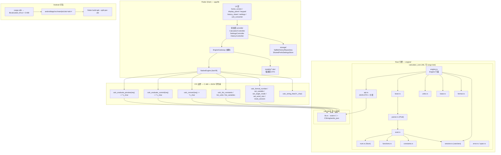
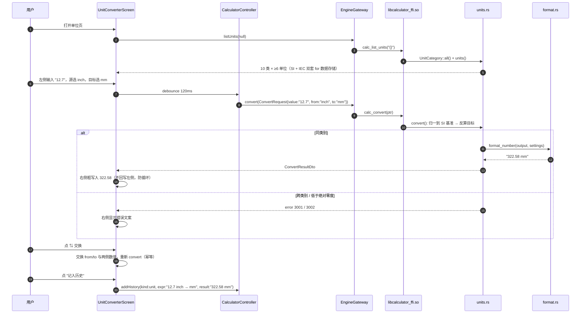
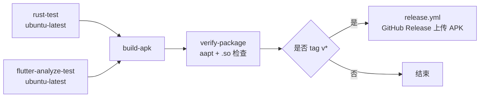

# Calculator-planover 系统架构设计 & 任务分解

> 撰写人：高见远（架构师）
> 版本：v1.0
> 上游输入：`docs/PRD.md`（许清楚 · v1.0）
> 本文为**工程实现的唯一权威设计文档**。PRD 中与本文冲突之处，**以本文为准**（冲突点已在 §0 显式列出）。

---

## 0. 决策前置说明（覆盖 PRD 的部分）

| # | PRD 原文 | 本文裁决 | 理由 |
|---|---|---|---|
| D1 | C3 / §1 / §5 写「通过 `flutter_rust_bridge` 暴露」 | **不使用 `flutter_rust_bridge`**，改用「C ABI + JSON 字符串 + 原生 `dart:ffi` 手工绑定」 | 本机无 Dart/Flutter SDK，codegen 一旦出问题本地无法复现与修复；手工绑定零 codegen、零构建期魔法，风险可控 |
| D2 | P0-25 要求「`flutter_rust_bridge` 代码生成产物提交或一键生成脚本」 | 无 codegen 产物；改为提供 `tools/` 下的构建脚本 | 同 D1 |
| D3 | §5 数据流图未区分 crate | Rust 侧拆为 `calculator_core`(rlib，全部逻辑+测试) + `calculator_ffi`(cdylib，仅序列化胶水) | 本机无 MSVC linker 时，`cargo test` 只构建 rlib，**保证本地 100% 可跑** |
| D4 | Q1 精度 | `Num = Rational(i64/i64) \| Float(f64) \| Special`，有理路径走 i64 分数，超越函数退化 f64；**不引入 GMP/MPFR/ibig** | C7 |
| D5 | Q1~Q12 全部 | 按主理人裁决执行，本文 §3/§4/§5 固化 | — |

**不可推翻的外部约束**（来自用户拍板）：
`applicationId = org.solovyev.android.calculator`｜显示名 `Calculator-planover`｜Rust 引擎 + Flutter UI｜三 ABI APK｜minSdk 26 / targetSdk 34。

---

## 1. 整体架构

### 1.1 架构图



### 1.2 分层说明

| 层 | 位置 | 职责 | 禁忌 |
|---|---|---|---|
| L1 UI | `app/lib/src/ui/` | 渲染、手势、动画、键盘 | **不得做任何数值运算**（C8） |
| L2 状态 | `app/lib/src/state/` | 防抖、输入编辑模型、页面状态、provider 广播 | 不直接碰 `dart:ffi` |
| L3 网关 | `app/lib/src/engine/` | 唯一调用 FFI 的出口；异常 → `EngineException`；JSON → 强类型 model | 只有 `native_engine.dart` 可 import `dart:ffi` |
| L4 FFI 胶水 | `engine/ffi/` | `*const c_char` ↔ `String`，`serde_json` 序列化，**不含业务逻辑** | 不得放任何计算逻辑 |
| L5 API/DTO | `engine/core/src/api.rs` | 所有请求/响应结构体 + serde 定义 + 分发到 `Engine` | — |
| L6 领域 | `engine/core/src/{lexer,parser,eval,...}.rs` | 纯计算 | 不依赖 Android/IO/时间 |

**关键不变量**：
1. **单一数据源**：所有数值计算、格式化、进制转换、单位换算、常量/变量求值**只在 Rust 完成**，Dart 侧零重复实现（C8）。
2. **错误不跨 FFI 抛异常**：Rust 一律返回 JSON 信封 `{"ok":false,"error":{...}}`；Dart 侧转成 `EngineException`。
3. **纯函数优先**：lexer/parser/format/units/base 全部纯函数，`cargo test` 直接覆盖。
4. **历史存储只在 Dart 侧**（sqflite），Rust 不碰文件 IO（PRD §5 约定 4）。
5. **谁分配谁释放**：Rust 返回的字符串必须由 Dart 调 `calc_string_free` 释放。

---

## 2. 仓库目录结构

```
Calculator-planover/
├── .github/
│   └── workflows/
│       ├── ci.yml                       # push/PR：rust-test → build-apk → verify-package
│       └── release.yml                  # tag：附加 GitHub Release
├── .gitignore
├── README.md
│
├── engine/                              # Rust workspace
│   ├── Cargo.toml                       # workspace，default-members = ["core"]
│   ├── rust-toolchain.toml              # channel = "1.83.0"（锁定）
│   ├── .gitignore
│   ├── core/                            # calculator_core —— 全部逻辑 + 全部测试（rlib）
│   │   ├── Cargo.toml
│   │   └── src/
│   │       ├── lib.rs                   # 模块导出 + crate 级文档
│   │       ├── span.rs                  # Span{start,end}（**字符偏移**，非字节）
│   │       ├── error.rs                 # EngineError / ErrorKind / code()
│   │       ├── num.rs                   # Num 枚举 + 有理/浮点运算 + 溢出回退
│   │       ├── token.rs                 # TokenKind / Token
│   │       ├── lexer.rs                 # 词法分析（0x/0b/0o、标识符、运算符、隐式乘法标记）
│   │       ├── ast.rs                   # Expr / BinaryOp / UnaryOp
│   │       ├── parser.rs                # Pratt 解析器
│   │       ├── functions.rs             # 函数表（名称/arity/类别/插入模板/实现）
│   │       ├── constants.rs             # 常量表（≥12 项，含物理常量）
│   │       ├── units.rs                 # UnitCategory / UnitDef / 比例+仿射换算
│   │       ├── base.rs                  # BaseRepr / 进制格式化 / 按位运算 / 位宽
│   │       ├── format.rs                # NumberFormatSettings / 科学计数法 / 分数 / 千分位
│   │       ├── session.rs               # 变量表 + ans + 设置 + 历史快照(内存)
│   │       ├── eval.rs                  # 求值器（AST → Num）
│   │       ├── engine.rs                # Engine 门面（对外领域 API）
│   │       ├── api.rs                   # JSON DTO + api::dispatch（无 FFI 依赖，可测）
│   │       └── edit.rs                  # 输入编辑纯函数（括号自动配对 / 跳过 / 成对删除）
│   │   └── tests/                       # 集成测试（表驱动）
│   │       ├── t01_arithmetic.rs
│   │       ├── t02_trig_log.rs
│   │       ├── t03_base_bitwise.rs
│   │       ├── t04_units.rs
│   │       ├── t05_format.rs
│   │       ├── t06_variables.rs
│   │       ├── t07_errors.rs
│   │       └── t08_api_json.rs
│   └── ffi/                             # calculator_ffi —— cdylib，仅胶水
│       ├── Cargo.toml                   # crate-type = ["cdylib"]
│       └── src/lib.rs                   # extern "C" 函数表 + 内存契约实现
│
├── app/                                 # Flutter 工程（Dart 侧）
│   ├── pubspec.yaml
│   ├── analysis_options.yaml
│   ├── android/                         # 见 §2.1（gradle wrapper 由 CI 生成）
│   │   ├── settings.gradle.kts
│   │   ├── build.gradle.kts
│   │   ├── gradle.properties
│   │   ├── .gitignore
│   │   └── app/
│   │       ├── build.gradle.kts
│   │       └── src/main/
│   │           ├── AndroidManifest.xml
│   │           ├── kotlin/org/solovyev/android/calculator/MainActivity.kt
│   │           ├── res/values/styles.xml
│   │           ├── res/drawable/ic_launcher_foreground.xml
│   │           ├── res/mipmap-anydpi-v26/ic_launcher.xml
│   │           └── jniLibs/.gitkeep
│   ├── lib/
│   │   ├── main.dart                    # 入口：初始化 NativeEngine + provider
│   │   ├── app.dart                     # MaterialApp + 主题 + 路由
│   │   └── src/
│   │       ├── engine/
│   │       │   ├── engine_gateway.dart  # 抽象接口（测试用 FakeEngine 注入）
│   │       │   ├── native_engine.dart   # 唯一 import dart:ffi 的文件
│   │       │   ├── ffi_bindings.dart    # DynamicLibrary + 函数指针 typedef
│   │       │   ├── fake_engine.dart     # 单测/组件测试替身（返回固定值，非重算）
│   │       │   └── engine_exception.dart
│   │       ├── models/                  # 强类型 DTO（fromJson / toJson）
│   │       │   ├── number_value.dart
│   │       │   ├── base_repr.dart
│   │       │   ├── eval_settings.dart
│   │       │   ├── eval_result.dart
│   │       │   ├── engine_error.dart
│   │       │   ├── constant_info.dart
│   │       │   ├── unit_info.dart
│   │       │   ├── convert_result.dart
│   │       │   ├── variable_info.dart
│   │       │   └── history_entry.dart
│   │       ├── state/
│   │       │   ├── calculator_controller.dart   # 输入+预览+提交主状态机
│   │       │   ├── settings_controller.dart
│   │       │   ├── history_controller.dart
│   │       │   └── debouncer.dart
│   │       ├── storage/
│   │       │   ├── history_repository.dart      # 抽象
│   │       │   ├── sqflite_history_repository.dart
│   │       │   ├── memory_history_repository.dart  # 测试用
│   │       │   └── settings_store.dart          # SharedPreferences
│   │       ├── theme/
│   │       │   ├── app_theme.dart               # Material 3 浅/深
│   │       │   └── tokens.dart                  # 尺寸/间距/字号常量
│   │       ├── utils/
│   │       │   ├── date_format.dart             # 自建，避免引入 intl
│   │       │   └── json_helpers.dart
│   │       └── ui/
│   │           ├── home_screen.dart
│   │           ├── screens/settings_screen.dart
│   │           ├── screens/unit_converter_screen.dart
│   │           └── widgets/
│   │               ├── display_panel.dart
│   │               ├── expression_field.dart
│   │               ├── preview_line.dart
│   │               ├── angle_mode_switch.dart
│   │               ├── base_result_row.dart
│   │               ├── function_tabs.dart
│   │               ├── constants_panel.dart
│   │               ├── variables_panel.dart
│   │               ├── keypad.dart
│   │               ├── key_button.dart
│   │               └── history_sheet.dart
│   └── test/
│       ├── unit/json_model_test.dart
│       ├── unit/debouncer_test.dart
│       ├── unit/history_repository_test.dart
│       ├── unit/controller_preview_test.dart
│       ├── widget/expression_field_test.dart
│       └── widget/keypad_test.dart
│
└── tools/
    ├── build_android_libs.sh            # cargo-ndk 三 ABI → jniLibs
    ├── gen_android_shell.py             # 用 flutter create 生成 gradle wrapper（CI）
    └── patch_android.py                 # 落 applicationId/minSdk/targetSdk/label 并校验
```

### 2.1 为什么 `android/gradle/wrapper/gradle-wrapper.jar` 不入库

该文件是**二进制**，无法以文本形式撰写；且 Flutter 模板随版本演进，手写 `settings.gradle.kts` 极易与所锁定的 Flutter 版本不一致 → CI 直接红。

**采用方案（CI 生成 + 补丁覆盖，见 §8.3）**：
1. CI 在临时目录执行 `flutter create --platforms=android --org org.solovyev.android --project-name calculator`，得到与当前 Flutter 版本 100% 匹配的 android 壳；
2. 把 `gradle/`、`gradlew`、`gradlew.bat` 拷回仓库 `app/android/`；
3. 用仓库自带的 `app/android/**` 文本配置**覆盖**生成物中的同名文件；
4. 执行 `tools/patch_android.py` 强制写入并校验 `applicationId` / `minSdk` / `targetSdk` / `android:label`。

这样既满足「仓库里有完整的 android 配置」，又保证 gradle 壳永远与锁定的 Flutter 版本对齐。

---

## 3. Rust 引擎模块划分

> 全部位于 `engine/core/src/`。所有 `pub fn` 签名即对外契约，工程师不得随意改名——Dart 侧 JSON 字段名与之一一对应（§5）。

### 3.1 `span.rs`

```rust
/// 源码区间。**使用 Unicode 标量（char）偏移，不是字节偏移**，
/// 以便 Dart 侧 `String.substring(start, end)` 直接可用。
#[derive(Debug, Clone, Copy, PartialEq, Eq, Default, serde::Serialize, serde::Deserialize)]
pub struct Span {
    pub start: usize, // 含
    pub end: usize,   // 不含
}
impl Span {
    pub fn new(start: usize, end: usize) -> Self;
    pub fn merge(self, other: Span) -> Span;
}
/// 把字节偏移转字符偏移（lexer 内部用）
pub fn byte_to_char_index(s: &str, byte_index: usize) -> usize;
```

### 3.2 `error.rs`

```rust
pub type Result<T> = std::result::Result<T, EngineError>;

#[derive(Debug, Clone, PartialEq)]
pub struct EngineError {
    pub kind: ErrorKind,
    pub span: Option<Span>,
    pub message: String,   // 中文，直接给 UI 展示
}

#[derive(Debug, Clone, Copy, PartialEq, Eq)]
pub enum ErrorKind {
    // 1xxx 词法/语法
    UnexpectedCharacter = 1000,
    UnexpectedToken     = 1001,
    IncompleteExpression= 1002,
    MismatchedParen     = 1003,
    InvalidNumberLiteral= 1004,
    UnknownFunction     = 1005,
    WrongArity          = 1006,
    // 2xxx 求值/数学
    DivisionByZero      = 2000,
    DomainError         = 2001,
    Overflow            = 2002,
    NotAnInteger        = 2003,
    // 3xxx 单位
    UnknownUnit         = 3000,
    IncompatibleUnits   = 3001,
    BelowAbsoluteZero   = 3002,
    // 4xxx 变量
    UndefinedVariable   = 4000,
    ReservedName        = 4001,
    InvalidVariableName = 4002,
    // 5xxx 请求/内部
    InvalidRequest      = 5000,
    InvalidSettings     = 5001,
    InternalError       = 5002,
}

impl ErrorKind {
    /// 稳定 snake_case 名称，写入 JSON `error.kind`，Dart 侧 switch 用
    pub fn stable_name(&self) -> &'static str;   // 如 "division_by_zero"
    pub fn code(&self) -> u16;
    /// 默认中文文案（未显式给 message 时使用）
    pub fn default_message(&self) -> &'static str;
}
impl EngineError {
    pub fn new(kind: ErrorKind) -> Self;
    pub fn with_span(kind: ErrorKind, span: Span) -> Self;
    pub fn with_message(kind: ErrorKind, msg: impl Into<String>) -> Self;
}
```

### 3.3 `num.rs`

```rust
#[derive(Debug, Clone, Copy, PartialEq)]
pub enum Num {
    /// 精确有理数，永远约分、分母恒正；den == 0 非法（构造时拒绝）
    Rational { num: i64, den: i64 },
    /// 退化浮点（超越函数、无理常量、溢出回退）
    Float(f64),
    /// 非有限值（serde 无法表达 f64 的 NaN/Inf，故单列）
    Special(Special),
}
#[derive(Debug, Clone, Copy, PartialEq, Eq)]
pub enum Special { Nan, Infinity, NegInfinity }

impl Num {
    pub fn rational(num: i64, den: i64) -> Result<Num>;      // den=0 → DivisionByZero
    pub fn int(v: i64) -> Num;
    pub fn float(v: f64) -> Num;                             // 非有限 → Special
    pub fn zero() -> Num; pub fn one() -> Num;

    pub fn is_int(&self) -> bool;
    pub fn to_f64(&self) -> f64;
    pub fn try_as_i64(&self) -> Result<i64>;                 // 非整数 → NotAnInteger
    pub fn abs(&self) -> Num;
    pub fn neg(&self) -> Num;                                // checked，溢出转 Float
    pub fn add(&self, r: &Num) -> Num;
    pub fn sub(&self, r: &Num) -> Num;
    pub fn mul(&self, r: &Num) -> Num;
    pub fn div(&self, r: &Num) -> Result<Num>;               // 0 → DivisionByZero
    pub fn rem(&self, r: &Num) -> Result<Num>;               // 语义见 3.3.1
    pub fn pow(&self, r: &Num) -> Result<Num>;               // 负底数+分数指数 → DomainError
    pub fn sqrt(&self) -> Result<Num>;                       // 负 → DomainError
    pub fn cbrt(&self) -> Num;
    pub fn factorial(&self) -> Result<Num>;                  // 非负整数，>20 用 f64
    /// 用连分数把 f64 逼近为最简分数（分母上限 10^9），供分数显示用
    pub fn to_rational_approx(&self, max_den: i64) -> Option<Num>;
}
impl PartialOrd for Num { /* 统一转 f64 比较 */ }
```

**3.3.1 语义裁决（固化）**

| 场景 | 规则 |
|---|---|
| 有理 × 有理 | 先交叉约分再乘；i64 溢出 → 自动降级 `Float` 继续算 |
| `a % b` | **取模**（与 `mod` 键同源），结果符号跟随被除数：`7 % 3 = 1`，`(-7) % 3 = -1` |
| 阶乘 | 仅非负整数；`n > 20` 用浮点近似；非整数/负数 → `DomainError`（Q5） |
| `0^0` | 返回 `1`（工程惯例） |
| 有理数与浮点混算 | 浮点「传染」：结果一律 `Float` |
| 等值判定 | `Rational{n,d}` 与 `Float(x)` 比较时以 `f64` 在 `1e-12` 相对误差内判定 |

### 3.4 `token.rs` / `lexer.rs`

```rust
#[derive(Debug, Clone, Copy, PartialEq, Eq)]
pub enum TokenKind {
    Number,        // 十进制 / 0x / 0b / 0o / 科学计数法 1e-9
    Ident,         // 变量 / 常量 / 函数名（含 π φ ε₀ 等 Unicode 符号）
    Plus, Minus, Star, Slash, Caret,
    LParen, RParen, Comma,
    Percent,       // 后缀百分号
    Bang,          // 后缀阶乘
    Assign,        // '=' 或 ':='
    And, Or, Xor, Not, Shl, Shr,   // & | ^ ~ << >>
    EOF,
}

#[derive(Debug, Clone, PartialEq)]
pub struct Token {
    pub kind: TokenKind,
    pub text: String,   // 原始切片
    pub span: Span,
}

pub struct Lexer<'a> { /* 内部 */ }
impl<'a> Lexer<'a> {
    pub fn new(src: &'a str) -> Self;
    pub fn tokenize(&mut self) -> Result<Vec<Token>>;
}
/// 便捷纯函数
pub fn tokenize(src: &str) -> Result<Vec<Token>>;
```

**词法规则**
- 空白跳过；`×` `÷` `−` `·` 等 UTF-8 运算符别名归一化为 `* / -`（UI 显示用 `×÷`，解析前不转换，由 lexer 兼容）。
- 数字：`1_000` 允许下划线分隔；`0x1F` / `0b1010` / `0o17`；`1.5e-9`；`.5`。
- 标识符：`[A-Za-z_][A-Za-z0-9_]*`，外加 Unicode 常量符号单字符 token（`π` `φ` `τ` `ε₀`）。
- **不在此层做隐式乘法**，只产出 token 流；隐式乘法在 parser 依据「Number/Ident/常量 后紧跟 Number/Ident/LParen」判定。

### 3.5 `ast.rs` / `parser.rs`

```rust
pub enum UnaryOp { Neg, Pos, Not, Percent }        // Percent 作为后缀一元
pub enum BinaryOp { Add, Sub, Mul, Div, Pow, Mod,
                    BitAnd, BitOr, BitXor, Shl, Shr }

pub enum Expr {
    Number(Num, Span),
    Const(String, Span),                 // π / e / c / ...
    Var(String, Span),
    Unary { op: UnaryOp, operand: Box<Expr>, span: Span },
    Binary { op: BinaryOp, lhs: Box<Expr>, rhs: Box<Expr>, span: Span },
    Call { name: String, args: Vec<Expr>, span: Span },
    Factorial(Box<Expr>, Span),
    Assign { name: String, value: Box<Expr>, span: Span },  // a=3+4 / x:=5
}

pub struct Parser<'a> { /* tokens + 常量/函数名字典 */ }
impl<'a> Parser<'a> {
    pub fn new(tokens: &'a [Token], src: &'a str) -> Self;
    pub fn parse(&mut self) -> Result<Expr>;
    /// 允许解析出「不完整表达式」以便给出友好提示：
    pub fn parse_lenient(&mut self) -> std::result::Result<Expr, EngineError>;
}
pub fn parse(src: &str) -> Result<Expr>;
```

**优先级表（Pratt，数字越大越紧）**

| 级别 | 运算符 | 结合性 | 备注 |
|---|---|---|---|
| 1 | `=` `:=`（赋值） | 右 | 最低 |
| 2 | `\|` `^`(xor) | 左 | — |
| 3 | `&` | 左 | — |
| 4 | `<<` `>>` | 左 | — |
| 5 | `+` `-` | 左 | — |
| 6 | `*` `/` `mod` **以及隐式乘法** | 左 | 隐式乘法与显式同级 |
| 7 | **一元 `-` `+` `~`** | 右 | **优先级低于 `^`（Q2）** |
| 8 | `^`（幂） | **右** | `2^3^2 = 512`（P0-06） |
| 9 | 后缀 `%`、`!` | — | 最紧，`200*10%` → `200*(10/100)` = 20（Q4） |
| 10 | 函数调用 / 括号 / 常量 | — | 最高 |

**隐式乘法规则（Q3）**：`Number|IdentConst|RParen` 之后紧跟 `Number|IdentConst|LParen` → 插入 `Mul`。
例：`2(3+4)=14`、`2π≈6.283185307`、`3sin(30)` 视为 `3*sin(30)`。
**例外**：紧跟 `(` 且标识符是**已注册函数名**时，优先按函数调用解析（`sin(30)` 不是 `sin*(30)`）。

### 3.6 `functions.rs`

```rust
pub struct FunctionDef {
    pub name: &'static str,       // "sin"
    pub arity: Arity,             // Fixed(1) / Fixed(2) / Variadic(2..)
    pub category: FuncCategory,   // Trig | Log | Power | Rounding | Bits | Stats | Const
    pub insert_template: &'static str, // 键盘插入文本，如 "sin(" / "log(,)"? 见下
    pub aliases: &'static [&'static str],
    pub eval: fn(&[Num], &EvalContext) -> Result<Num>,
}
pub enum Arity { Fixed(u8), Range(u8, u8) }
pub fn lookup(name: &str) -> Option<&'static FunctionDef>;
pub fn all() -> &'static [FunctionDef];
pub fn is_function_name(name: &str) -> bool;
```

**P0 函数集（≥ 每个 2 条断言）**：`sin cos tan asin acos atan`｜`ln log log2 log10 exp exp10 pow`｜`sqrt cbrt root`｜`sq cube`｜`abs neg inv`｜`fact mod min max floor ceil round trunc gcd lcm`｜`and or xor not shl shr`｜`sinh cosh tanh asinh acosh atanh`（P1-05）｜`rand`（P1-05）。
反三角函数结果受 `AngleMode` 影响（DEG 返回度数值）。

### 3.7 `constants.rs`

```rust
pub struct ConstantDef {
    pub symbol: &'static str,   // "c"
    pub name: &'static str,     // "光速"
    pub unit: &'static str,     // "m/s"
    pub value: f64,
    pub category: &'static str, // "math" | "physics" | "chem"
    pub aliases: &'static [&'static str],  // ["π","pi"]
}
pub fn all() -> &'static [ConstantDef];
pub fn lookup(symbol_or_alias: &str) -> Option<&'static ConstantDef>;
```

**≥12 项清单（P0-12）**：`π`(pi)｜`e`｜`φ`(phi 黄金比)｜`τ`(tau=2π)｜`c` 光速 299792458 m/s｜`h` 普朗克 6.62607015e-34 J·s｜`ħ` 约化普朗克｜`G` 引力常数 6.67430e-11｜`N_A` 阿伏伽德罗 6.02214076e23｜`R` 气体常数 8.314462618｜`e_c` 元电荷 1.602176634e-19 C（显示 `e`）｜`ε₀` 真空介电常数 8.8541878128e-12｜`m_e` 电子质量 9.1093837015e-31 kg｜`m_p` 质子质量｜`g` 标准重力 9.80665｜`k_B` 玻尔兹曼｜`atm` 标准大气压。

> ⚠️ 冲突处理：`e`（自然常数）与 `e_c`（元电荷）在键盘/常量面板以**全名区分**；解析器里 `e` 绑定自然常数，`e_c` 绑定元电荷。科学计数法 `1e9` 由 lexer 优先识别为数字，不会误判为 `1*e*9`。

### 3.8 `units.rs`

```rust
#[derive(Debug, Clone, Copy, PartialEq, Eq, Hash)]
pub enum UnitCategory {
    Length, Mass, Temperature, Time, Area, Volume, DataStorage, Speed, Pressure, Energy,
}
impl UnitCategory {
    pub fn id(&self) -> &'static str;     // "length"
    pub fn name(&self) -> &'static str;   // "长度"
    pub fn all() -> &'static [UnitCategory];     // 10 个
    pub fn units(&self) -> &'static [UnitDef];   // 每类 ≥ 6
}

pub enum UnitKind {
    /// 比例型：value_si = value * factor
    Proportional { factor: f64 },
    /// 仿射型：value_si = value * scale + offset（温度，Q8）
    Affine { scale: f64, offset: f64 },
}

pub struct UnitDef {
    pub id: &'static str,        // "inch"
    pub symbol: &'static str,    // "inch"（UI 显示）
    pub name: &'static str,      // "英寸"
    pub category: UnitCategory,
    pub kind: UnitKind,
    pub aliases: &'static [&'static str],   // ["in","英寸"]
}

pub fn lookup_unit(id_or_alias: &str) -> Option<&'static UnitDef>;
pub fn convert(value: &Num, from: &UnitDef, to: &UnitDef) -> Result<Num>;
pub fn parse_convert_query(q: &str) -> Result<(Num, &'static UnitDef, &'static UnitDef)>;
//   "12.7 inch in mm" / "12.7 inch to mm" / "12.7 inch -> mm"  (P1-09)
```

**换算实现**：先把源值归一到该类别的 **SI 基准单位**（比例型：`v*factor`；仿射型：`v*scale+offset`），再从基准反算到目标（比例：`/factor`；仿射：`(si-offset)/scale`）。跨类别 → `IncompatibleUnits`（3001）。温度低于绝对零度 → `BelowAbsoluteZero`（3002）。

**各类别 ≥6 单位（P0-15）**
- 长度：nm μm mm cm m km inch ft yd mi nmi 光年
- 质量：mg g kg t oz lb st 克拉
- 温度：°C °F K（仿射）
- 时间：ns μs ms s min h d 周 年
- 面积：mm² cm² m² km² ha 英亩 ft² yd² in²
- 体积：mL cL L m³ ft³ in³ gal(US) gal(UK) 杯
- 数据存储：**SI 十进制** bit B kB MB GB TB ＋ **IEC 二进制** KiB MiB GiB TiB（两套并存，Q8/P0-15 第 3 条）
- 速度：m/s km/h mph ft/s knot 马赫
- 压力：Pa kPa MPa bar mbar psi atm mmHg
- 能量：J kJ cal kcal Wh kWh eV BTU

### 3.9 `base.rs`

```rust
#[derive(Debug, Clone, Copy, PartialEq, Eq)]
pub enum Base { Bin, Oct, Dec, Hex }
impl Base { pub fn radix(&self) -> u32; pub fn prefix(&self) -> &'static str; }

#[derive(Debug, Clone, PartialEq, Eq, serde::Serialize)]
pub struct BaseRepr {
    pub dec: String,
    pub hex: String,
    pub oct: String,
    pub bin: String,
    pub word_size: u8,     // 8/16/32/64
    pub is_integer: bool,  // false → 只给 dec（含小数），其余为空串
}

pub fn format_in_base(v: i64, base: Base, word_size: u8) -> String;
//   Q6：二进制补码。word_size=64 时 ~0 = "FFFFFFFFFFFFFFFF"，-1 同理
pub fn parse_in_base(s: &str, base: Base, word_size: u8) -> Result<i64>;
pub fn mask_to_width(v: i64, word_size: u8) -> i64;
pub fn bitwise(op: BitOp, a: i64, b: i64, word_size: u8) -> i64;
pub enum BitOp { And, Or, Xor, Shl, Shr }
pub fn repr_of(n: &Num, word_size: u8) -> BaseRepr;
```

### 3.10 `format.rs`

```rust
#[derive(Debug, Clone, Copy, PartialEq, Eq)]
pub enum Notation { Auto, Scientific, Fixed }
#[derive(Debug, Clone, Copy, PartialEq, Eq)]
pub enum PrecisionMode { Significant, DecimalPlaces }
#[derive(Debug, Clone, Copy, PartialEq, Eq)]
pub enum FractionMode { Off, Improper, Mixed }

#[derive(Debug, Clone, Copy, PartialEq)]
pub struct NumberFormatSettings {
    pub notation: Notation,
    pub precision_mode: PrecisionMode,
    pub precision: u8,        // 1..=15，越界 → InvalidSettings
    pub fraction_mode: FractionMode,
    pub grouping: bool,       // 千位分隔
}
impl Default for NumberFormatSettings { /* Auto / Significant / 10 / Off / true */ }

pub fn format_number(n: &Num, s: &NumberFormatSettings) -> Result<String>;
//   优先级：fraction_mode 生效且能化为分数 → 分数串；否则按 notation+precision
pub fn format_fraction(n: &Num, mode: FractionMode) -> Option<String>;
//   1/3+1/6 → "1/2"；2.75 → "2 3/4"（Mixed）；化不出（分母 >10^9）→ None → 回退小数
pub fn format_scientific(v: f64, sig: u8) -> String;   // 1.23456789×10⁸（用 × 与 Unicode 上标）
pub fn group_digits(int_part: &str) -> String;
pub fn validate(s: &NumberFormatSettings) -> Result<()>;
```

### 3.11 `session.rs`

```rust
pub struct Session {
    pub variables: HashMap<String, Num>,   // 用户自定义变量
    pub ans: Option<Num>,                  // Q9：独立于历史，清空历史不重置
    pub settings: EngineSettings,
}
#[derive(Debug, Clone, Copy, PartialEq)]
pub struct EngineSettings {
    pub angle_mode: AngleMode,
    pub word_size: u8,          // 8/16/32/64，默认 64
    pub format: NumberFormatSettings,
}
#[derive(Debug, Clone, Copy, PartialEq, Eq)]
pub enum AngleMode { Deg, Rad, Grad }
impl AngleMode {
    pub fn to_radians(&self, v: f64) -> f64;    // deg: v*π/180  grad: v*π/200
    pub fn from_radians(&self, v: f64) -> f64;
}

impl Session {
    pub fn new() -> Self;
    pub fn get_var(&self, name: &str) -> Result<Num>;      // ans / 常量 / 自定义
    pub fn set_var(&mut self, name: &str, v: Num) -> Result<()>;
    //   ReservedName(4001)：π/e/ans/函数名 不可覆盖；InvalidVariableName(4002)
    pub fn delete_var(&mut self, name: &str) -> Result<()>;
    pub fn list_vars(&self) -> Vec<VariableInfo>;
    pub fn reset(&mut self);      // 清变量，**保留 ans**（Q9）
}
```

### 3.12 `eval.rs`

```rust
pub struct EvalContext<'a> {
    pub session: &'a mut Session,
    pub depth: u32,               // 防递归炸弹，>64 → InternalError
}
pub fn eval(expr: &Expr, ctx: &mut EvalContext) -> Result<Num>;
/// 便捷：一次性求值（内部 new 临时 Session）
pub fn eval_simple(src: &str, settings: &EngineSettings) -> Result<Num>;
```

### 3.13 `engine.rs`（领域门面）

```rust
pub struct Engine { session: Session }
impl Engine {
    pub fn new() -> Self;
    pub fn settings(&self) -> &EngineSettings;
    pub fn set_angle_mode(&mut self, m: AngleMode);
    pub fn set_word_size(&mut self, w: u8) -> Result<()>;   // 仅 8/16/32/64
    pub fn reset_session(&mut self);

    /// 预览：**不改 ans、不落变量**（除赋值语句外不产生副作用）
    pub fn evaluate_preview(&mut self, expr: &str) -> Result<EvalResult>;
    /// 提交：更新 ans；若表达式是赋值语句则写入变量
    pub fn evaluate_commit(&mut self, expr: &str) -> Result<EvalResult>;

    pub fn convert(&self, value: &Num, from: &str, to: &str) -> Result<ConvertResult>;
    pub fn convert_query(&self, q: &str) -> Result<ConvertResult>;
    pub fn list_constants(&self) -> Vec<ConstantInfo>;
    pub fn list_units(&self, category: Option<UnitCategory>) -> Vec<CategoryInfo>;
    pub fn list_variables(&self) -> Vec<VariableInfo>;
    pub fn set_variable(&mut self, name: &str, expr: &str) -> Result<VariableInfo>;
    pub fn delete_variable(&mut self, name: &str) -> Result<()>;
    pub fn format_number(&self, value: &Num) -> Result<FormattedValue>;
}
```

### 3.14 `edit.rs`（输入编辑纯函数，P0-02）

```rust
#[derive(Debug, Clone, Copy, PartialEq, Eq)]
pub enum EditAction { Insert(char), InsertStr, Backspace, Delete }
pub struct EditRequest { pub text: String, pub cursor: usize, pub action: EditAction, pub payload: String }
pub struct EditResult { pub text: String, pub cursor: usize, pub changed: bool }

/// 括号自动配对 / 右括号跳过 / 成对删除。纯函数，无 IO，100% cargo test
pub fn apply_edit(req: EditRequest) -> EditResult;
/// 给定 text+cursor，返回需要高亮匹配的括号区间（两侧），无则 null
pub fn matching_paren(text: &str, cursor: usize) -> Option<(Span, Span)>;
```

### 3.15 `api.rs`（JSON DTO + 分发，**不含任何 FFI 代码**，可 `cargo test`）

```rust
// —— 请求 ——
#[derive(serde::Deserialize)]
pub struct EvaluateRequest { pub expr: String, pub settings: Option<SettingsDto>, pub cursor: Option<usize> }
#[derive(serde::Deserialize)]
pub struct ConvertRequest { pub value: Option<String>, pub from: String, pub to: String, pub query: Option<String> }
#[derive(serde::Deserialize)]
pub struct SetVariableRequest { pub name: String, pub expr: String }
#[derive(serde::Deserialize)]
pub struct SettingsDto { pub angle_mode: Option<String>, pub word_size: Option<u8>, pub number_format: Option<FormatDto> }

// —— 响应 ——
#[derive(serde::Serialize)]
pub struct EvalResultDto {
    pub value: NumDto,
    pub approx: f64,
    pub display: String,
    pub fraction: Option<String>,
    pub base: BaseRepr,
    pub assignments: Vec<VariableInfo>,   // 本次执行产生的变量/ans 变更
    pub is_integer: bool,
}
#[derive(serde::Serialize)]
pub enum NumDto { #[serde(rename="rational")] Rational{num:i64,den:i64},
                  #[serde(rename="float")] Float{value:f64},
                  #[serde(rename="special")] Special{which:&'static str} }

/// 统一信封
#[derive(serde::Serialize)]
pub struct Envelope<T: serde::Serialize> { pub ok: bool,
    #[serde(skip_serializing_if="Option::is_none")] pub data: Option<T>,
    #[serde(skip_serializing_if="Option::is_none")] pub error: Option<ErrorDto> }
#[derive(serde::Serialize)]
pub struct ErrorDto { pub code: u16, pub kind: &'static str, pub message: String,
                      #[serde(skip_serializing_if="Option::is_none")] pub span: Option<Span> }

/// 所有 API 的统一入口：函数名 → JSON in → JSON out。**FFI 层只调这一个函数**
pub fn dispatch(method: &str, payload_json: &str, engine: &mut Engine) -> String;
```

> ✅ `dispatch` 是**可测试的纯字符串函数**：`api_json` 集成测试直接喂 JSON 串断言输出，等于把 FFI 语义 100% 放到本地 `cargo test` 覆盖范围内。这是本机无 Flutter SDK 情况下最重要的风险对冲手段。

### 3.16 `ffi/src/lib.rs`（cdylib 胶水）

```rust
use std::os::raw::c_char;
use std::ffi::{CStr, CString};
use std::sync::{LazyLock, Mutex};
use calculator_core::{Engine, api};

static ENGINE: LazyLock<Mutex<Engine>> = LazyLock::new(|| Mutex::new(Engine::new()));

/// 统一的调用包装：Rust panic 一律兜住，转成 code 5002 的 JSON，绝不 unwind 跨 FFI
fn call(method: &str, req: *const c_char) -> *mut c_char { /* ... */ }

#[no_mangle] pub extern "C" fn calc_version() -> *mut c_char;
#[no_mangle] pub extern "C" fn calc_evaluate_preview(req: *const c_char) -> *mut c_char;
#[no_mangle] pub extern "C" fn calc_evaluate_commit(req: *const c_char) -> *mut c_char;
#[no_mangle] pub extern "C" fn calc_convert(req: *const c_char) -> *mut c_char;
#[no_mangle] pub extern "C" fn calc_list_constants(req: *const c_char) -> *mut c_char;
#[no_mangle] pub extern "C" fn calc_list_units(req: *const c_char) -> *mut c_char;
#[no_mangle] pub extern "C" fn calc_list_variables(req: *const c_char) -> *mut c_char;
#[no_mangle] pub extern "C" fn calc_format_number(req: *const c_char) -> *mut c_char;
#[no_mangle] pub extern "C" fn calc_set_variable(req: *const c_char) -> *mut c_char;
#[no_mangle] pub extern "C" fn calc_delete_variable(req: *const c_char) -> *mut c_char;
#[no_mangle] pub extern "C" fn calc_set_angle_mode(req: *const c_char) -> *mut c_char;
#[no_mangle] pub extern "C" fn calc_set_word_size(req: *const c_char) -> *mut c_char;
#[no_mangle] pub extern "C" fn calc_reset_session(req: *const c_char) -> *mut c_char;
#[no_mangle] pub extern "C" fn calc_apply_edit(req: *const c_char) -> *mut c_char;
/// 释放本库分配的 C 字符串；传 NULL 是安全的 no-op
#[no_mangle] pub extern "C" fn calc_string_free(s: *mut c_char);
```

---

## 4. 关键数据结构总览（Rust）

> 便于工程师一眼对齐。完整定义见 §3 各小节。

```rust
// ── 数值 ─────────────────────────────────────────────
pub enum Num { Rational { num: i64, den: i64 }, Float(f64), Special(Special) }

// ── 错误 ─────────────────────────────────────────────
pub struct EngineError { pub kind: ErrorKind, pub span: Option<Span>, pub message: String }

// ── 求值结果（领域层）─────────────────────────────────
pub struct EvalResult {
    pub value: Num,
    pub display: String,             // 已按 format 设置格式化，UI 直接显示
    pub fraction: Option<String>,    // 分数模式下的表示
    pub base: BaseRepr,
    pub assignments: Vec<VariableInfo>,  // ans / 自定义变量变更
}

// ── 设置 ─────────────────────────────────────────────
pub enum AngleMode { Deg, Rad, Grad }
pub struct NumberFormatSettings {
    pub notation: Notation,          // Auto | Scientific | Fixed
    pub precision_mode: PrecisionMode, // Significant | DecimalPlaces
    pub precision: u8,               // 1..=15
    pub fraction_mode: FractionMode, // Off | Improper | Mixed
    pub grouping: bool,
}
pub struct EngineSettings { pub angle_mode: AngleMode, pub word_size: u8, pub format: NumberFormatSettings }

// ── 单位 ─────────────────────────────────────────────
pub enum UnitCategory { Length, Mass, Temperature, Time, Area, Volume, DataStorage, Speed, Pressure, Energy }
pub enum UnitKind { Proportional { factor: f64 }, Affine { scale: f64, offset: f64 } }
pub struct UnitDef { pub id: &'static str, pub symbol: &'static str, pub name: &'static str,
                     pub category: UnitCategory, pub kind: UnitKind, pub aliases: &'static [&'static str] }
pub struct ConvertResult { pub from: UnitInfo, pub to: UnitInfo,
                           pub input_value: Num, pub output_value: Num,
                           pub input_display: String, pub output_display: String }

// ── 进制 ─────────────────────────────────────────────
pub enum Base { Bin, Oct, Dec, Hex }
pub struct BaseRepr { pub dec: String, pub hex: String, pub oct: String,
                      pub bin: String, pub word_size: u8, pub is_integer: bool }
```

---

## 5. FFI 接口清单与 JSON Schema

### 5.1 内存与调用契约（**必须遵守**）

| 项 | 约定 |
|---|---|
| 调用约定 | `extern "C"`，仅传 `*const c_char` / 返回 `*mut c_char` |
| 入参 | UTF-8、**以 `\0` 结尾**的 C 字符串；`NULL` 视为 `{}`（空请求） |
| 返回值 | Rust 用 `CString::into_raw()` 分配的 UTF-8 字符串；**永不返回 NULL**（兜底返回 `{"ok":false,...}`） |
| 释放 | Dart 必须在 `finally` 中调 `calc_string_free(ptr)`；对 `nullptr` 调用是安全 no-op；**同一指针禁止 free 两次** |
| 线程 | 函数内部用 `Mutex<Engine>` 串行化，可从任意 Dart isolate 调用；**但 Dart 侧统一在 UI isolate 同步调用**（计算足够快） |
| panic | `std::panic::catch_unwind` 全包，转成 `code=5002`；**panic 绝不跨越 FFI 边界** |
| 会话状态 | 进程级单例 `LazyLock<Mutex<Engine>>`；`calc_reset_session` 重置 |
| 确定性 | 除 `rand` 外全部纯函数式、可重复 |

### 5.2 函数清单

| # | 函数 | 请求 | 响应 `data` | 备注 |
|---|---|---|---|---|
| 1 | `calc_version()` | — | `{"version":"1.0.0","engine":"calculator_core","abi":1}` | Dart 启动时自检，版本号不匹配直接报错 |
| 2 | `calc_evaluate_preview` | `EvaluateRequest` | `EvalResultDto` | **无副作用**（不改 ans/变量） |
| 3 | `calc_evaluate_commit` | `EvaluateRequest` | `EvalResultDto` | 更新 `ans`；赋值语句写入变量 |
| 4 | `calc_convert` | `ConvertRequest` | `ConvertResultDto` | — |
| 5 | `calc_list_constants` | `{}` | `{"constants":[...]}` | — |
| 6 | `calc_list_units` | `{"category":?}` | `{"categories":[...]}` | 空 → 全部 10 类 |
| 7 | `calc_list_variables` | `{}` | `{"variables":[...,ans]}` | `ans` 只读标记 |
| 8 | `calc_format_number` | `{"value":"1/3","settings":{...}}` | `FormattedValueDto` | — |
| 9 | `calc_set_variable` | `SetVariableRequest` | `VariableInfo` | expr 先求值再存 |
| 10 | `calc_delete_variable` | `{"name":"a"}` | `{"name":"a"}` | — |
| 11 | `calc_set_angle_mode` | `{"angle_mode":"rad"}` | `{"angle_mode":"rad"}` | — |
| 12 | `calc_set_word_size` | `{"word_size":32}` | `{"word_size":32}` | 非法值 → 5001 |
| 13 | `calc_reset_session` | `{"keep_ans":true}` | `{"ok":true}` | 默认保留 ans（Q9） |
| 14 | `calc_apply_edit` | `EditRequest` | `EditResult` | 括号自动配对（P0-02） |
| 15 | `calc_string_free` | `*mut c_char` | — | 无返回 |

**Dart 侧对应封装**（`ffi_bindings.dart`）：

```dart
typedef _CalcStr = Pointer<Utf8> Function(Pointer<Utf8>);
typedef _CalcStrDart = Pointer<Utf8> Function(Pointer<Utf8>);

// 打开方式（Android 自动搜索 APK 的 lib/<abi>/）：
final lib = DynamicLibrary.open('libcalculator_ffi.so');
final _preview = lib.lookupFunction<_CalcStr, _CalcStrDart>('calc_evaluate_preview');
final _free = lib.lookup<Void Function(Pointer<Utf8>)>()... // 见下方注意
```

> ⚠️ **Dart `dart:ffi` 注意点**：`void` 返回函数不能用 `Void Function(...)` 的 `lookupFunction` 简写，必须写
> `typedef _FreeNative = Void Function(Pointer<Utf8>);` /
> `typedef _FreeDart = void Function(Pointer<Utf8>);`
> 再 `lib.lookupFunction<_FreeNative, _FreeDart>('calc_string_free')`。

### 5.3 请求 / 响应 JSON Schema

#### 5.3.1 统一信封

```jsonc
// 成功
{ "ok": true,  "data": { /* ... */ } }
// 失败
{ "ok": false,
  "error": { "code": 2000, "kind": "division_by_zero",
             "message": "除数不能为零", "span": { "start": 2, "end": 3 } } }
```

`kind` 取值 = `ErrorKind::stable_name()` 的 snake_case：
`unexpected_character` `unexpected_token` `incomplete_expression` `mismatched_paren` `invalid_number_literal` `unknown_function` `wrong_arity` `division_by_zero` `domain_error` `overflow` `not_an_integer` `unknown_unit` `incompatible_units` `below_absolute_zero` `undefined_variable` `reserved_name` `invalid_variable_name` `invalid_request` `invalid_settings` `internal_error`

#### 5.3.2 `EvaluateRequest`

```jsonc
{
  "expr": "sin(30)+2(3+4)",
  "cursor": 12,                     // 可选，仅用于错误高亮上下文
  "settings": {                     // 可选；省略则用会话当前设置
    "angle_mode": "deg",            // "deg" | "rad" | "grad"
    "word_size": 64,                // 8|16|32|64
    "number_format": {
      "notation": "auto",           // "auto" | "scientific" | "fixed"
      "precision_mode": "significant", // "significant" | "decimal_places"
      "precision": 10,              // 1..15
      "fraction_mode": "off",       // "off" | "improper" | "mixed"
      "grouping": true
    }
  }
}
```

#### 5.3.3 `EvalResultDto`（`calc_evaluate_preview` / `calc_evaluate_commit` 的 `data`）

```jsonc
{
  "value":    { "kind": "rational", "num": 7, "den": 2 },
  "approx":   3.5,
  "display":  "3.5",
  "fraction": "3 1/2",                     // null 表示当前不是分数模式
  "is_integer": false,
  "base": {
    "dec": "3", "hex": "3", "oct": "3", "bin": "11",
    "word_size": 64, "is_integer": false
  },
  "assignments": [ { "name": "ans", "display": "3.5", "readonly": true } ]
}
```

`value.kind` 三种形态：
```jsonc
{ "kind": "rational", "num": 7,   "den": 2 }
{ "kind": "float",    "value": 3.5 }
{ "kind": "special",  "which": "inf" }     // "inf" | "-inf" | "nan"
```

#### 5.3.4 `ConvertRequest` / `ConvertResultDto`

```jsonc
// 请求（二选一：显式 value+from+to，或一句 query）
{ "value": "12.7", "from": "inch", "to": "mm" }
{ "query": "12.7 inch in mm" }
// 响应
{
  "from": { "id":"inch", "symbol":"inch", "name":"英寸", "category":"length" },
  "to":   { "id":"mm",   "symbol":"mm",   "name":"毫米", "category":"length" },
  "input_value":  { "kind":"rational", "num":127, "den":10 },
  "output_value": { "kind":"rational", "num":32258, "den":100 },
  "input_display":  "12.7 inch",
  "output_display": "322.58 mm"
}
```

#### 5.3.5 `calc_list_constants`

```jsonc
{ "ok": true, "data": { "constants": [
  { "symbol":"π", "name":"圆周率", "unit":"",   "value":"3.141592653589793", "category":"math", "aliases":["pi"] },
  { "symbol":"c", "name":"光速",   "unit":"m/s","value":"299792458",         "category":"physics", "aliases":[] }
]}}
```

#### 5.3.6 `calc_list_units`

```jsonc
{ "ok": true, "data": { "categories": [
  { "id":"length", "name":"长度", "units":[
     { "id":"nm","symbol":"nm","name":"纳米","kind":"proportional" },
     { "id":"mm","symbol":"mm","name":"毫米","kind":"proportional" }
  ]},
  { "id":"temperature","name":"温度","units":[
     { "id":"C","symbol":"°C","name":"摄氏度","kind":"affine" }
  ]}
]}}
```

#### 5.3.7 `calc_apply_edit`

```jsonc
// 请求
{ "text": "(", "cursor": 1, "action": "insert", "payload": ")" }
// 响应
{ "ok": true, "data": { "text": "()", "cursor": 1, "changed": true } }
```

---

## 6. 调用流程时序图

### 6.1 链路 A：输入变化 → 防抖 → Rust 求值 → 预览渲染

```mermaid
sequenceDiagram
    autonumber
    participant U as 用户
    participant EF as ExpressionField
    participant CC as CalculatorController
    participant DB as Debouncer(120ms)
    participant GW as EngineGateway
    participant NE as NativeEngine
    participant DLL as libcalculator_ffi.so
    participant CORE as calculator_core::api

    U->>EF: 按键 / 移动光标 / 删除
    EF->>CC: onChanged(text, cursor)
    CC->>CC: 立即更新本地 text/selection（乐观 UI）
    CC->>DB: schedule(evaluate)
    DB-->>CC: 120ms 后触发（期间新输入会取消前一次）
    CC->>GW: evaluatePreview(expr, settings)
    GW->>NE: evaluatePreview(...)
    NE->>NE: jsonEncode(EvaluateRequest)
    NE->>DLL: calc_evaluate_preview(ptr)
    DLL->>CORE: api::dispatch("evaluate_preview", json)
    CORE->>CORE: lexer → parser(Pratt) → eval → format → base
    CORE-->>DLL: Envelope<EvalResultDto> (JSON 串)
    DLL-->>NE: *mut c_char
    NE->>NE: toDartString() → jsonDecode
    NE->>DLL: calc_string_free(ptr)   %% finally 中必执行
    NE-->>GW: EvalResult（或 throw EngineException）
    GW-->>CC: EvalResult
    alt ok == true
        CC->>CC: _preview = display; _base = base; _error = null
    else ok == false
        CC->>CC: _error = EngineError(code,kind,message,span)
    end
    CC-->>EF: notifyListeners()
    EF->>EF: 预览行渲染 display 或 错误文案 + span 红色下划线
```

### 6.2 链路 B：按 `=` → commit → 写历史 + 更新 ans

```mermaid
sequenceDiagram
    autonumber
    participant U as 用户
    participant KP as Keypad
    participant CC as CalculatorController
    participant HC as HistoryController
    participant HR as HistoryRepository(sqflite)
    participant GW as EngineGateway
    participant DLL as libcalculator_ffi.so
    participant SES as Session(ans/vars)

    U->>KP: 按下 "="
    KP->>CC: commit()
    CC->>CC: 取消 pending 防抖任务
    CC->>GW: evaluateCommit(expr, settings)
    GW->>DLL: calc_evaluate_commit(ptr)
    DLL->>SES: evaluate_commit 内部：eval → session.ans = value
    SES-->>DLL: ans 已更新（Q9：与历史解耦）
    DLL-->>GW: EvalResultDto
    GW-->>CC: EvalResult
    alt 成功
        CC->>HC: add(HistoryEntry{expr, result, ts, kind:calc})
        HC->>HR: insert(entry)
        HR->>HR: 若 count > 500 → DELETE 最旧的 N 条（Q7）
        CC->>CC: text = result.display; cursor = 末尾; selection 重置
        CC->>CC: preview = null（新表达式起点，P0-05）
    else 失败
        CC->>CC: 保留原表达式，预览行显示错误 + span 高亮
    end
    CC-->>KP: notifyListeners() → 输入行/预览/历史角标刷新
```

### 6.3 链路 C：单位换算



---

## 7. 依赖清单

### 7.1 Rust crates（**极度克制，仅 3 个运行时依赖**）

| Crate | 版本 | 用途 | 选型理由 / 风险控制 |
|---|---|---|---|
| `serde` | `=1.0.210`（`features=["derive"]`） | 序列化派生 | 事实标准；**禁用 `default-features` 以外的特性**，不引 `std` 外东西 |
| `serde_json` | `=1.0.128` | JSON 编解码 | 纯 Rust，无 C 依赖（C7）；交叉编译零风险 |
| `libc` | `=0.2.159` | `c_char` 类型（仅 `ffi` crate 用） | 纯 Rust 头文件，无链接期依赖 |
| `rand` | **不引入** | P1-05 `rand()` | 用 `std::collections::hash_map::RandomState` + 系统时间哈希实现简易伪随机，避免交叉编译/pull 依赖风险 |

> **明确不引入**：`num-rational`（自己 60 行实现 i64 有理数，可控且无溢出策略分歧）、`rust_decimal`、`ibig`/`dashu`、`thiserror`（手写 `Display`/`From` 更省事）、`once_cell`（用 std `LazyLock`）、`anyhow`（错误需带 span，自定义更精确）。
> `Cargo.lock` **必须提交**（CI `cargo build --locked`）。

版本锁定策略：`Cargo.toml` 用 `=` 精确版本 + `Cargo.lock` 入库 + `rust-toolchain.toml` 锁 `channel = "1.83.0"`。

### 7.2 Dart packages（**保守优先，共 5 个运行时依赖**）

| Package | 版本 | 用途 | 理由 / 风险控制 |
|---|---|---|---|
| `flutter` / `dart` SDK | Flutter **3.24.5**（Dart 3.5.4） | — | CI 中 `subosito/flutter-action@v2` 精确锁版本，杜绝漂移 |
| `ffi` | `2.1.3`（精确） | `Utf8` / `toNativeUtf8` / `malloc` | Dart 官方维护，API 极稳；**只用于字符串转换** |
| `provider` | `6.1.2`（精确） | 状态管理 | 零 codegen、API 极简；**不用 riverpod**（API 面大、版本间 breaking 多） |
| `sqflite` | `2.3.3`（精确） | 历史持久化（Q7） | 官方插件，纯 Dart+平台通道，无 Google Play services 依赖 |
| `shared_preferences` | `2.3.3`（精确） | 设置持久化 | 官方插件；**只用 `setBool/setInt/setString`**，避开新 API |
| `path` | `1.9.0`（精确） | `join(databasesPath, 'history.db')` | `sqflite` 官方示例必需，纯 Dart |

**dev_dependencies**
| `flutter_test` | SDK | 组件/单元测试 |
| `flutter_lints` | `4.0.0`（精确） | 静态检查；CI 用 `flutter analyze --no-fatal-infos` 仅对 error 判负 |

> **明确不引入**：`intl`（自建 20 行日期格式化，规避数据初始化与版本漂移）、`freezed`/`json_serializable`/`build_runner`（**严禁 codegen**）、`riverpod`、`get_it`、`hive`/`isar`（Isar 需 codegen + 原生构建）、`google_fonts`（需网络下载字体，CI/离线失败）、`flutter_rust_bridge`。

---

## 8. GitHub Actions CI 设计

### 8.1 总览



| Job | 触发 | 关键步骤 | 产物 |
|---|---|---|---|
| `rust-test` | push/PR | `cargo test -p calculator_core --locked`；`cargo build --target <3 abi>` 编译冒烟（可 `continue-on-error`） | 测试报告 |
| `flutter-analyze-test` | push/PR | setup-java 17 → flutter-action 3.24.5 → `flutter pub get` → `flutter analyze --no-fatal-infos` → `flutter test` | — |
| `build-apk` | 前两者通过 | 交叉编译 .so → 落 jniLibs → 生成 android 壳 → patch → `flutter build apk --debug --split-per-abi` | 3 个 APK |
| `verify-package` | build-apk | `aapt dump badging` 校验 id/minSdk/targetSdk；`unzip -l` 校验三 ABI 的 `.so` | 校验日志 |
| `release` | `tag: v*` | 下载产物 → 创建 Release（可选：release 签名走 Secrets） | Release |

### 8.2 Job 细节

**Job 1 `rust-test`**
```yaml
runs-on: ubuntu-latest
steps:
  - uses: actions/checkout@v4
  - uses: dtolnay/rust-toolchain@stable          # 实际版本由 rust-toolchain.toml 锁定 1.83.0
    with: { targets: aarch64-linux-android, armv7-linux-androideabi, x86_64-linux-android }
  - uses: Swatinem/rust-cache@v2                 # key 含 Cargo.lock hash + target
  - run: cargo install cargo-ndk --version 3.5.4 --locked   # 缓存：~/.cargo/bin
  - run: cargo test -p calculator_core --locked             # ← 与本地完全一致的验证
  - run: cargo build -p calculator_ffi --release --locked   # 主机侧 cdylib 冒烟
```
> 注意：`cargo test`（不带 `-p`）在 workspace 根会因 `default-members=["core"]` 只测 core，**不会**去链接 cdylib。这是本机无 linker 环境下仍能跑测试的关键。

**Job 2 `flutter-analyze-test`**
```yaml
- uses: actions/setup-java@v4
  with: { distribution: temurin, java-version: '17' }
- uses: subosito/flutter-action@v2
  with: { flutter-version: '3.24.5', channel: 'stable', cache: true }
- run: flutter --version        # 打印，便于回溯
- run: flutter pub get
- run: flutter analyze --no-fatal-infos
- run: flutter test --reporter expanded
```

**Job 3 `build-apk`**
```yaml
needs: [rust-test, flutter-analyze-test]
- uses: actions/setup-java@v4        # temurin 17
- uses: subosito/flutter-action@v2   # 3.24.5
- uses: dtolnay/rust-toolchain@stable (targets: 3 android abi)
- run: cargo install cargo-ndk --version 3.5.4 --locked
- run: bash tools/build_android_libs.sh
      #   cargo ndk -t arm64-v8a -t armeabi-v7a -t x86_64 -o ../app/android/app/src/main/jniLibs build --release
- run: python3 tools/gen_android_shell.py    # flutter create 生成 gradle wrapper
- run: python3 tools/patch_android.py        # 写 applicationId/minSdk/targetSdk/label 并 assert
- run: flutter build apk --debug --split-per-abi
- uses: actions/upload-artifact@v4
  with: { name: apks, path: app/build/outputs/apk/debug/*.apk }
```

**Job 4 `verify-package`**
```yaml
- run: sdkmanager "build-tools;34.0.0"    # 或 setup-android 已带
- run: |
    AAPT=$ANDROID_HOME/build-tools/34.0.0/aapt
    for f in app/build/outputs/apk/debug/*.apk; do
      "$AAPT" dump badging "$f" | grep -q "package: name='org.solovyev.android.calculator'" || exit 1
      "$AAPT" dump badging "$f" | grep -q "sdkVersion:'26'" || exit 1
      "$AAPT" dump badging "$f" | grep -q "targetSdkVersion:'34'" || exit 1
      "$AAPT" dump badging "$f" | grep -q "application-label:'Calculator-planover'" || exit 1
      unzip -l "$f" | grep -q "lib/.*/libcalculator_ffi.so" || exit 1
    done
```

**缓存策略**
| 缓存 | Action | Key |
|---|---|---|
| Cargo registry/target | `Swatinem/rust-cache@v2` | `Cargo.lock` + target triple |
| Flutter SDK | `subosito/flutter-action@v2` `cache: true` | Flutter 版本号 |
| Gradle | `actions/cache@v4` 路径 `~/.gradle/caches` | `**/*.gradle*` hash |
| cargo-ndk 二进制 | `actions/cache@v4` 路径 `~/.cargo/bin/cargo-ndk` | `cargo-ndk-3.5.4` |

**版本锁定**：`rust-toolchain.toml`(`1.83.0`) + `flutter-version: '3.24.5'` + `Cargo.lock` + `pubspec.lock` 全部入库 + 所有 CI step action 用 `@vN` 主版本。

### 8.3 `tools/` 脚本职责

| 脚本 | 职责 | 关键实现要点 |
|---|---|---|
| `build_android_libs.sh` | 三 ABI 交叉编译 | `cargo ndk -t arm64-v8a -t armeabi-v7a -t x86_64 -o <jniLibs> build --release`；产出后 `ls -R` 断言三个目录各有一个 `.so` |
| `gen_android_shell.py` | 生成 gradle wrapper | 在 `tmp/` 跑 `flutter create --platforms=android --org org.solovyev.android --project-name calculator tmpapp`；把 `tmpapp/android/gradle`、`gradlew`、`gradlew.bat` 拷到 `app/android/`；若 `app/android/settings.gradle.kts` 不存在则整目录拷贝 |
| `patch_android.py` | 落包信息与 SDK 版本 | 用正则改写 `app/android/app/build.gradle.kts`：`applicationId = "org.solovyev.android.calculator"`、`minSdk = 26`、`targetSdk = 34`；改写 `AndroidManifest.xml` 的 `android:label="Calculator-planover"`；**最后 grep 断言三项，失败 exit 1** |

`app/android/app/build.gradle.kts` 关键片段（作为基准）：
```kotlin
android {
    namespace = "org.solovyev.android.calculator"
    compileSdk = 34
    ndkVersion = ""            // 不使用 externalNativeBuild，留空/不写
    defaultConfig {
        applicationId = "org.solovyev.android.calculator"
        minSdk = 26
        targetSdk = 34
        versionCode = 1
        versionName = "1.0.0"
    }
    buildTypes { release { signingConfig = signingConfigs.getByName("debug") } }
}
// 注意：**不要**配置 externalNativeBuild / CMake
```
`AndroidManifest.xml`：
```xml
<manifest xmlns:android="http://schemas.android.com/apk/res/android">
    <uses-permission android:name="android.permission.VIBRATE"/> <!-- P1-04 -->
    <application android:label="Calculator-planover"
                 android:name="${applicationName}"
                 android:icon="@mipmap/ic_launcher">
        <activity android:name=".MainActivity" android:launchMode="singleTop"
                  android:theme="@style/LaunchTheme" android:exported="true"
                  android:configChanges="orientation|keyboardHidden|screenSize|screenLayout|locale|density|uiMode"
                  android:windowSoftInputMode="adjustResize">
            <intent-filter>
                <action android:name="android.intent.action.MAIN"/>
                <category android:name="android.intent.category.LAUNCHER"/>
            </intent-filter>
        </activity>
    </application>
</manifest>
```

---

## 9. 任务分解（按实现顺序）

> 说明：本地**只有 Rust 能真实验证**。因此 T02/T03/T04(FFI 部分) 的验收尽量用 `cargo test`；Dart 侧仅 T04 后半与 T05 靠 CI。每个任务内部已按「先本地可验、后 CI 可验」排序。

### T01 — 仓库骨架、版本锁定与 CI 流水线
**依赖**：无
**涉及文件**
```
.gitignore, README.md
engine/Cargo.toml, engine/rust-toolchain.toml, engine/.gitignore
engine/core/Cargo.toml, engine/core/src/lib.rs（仅模块声明，先占位）
engine/ffi/Cargo.toml, engine/ffi/src/lib.rs（仅 calc_version + calc_string_free 占位）
app/pubspec.yaml, app/analysis_options.yaml
app/android/settings.gradle.kts, app/android/build.gradle.kts, app/android/gradle.properties, app/android/.gitignore
app/android/app/build.gradle.kts, app/android/app/src/main/AndroidManifest.xml
app/android/app/src/main/kotlin/org/solovyev/android/calculator/MainActivity.kt
app/android/app/src/main/res/values/styles.xml, app/android/app/src/main/res/drawable/ic_launcher_foreground.xml
app/android/app/src/main/res/mipmap-anydpi-v26/ic_launcher.xml, app/android/app/src/main/jniLibs/.gitkeep
.github/workflows/ci.yml, .github/workflows/release.yml
tools/build_android_libs.sh, tools/gen_android_shell.py, tools/patch_android.py
```
**实现要点**
1. `engine/Cargo.toml` 为 workspace：`members=["core","ffi"]`，`default-members=["core"]`，`resolver="2"`，`[workspace.package] version/edition=2021`。
2. `engine/core/Cargo.toml`：`[lib] crate-type=["rlib"]`（**只 rlib**）；`engine/ffi/Cargo.toml`：`crate-type=["cdylib"]`，仅依赖 `core` + `serde_json` + `libc`。
3. `rust-toolchain.toml`：`[toolchain] channel="1.83.0"; components=["rustfmt","clippy"]; targets=["aarch64-linux-android","armv7-linux-androideabi","x86_64-linux-android"]`。
4. `app/pubspec.yaml`：`name: calculator_planover`，`environment: sdk: '>=3.5.0 <4.0.0'`，依赖按 §7.2 **写精确版本（不带 `^`）**。
5. `analysis_options.yaml`：`include: package:flutter_lints/flutter.yaml` + 关闭 `prefer_const_constructors` 等易噪规则。
6. `MainActivity.kt` 仅 `class MainActivity : FlutterActivity()`。
7. CI 四个 job 按 §8.2 落地；`flutter build apk --debug --split-per-abi`。
8. 三个 `tools/` 脚本按 §8.3 实现，且 `patch_android.py` 必须有断言退出码。

**验收方式**
- `[R]` 本地：`cargo test -p calculator_core`（此时仅 smoke test，须通过）
- `[C]` CI：`rust-test` + `flutter-analyze-test` 两 job 绿（此阶段 Flutter 无代码，`flutter analyze` 可能因空 lib 报错 → 先放一个最小 `main.dart` 占位）
- `[C]` `build-apk`：产出 3 个 APK；`verify-package` 四项断言通过

---

### T02 — Rust 核心计算层（num / error / span / token / lexer / ast / parser / eval）
**依赖**：T01
**涉及文件**
```
engine/core/src/{span.rs, error.rs, num.rs, token.rs, lexer.rs, ast.rs, parser.rs, eval.rs}
engine/core/src/lib.rs（补齐模块导出）
engine/core/tests/{t01_arithmetic.rs, t02_trig_log.rs, t07_errors.rs}
```
**实现要点**
1. `num.rs`：i64 有理数（gcd 约分、分母恒正、checked 运算溢出降级 f64）、`to_rational_approx`（连分数）、`factorial`（>20 转 f64）。
2. `lexer.rs`：按 §3.4；**Span 必须是 char 偏移**；`1e9` 优先按数字解析。
3. `parser.rs`：Pratt，严格按 §3.5 优先级表；`-3^2 = -9`（Q2）；`^` 右结合；隐式乘法（Q3）；`%` 作后缀（Q4）；`!` 后缀；赋值 `=`/`:=`。
4. `eval.rs`：AST 求值 + 递归深度上限 64。
5. 测试用**表驱动**：`assert_eval("1+2*3", "7")`，覆盖 PRD 中全部 `[R]` 表达式清单（≥40 条四则、≥20 组进制、≥6 条三角/角度）。

**验收方式**
- `[R]` 本地 `cargo test -p calculator_core`：全绿
- 断言基线：`2^3^2=512`、`-3^2=-9`、`2(3+4)=14`、`200*10%=20`、`0.1+0.2`、`1/3*3=1`、`20!=2432902008176640000`
- 错误：`1+*2` → `UnexpectedToken @ span 2..3`；`1/0` → `DivisionByZero`；`asin(2)` → `DomainError`；`(-1)!` → `DomainError`

---

### T03 — Rust 服务层与 API/DTO（functions / constants / units / base / format / session / engine / api / edit）
**依赖**：T02
**涉及文件**
```
engine/core/src/{functions.rs, constants.rs, units.rs, base.rs, format.rs, session.rs, engine.rs, api.rs, edit.rs}
engine/core/tests/{t03_base_bitwise.rs, t04_units.rs, t05_format.rs, t06_variables.rs, t08_api_json.rs}
```
**实现要点**
1. `functions.rs`：§3.6 全函数表；反三角结果按 `AngleMode` 转换；域外一律 `DomainError`。
2. `constants.rs`：≥12 项；`c = 299792458` 必须有断言。
3. `units.rs`：10 类 × ≥6 单位；比例/仿射双路径；数据存储 SI + IEC 双套；`parse_convert_query`。
4. `base.rs`：二进制补码（Q6），`~0` 在 64 位宽 = `FFFFFFFFFFFFFFFF`。
5. `format.rs`：科学计数法用 `×10⁸`（Unicode 上标）；分数/混合数；千分位；`precision` 1..15 校验。
6. `session.rs`：`ans` 与历史解耦（Q9）；`reset()` 保留 ans；保留名校验。
7. `api.rs`：`dispatch(method, json, &mut Engine) -> String` + 全部 DTO + `Envelope`；**错误码表按 §3.2/§5.3.1**。
8. `edit.rs`：括号自动配对/跳过/成对删除纯函数。
9. `t08_api_json.rs`：**直接对 `dispatch` 喂 JSON 串断言输出 JSON**，把 FFI 语义全部拉进本地测试网。

**验收方式**
- `[R]` 本地 `cargo test -p calculator_core` 全绿
- 单位：`1 inch = 25.4 mm`（误差 <1e-9）、`100°C = 212°F = 373.15K`、`1 GiB = 1024 MiB`、跨类别 → 3001、`-300°C` → 3002
- 进制：`0xFF`→255、`0b1010 & 0b1100 = 8`、64 位宽 `~0` 断言
- 格式：有效位 4 → `3.142`；小数位 2 → `3.14`；分数 `1/3+1/6` → `1/2`；`2.75` → `2 3/4`
- API：`dispatch("evaluate_preview", r#"{"expr":"1/0"}"#)` 含 `"code":2000`

---

### T04 — Rust FFI 胶水层 + Dart 数据/绑定/存储层
**依赖**：T03
**涉及文件**
```
engine/ffi/src/lib.rs（全部 extern "C" 函数）
app/lib/src/engine/{engine_gateway.dart, native_engine.dart, ffi_bindings.dart, fake_engine.dart, engine_exception.dart}
app/lib/src/models/{number_value.dart, base_repr.dart, eval_settings.dart, eval_result.dart, engine_error.dart,
                    constant_info.dart, unit_info.dart, convert_result.dart, variable_info.dart, history_entry.dart}
app/lib/src/state/{debouncer.dart, settings_controller.dart}
app/lib/src/storage/{history_repository.dart, sqflite_history_repository.dart, memory_history_repository.dart, settings_store.dart}
app/lib/src/utils/{date_format.dart, json_helpers.dart}
app/test/unit/{json_model_test.dart, debouncer_test.dart, history_repository_test.dart}
```
**实现要点**
1. `ffi/src/lib.rs`：`LazyLock<Mutex<Engine>>` + `catch_unwind` + `call()` 统一包装（CString in/out）；NULL 入参视作 `{}`；15 个导出函数 + `calc_string_free`。
2. `ffi_bindings.dart`：`DynamicLibrary.open('libcalculator_ffi.so')`；所有 typedef 成对声明（Native/Dart）；`void` 返回用 `Void Function(Pointer<Utf8>)` → `void Function(Pointer<Utf8>)`。
3. `native_engine.dart`：统一 `_invoke(method, json)` → `toNativeUtf8` → 调用 → **`try/finally` 中 `calc_string_free`** → `jsonDecode` → `ok?data:throw EngineException`。
4. 所有 model 手写 `fromJson/toJson`，**字段用 snake_case，与 Rust 完全一致**；`fromJson` 对缺字段给默认值（防崩溃）。
5. `EngineGateway` 是抽象类；`FakeEngine` 返回固定值，**绝不重新实现数学**（C8）。
6. `sqflite_history_repository.dart`：`CREATE TABLE history(id INTEGER PK, expr TEXT, result TEXT, ts INTEGER, kind INTEGER)`；插入后 `DELETE FROM history WHERE id NOT IN (SELECT id FROM history ORDER BY ts DESC LIMIT 500)`（Q7）；`MemoryHistoryRepository` 供 `flutter test` 注入。
7. `settings_store.dart`：8 项设置 + `SharedPreferences`；读失败回落到默认值。
8. **所有 widget/unit 测试一律注入 `FakeEngine` 与 `MemoryHistoryRepository`，不得加载 `.so`**（否则 `flutter test` 在 CI 会直接崩溃）。

**验收方式**
- `[R]` 本地：`cargo build -p calculator_ffi --release` 通过（`cargo test` 仍只跑 core）
- `[F]` CI：`flutter analyze --no-fatal-infos` 无 error；`flutter test` 中 `json_model_test` / `debouncer_test` / `history_repository_test` 通过
- `[C]` `build-apk` 后 `unzip -l` 见 `lib/arm64-v8a/libcalculator_ffi.so` 等 3 个

---

### T05 — Flutter UI 层 + 主状态机 + Android 打包收尾
**依赖**：T04
**涉及文件**
```
app/lib/main.dart, app/lib/app.dart
app/lib/src/theme/{app_theme.dart, tokens.dart}
app/lib/src/state/{calculator_controller.dart, history_controller.dart}
app/lib/src/ui/home_screen.dart
app/lib/src/ui/screens/{settings_screen.dart, unit_converter_screen.dart}
app/lib/src/ui/widgets/{display_panel.dart, expression_field.dart, preview_line.dart, angle_mode_switch.dart,
                        base_result_row.dart, function_tabs.dart, constants_panel.dart, variables_panel.dart,
                        keypad.dart, key_button.dart, history_sheet.dart}
app/test/widget/{expression_field_test.dart, keypad_test.dart}
app/test/unit/controller_preview_test.dart
app/android/**（配合 CI 校准：label / applicationId / minSdk / targetSdk）
```
**实现要点**
1. `main.dart`：`WidgetsFlutterBinding.ensureInitialized()` → `NativeEngine()`（包 try/catch，失败显示错误页）→ `MultiProvider` 注入 `SettingsController / HistoryController / CalculatorController`。
2. `calculator_controller.dart`：持有 `text/selection/preview/error/base`；`onChanged` → `Debouncer(120ms)` → `evaluatePreview`；`commit()` → `evaluateCommit` → 写历史 → 重置输入行为结果。
3. `expression_field.dart`：`TextEditingController` + 自定义 `TextInputFormatter`；光标任意位置点击；括号配对调 `calc_apply_edit`；`ScrollController` 跟随光标（P1-12）。
4. `preview_line.dart`：正常灰、错误红；`error.span` 用 `RichText` 加红色下划线。
5. `keypad.dart`：5×5 网格（PRD §4.1 ⑦）；每个键必须有行为，无死键；长按 `C` 清空、长按 `⌫` 连删。
6. `history_sheet.dart`：`showModalBottomSheet` + `DraggableScrollableSheet`，高度 0.7–0.85；点击载入；单条删除/全部清空。
7. `app_theme.dart`：Material 3，`ThemeMode.system/light/dark`，`ColorScheme.fromSeed`。
8. `settings_screen.dart`：含「`-3^2 = -9`（一元负号优先级低于幂运算）」文字说明（Q2）。
9. `unit_converter_screen.dart`：双向联动（改一侧另一侧更新，用 `_editingSide` 防循环）；类别页签；网格选单位。
10. 所有可点元素加 `Semantics` label（P1-14）。

**验收方式**
- `[F]` CI：`flutter analyze --no-fatal-infos` 无 error；`flutter test` 全绿（含 `expression_field_test` / `keypad_test` / `controller_preview_test`，均注入 `FakeEngine`）
- `[C]` `build-apk` 三 ABI 成功；`verify-package`：applicationId = `org.solovyev.android.calculator`、minSdk 26、targetSdk 34、label = `Calculator-planover`
- `[M]` 真机：P0-01/03/20/23/24

---

### 任务依赖图

```mermaid
graph LR
  T01["T01 仓库骨架 + 版本锁定 + CI"] --> T02["T02 Rust 核心计算层"]
  T02 --> T03["T03 Rust 服务层 + API/DTO"]
  T03 --> T04["T04 FFI 胶水 + Dart 数据/绑定/存储"]
  T04 --> T05["T05 Flutter UI + 主状态机 + 打包收尾"]
  T01 -.占位 main.dart.-> T05
```

---

## 10. 共享知识（跨文件约定，**工程师必读**）

### 10.1 命名约定

| 对象 | 风格 | 例 |
|---|---|---|
| Rust 模块 / 函数 / 变量 | `snake_case` | `evaluate_preview` |
| Rust 类型 / 枚举变体 | `UpperCamelCase` | `AngleMode::Deg` |
| Rust 常量 | `SCREAMING_SNAKE_CASE` | `MAX_HISTORY` |
| FFI 导出函数 | `calc_` + `snake_case` | `calc_evaluate_preview` |
| **JSON 字段** | `snake_case` | `angle_mode`, `word_size` |
| JSON 枚举取值 | `snake_case` 字符串 | `"deg"`, `"significant"`, `"division_by_zero"` |
| Dart 文件 | `snake_case.dart` | `native_engine.dart` |
| Dart 类 | `UpperCamelCase` | `EvalResult` |
| Dart 私有成员 | `_leadingUnderscore` | `_preview` |
| Dart 常量 | `lowerCamelCase` | `defaultPrecision` |

> ⚠️ **Rust `#[serde(rename_all = "snake_case")]` 必须在所有 DTO 上显式标注**，防止改字段名导致 Dart 侧静默取到 null。

### 10.2 错误处理约定

1. Rust 领域层永远返回 `Result<T, EngineError>`，**不准 `unwrap()` / `expect()` / `panic!()`**（除 `LazyLock` 初始化与 FFI 兜底）。
2. FFI 边界：`catch_unwind` 兜住一切 → `code 5002 / kind "internal_error"`。
3. Dart：`EngineException implements Exception`，字段 `code / kind / message / span`；UI 只根据 `kind` 分支：
   - `incomplete_expression` → 灰色提示「表达式不完整」
   - 其余 → 红色文案 + span 高亮
4. FFI 调用**必须** `try/finally` 释放字符串：
```dart
final reqPtr = jsonEncode(req).toNativeUtf8();
Pointer<Utf8>? resPtr;
try {
  resPtr = _preview(reqPtr);
  return jsonDecode(resPtr.toDartString()) as Map<String, dynamic>;
} finally {
  if (resPtr != nullptr) _free(resPtr);
  malloc.free(reqPtr);
}
```
5. Dart model 的 `fromJson` 对**任何缺失/类型不符字段给默认值**，永不 throw（一条脏数据不能让 App 崩）。

### 10.3 Dart ↔ Rust 类型映射

| Rust | JSON | Dart |
|---|---|---|
| `Num::Rational{num,den}` | `{"kind":"rational","num":7,"den":2}` | `NumberValue.rational` |
| `Num::Float(f64)` | `{"kind":"float","value":3.5}` | `NumberValue.float` |
| `Num::Special` | `{"kind":"special","which":"inf"}` | `NumberValue.special` |
| `f64`（有限） | number | `double` |
| `f64`（NaN/Inf） | **不出现**（走 Special） | — |
| `i64` | number | `int` |
| `u8` | number | `int` |
| `String` | string | `String` |
| `Option<T>` | 值或 `null` / 缺字段 | `T?` |
| `Vec<T>` | array | `List<T>` |
| `HashMap<String,Num>` | object | `Map<String, NumberValue>` |
| `Span{start,end}` | `{"start":2,"end":3}` | `Span`（char 偏移） |
| `bool` | bool | `bool` |
| `enum` | snake_case string | Dart `enum` + `_fromJson` |

**Span 语义**：**Unicode 字符（char）偏移，左闭右开**。Dart 可直接 `text.substring(span.start, span.end)`。Rust lexer 内部用字节偏移，`byte_to_char_index` 在产出 Token 时转换。

### 10.4 其他跨文件约定

- **防抖统一 120ms**，只在一个 `Debouncer` 类实现，禁止各处手写 `Timer`。
- **精度默认**：`Notation.Auto / PrecisionMode.Significant / precision=10 / FractionMode.Off / grouping=true`。
- **历史上限 500**（Q7），裁剪逻辑**只在 `sqflite_history_repository.dart` 一处**。
- **`ans` 语义**：独立于历史；清空历史不重置；`calc_reset_session{"keep_ans":true}` 默认保留。
- **角度模式唯一来源**是 Rust `Session`；Dart 只做缓存 + 下发，切换时立刻重算预览。
- **所有 UI 文案中文**，`ans`/`DEG` 等符号保持英文。
- **禁止在 Dart 做任何数值运算**（含 `double.parse` 仅可用于**透传**给 Rust 前的原样字符串，不得用于计算与格式化）。

---

## 11. 风险与待明确

### 11.1 最可能导致 CI 变红的 5 个点（含规避写法）

| # | 风险 | 为什么红 | 规避写法 |
|---|---|---|---|
| **R1** | **Android gradle 壳与 Flutter 版本不匹配**（最高危） | 手写 `settings.gradle.kts` / AGP 版本 / Kotlin 版本与 Flutter 3.24.5 不一致 → `flutter build apk` 直接 fail；`gradle-wrapper.jar` 是二进制，无法文本撰写 | **CI 用 `flutter create` 生成壳 + 拷回 wrapper + `patch_android.py` 覆盖配置并断言**（§2.1 / §8.3）。仓库里的 `android/**` 文本配置只作为覆盖源，不承担模板正确性 |
| **R2** | **`flutter analyze` 因 lint 告警失败** | `flutter analyze` 默认对 info 级问题也返回非 0 | CI 固定用 `flutter analyze --no-fatal-infos`；`analysis_options.yaml` 中显式关闭 `prefer_const_constructors`、`sort_child_properties_last` 等高频噪声规则；**只用已稳定 API**（不用 `withOpacity` 等已弃用 API） |
| **R3** | **`flutter test` 加载不到 `.so`** | 测试进程是宿主机（Linux x64），APK 里的 `lib/arm64-v8a/*.so` 无法被 `DynamicLibrary.open` 找到 → 所有经过 engine 的测试崩 | 架构上强制 `EngineGateway` 抽象 + `FakeEngine`；**任何测试禁止 import `native_engine.dart`**；`flutter test` 用例只覆盖 model/防抖/仓库/UI（注入 Fake） |
| **R4** | **cargo-ndk 交叉编译失败**（NDK 版本/目标名/linker） | `armv7-linux-androideabi` 目标名写错、NDK 未装、或 `.so` 输出目录层级不对导致 AGP 打包时找不到 | 用 `cargo ndk -t arm64-v8a -t armeabi-v7a -t x86_64 -o <jniLibs> build --release`（让 cargo-ndk 自己摆目录）；`build_android_libs.sh` 末尾 `ls` 断言三个目录各有 `.so`；`verify-package` 再 `unzip -l` 复查 |
| **R5** | **本地 `cargo test` 因缺少 MSVC linker 而失败** | workspace 若默认构建 `cdylib`，Windows 无 `link.exe` 时直接 fail | `engine/Cargo.toml` 设 `default-members=["core"]`；`core` 只产 `rlib`；本地/CI 一律 `cargo test -p calculator_core`；`calculator_ffi` 只在 CI 的 Linux runner 上构建。另：如本机仍报 link 错，改用 `cargo test -p calculator_core --lib` 并确认 `rustup default` 为 `stable-gnu` 而非 `msvc`（可在 `rust-toolchain.toml` 加 `channel="1.83.0"` 时用 `rustup toolchain install 1.83.0-x86_64-pc-windows-gnu`） |

**次级风险**
- `aapt` 在 build-tools 34 中路径/可用性 → `verify-package` job 显式 `sdkmanager "build-tools;34.0.0"`，并保留 `unzip -l` 校验作为不依赖 aapt 的兜底。
- `sqflite` 在 `flutter test` 中无平台通道 → 必须走 `MemoryHistoryRepository`（R3 同源）。
- pub 依赖解析漂移 → `pubspec.yaml` 全部写**精确版本号**（不带 `^`），`pubspec.lock` 入库。

### 11.2 仍待明确（不阻塞开工，实现时按下列默认值执行）

| # | 事项 | 本文默认 | 备注 |
|---|---|---|---|
| A1 | `rand()` 的随机源 | 用 `SystemTime` + `DefaultHasher` 生成伪随机，非密码学安全 | P1-05，可接受 |
| A2 | 撤销/重做（P1-13） | 在 `CalculatorController` 内维护 `_undo/_redo` 快照栈（上限 50），**在 Dart 侧实现**（属编辑状态，非数值计算，不违反 C8） | 若时间紧可列为 P1 后置 |
| A3 | 触感反馈（P1-04） | 用 `HapticFeedback.lightImpact()`（Flutter 内置，**不需要 VIBRATE 权限**）→ 清单里可不声明权限 | 比平台通道安全得多，建议采纳 |
| A4 | 图标 | 用 `res/drawable/ic_launcher_foreground.xml` 矢量 + adaptive icon，避免提供多套 PNG | 保证任一密度都不缺资源 |
| A5 | 历史搜索 / 复制粘贴（P1-02/03） | 归入 T05 的 `history_sheet.dart`；复制用 `Clipboard.setData`（Flutter 内置） | — |
| A6 | 横屏布局（P1-10） | T05 中用 `LayoutBuilder` 按 `width>height` 切左右分栏 | — |
| A7 | 数据存储单位符号冲突 | SI 用 `kB/MB/GB`，IEC 用 `KiB/MiB/GiB`，id 分别为 `kb_si`/`kib` | 避免 id 撞车 |

---

*文档结束 · 变更请走版本迭代，勿直接覆盖*
